# Mermaid Diagram Syntax Reference

## Quick Start

Mermaid diagrams in Quarto use this syntax:

```markdown
\```{mermaid}
%%| fig-width: 10
%%| fig-height: 6

flowchart LR
    A[Start] --> B[End]
\```
```

## 13 Diagram Types

### 1. Flowchart (Decision Trees, Workflows)

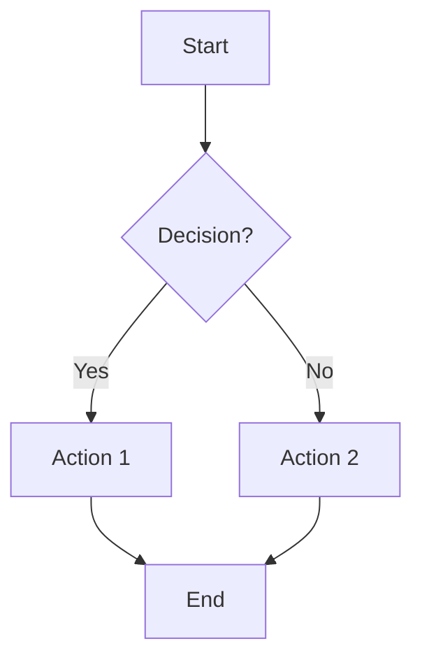

**Shapes:**
- `[Rectangle]` - Process
- `(Rounded)` - Start/End
- `{Diamond}` - Decision
- `[[Subroutine]]`
- `[(Database)]`
- `((Circle))`

### 2. Sequence Diagram (Interactions, API Calls)

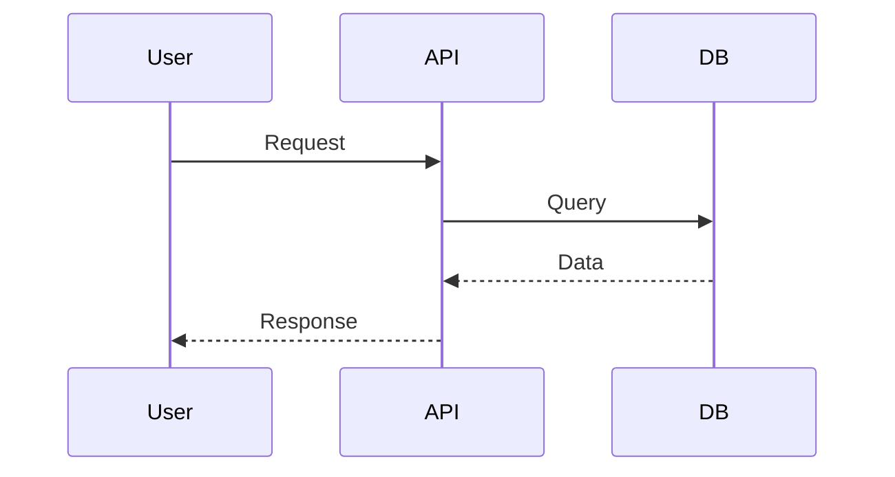

### 3. State Diagram (State Machines, Lifecycles)

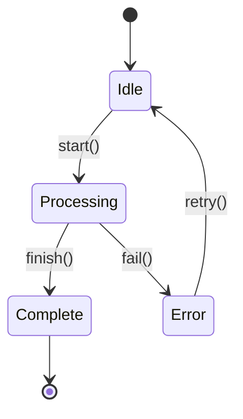

### 4. Gantt Chart (Timelines, Planning)

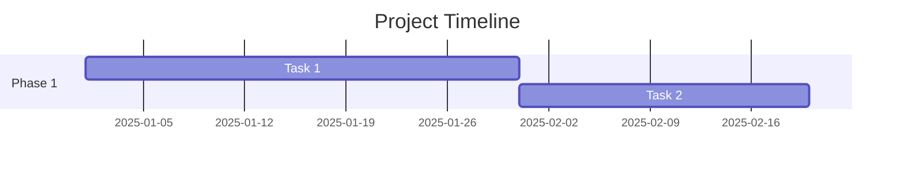

### 5. Pie Chart (Percentages, Distributions)

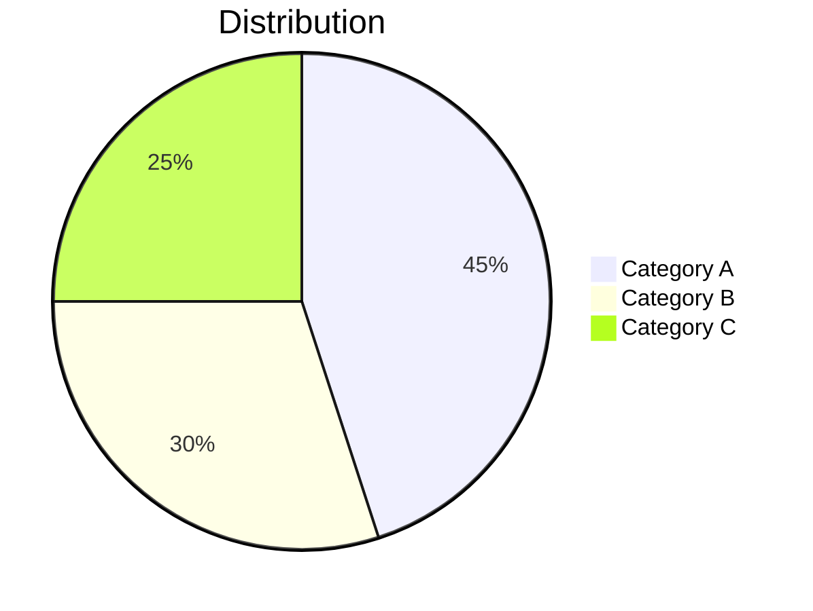

### 6. Class Diagram (Architecture, UML)

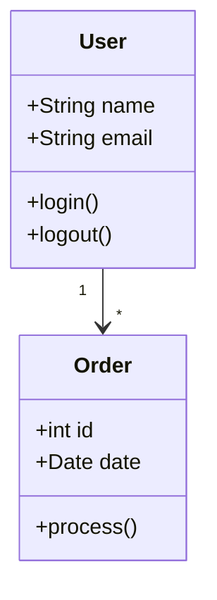

### 7. Journey Diagram (User Flows)

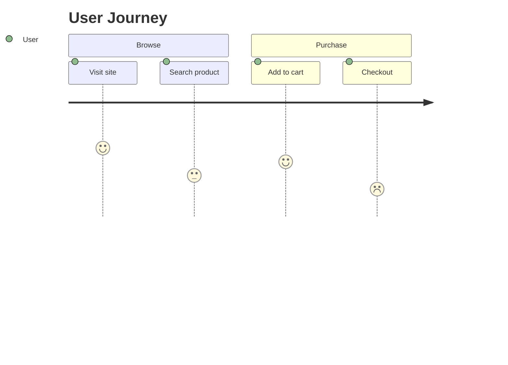

### 8. Git Graph (Git Workflows)

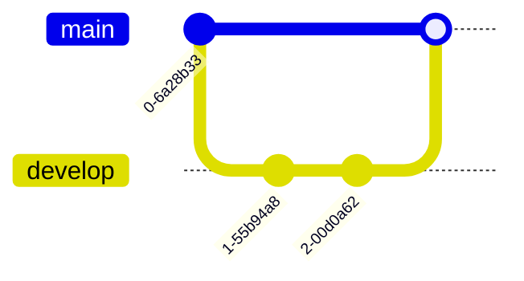

### 9. Quadrant Chart (Priority Matrices)

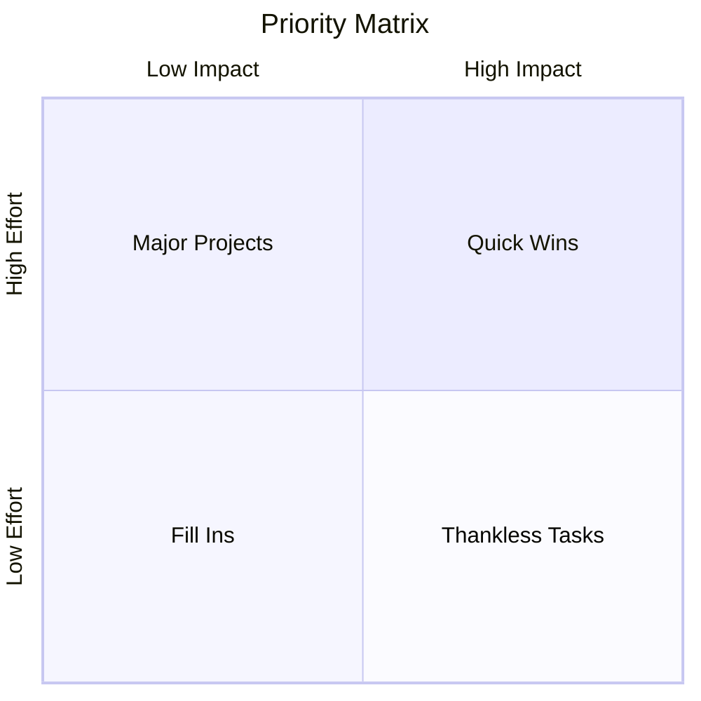

### 10. ER Diagram (Entity Relationships)

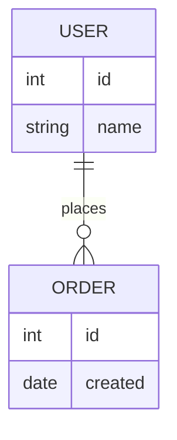

### 11. Mindmap (Concept Maps)

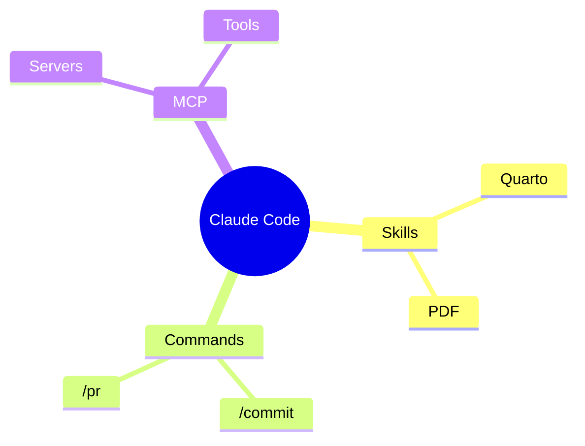

### 12. Timeline (Historical Data)

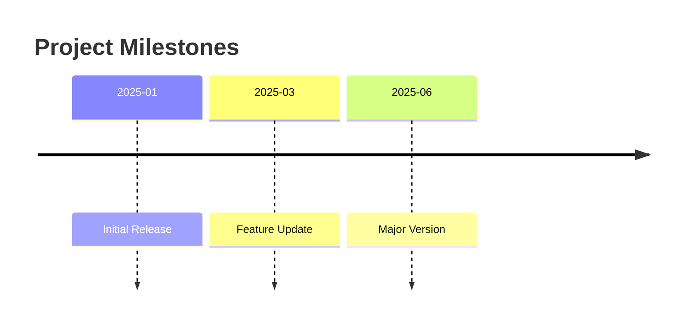

### 13. Sankey Diagram (Flow Diagrams)

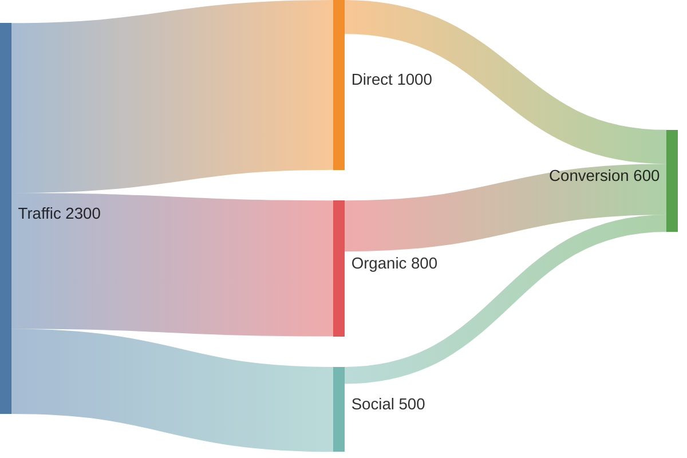

## Adding Colors (Material Design 3)


## Best Practices

1. **Always specify diagram type** (flowchart, sequence, etc.)
2. **Use fig-width and fig-height** for consistent sizing
3. **Add colors** with classDef for Material Design 3
4. **Use descriptive node IDs** (not just A, B, C)
5. **Comment complex diagrams** with `%%`
