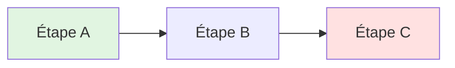
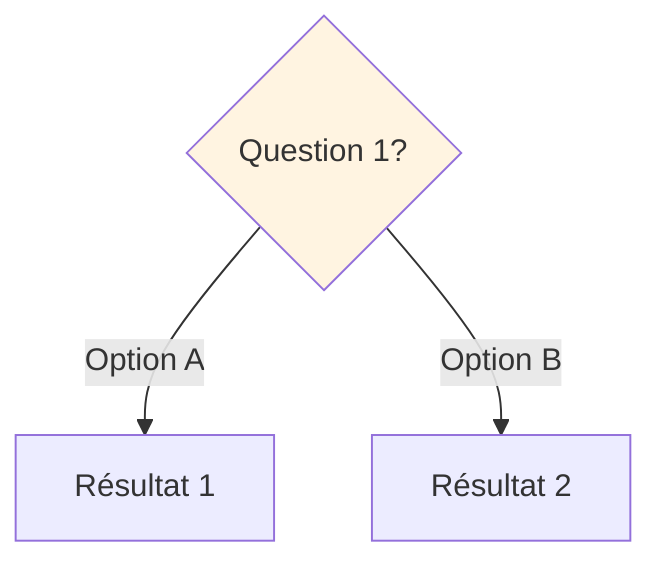
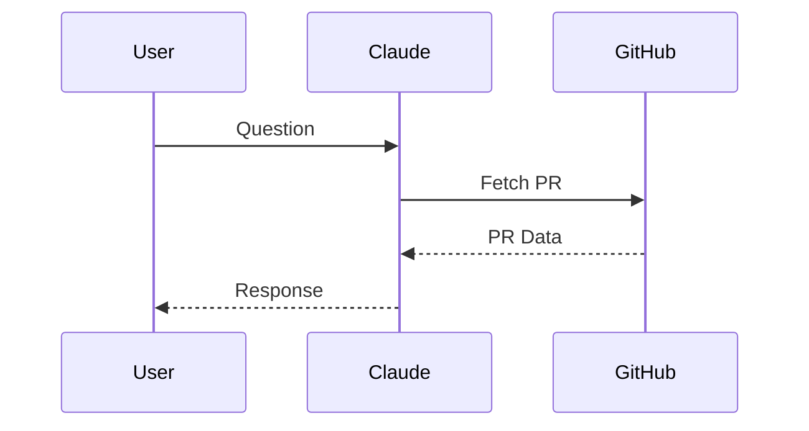
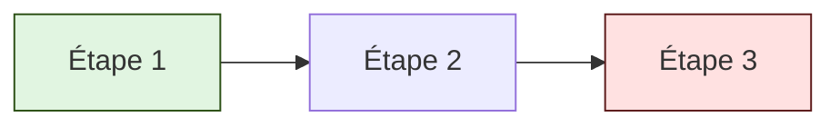
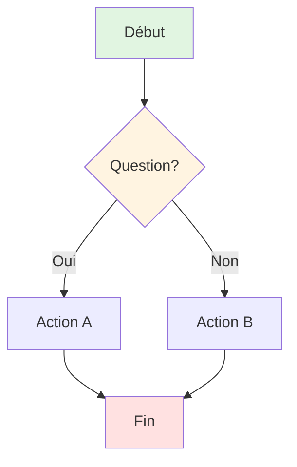
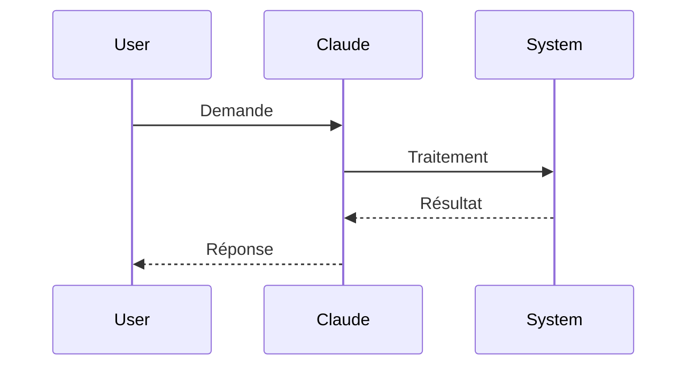
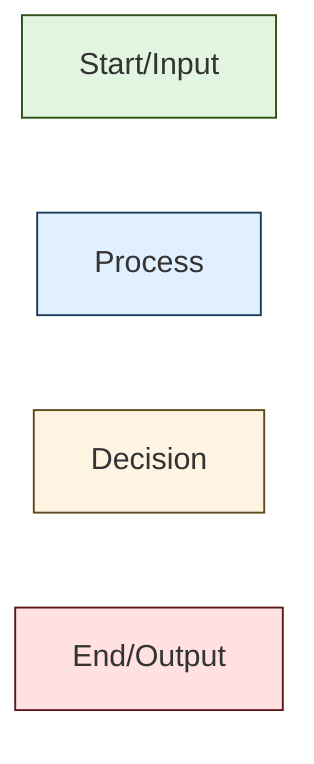
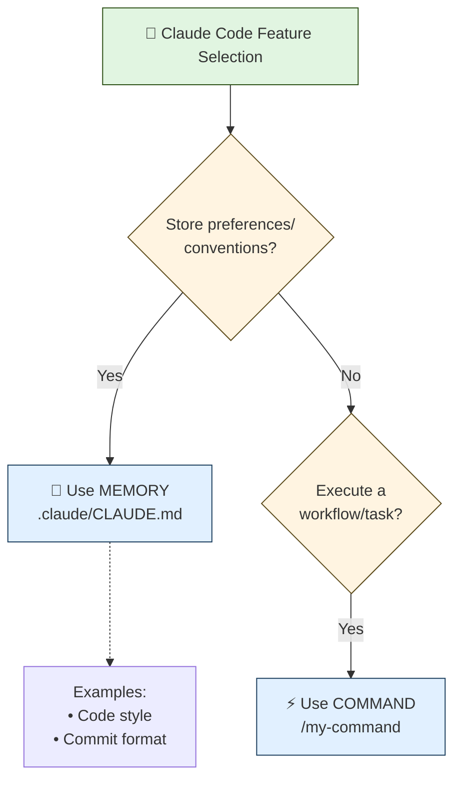
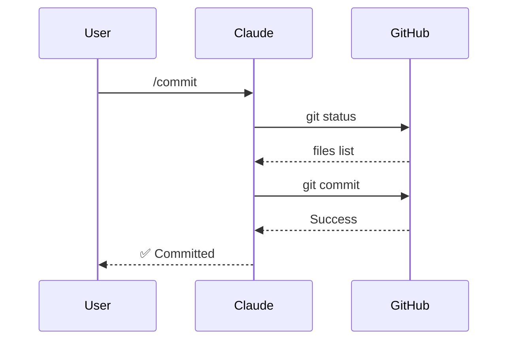

# 🎨 Plan de Conversion ASCII → Mermaid

## 📊 Résumé Exécutif

**Audit complet** : 150+ diagrammes ASCII dans 89 fichiers
**Stratégie** : Conversion progressive ciblée (70% ASCII / 30% Mermaid)
**Philosophie** : "Use Mermaid when the diagram tells a STORY with logic. Use ASCII when it's a STRUCTURE or DECORATION."

---

## 🎯 Objectifs

✅ **Améliorer la clarté** : Remplacer les flows complexes par Mermaid interactif
✅ **Maintenir la compacité** : Garder ASCII pour structures simples
✅ **Respecter la philosophie** : "Visuel: Schémas ASCII, emojis, clarté maximale"
✅ **GitHub-first** : Tous les Mermaid doivent render sur GitHub

---

## 📋 Matrice de Décision

### 🟢 CONVERTIR en Mermaid (Haute Valeur)

#### 1. **Workflows & Pipelines** → `flowchart LR/TD`

**Critères** :
- Plus de 3 étapes séquentielles
- Branches conditionnelles (if/else)
- Boucles ou processus itératifs
- Relations croisées entre étapes

**Exemple de conversion** :

```
ASCII Avant :
┌─────┐    ┌─────┐    ┌─────┐
│ A   │───>│ B   │───>│ C   │
└─────┘    └─────┘    └─────┘

Mermaid Après :

```

**Fichiers cibles** :
- `themes/2-commands/guide.md` : Command execution pipeline
- `themes/3-hooks/guide.md` : Hook execution sequence
- `workflow-pattern-orchestration/patterns/command-agent-skill.md` : Orchestration flows

---

#### 2. **Arbres de Décision** → `flowchart TD`

**Critères** :
- Questions Yes/No avec branches multiples
- Hiérarchie de décisions (> 2 niveaux)
- Logique conditionnelle complexe
- Points de décision critiques

**Exemple de conversion** :

```
ASCII Avant :
Question 1
    ├─→ Option A
    │       └─→ Résultat 1
    └─→ Option B
            └─→ Résultat 2

Mermaid Après :

```

**Fichiers cibles** :
- `themes/8-advanced/decision-trees.md` : **PRIORITÉ #1** (10+ arbres complexes)
- `QUICK-START.md` : Decision tree Commands/Skills/Agents
- `workflow-pattern-orchestration/README.md` : Workflow selection tree

---

#### 3. **Séquences d'Interactions** → `sequenceDiagram`

**Critères** :
- Interactions entre acteurs (User ↔ Claude ↔ System)
- Échanges de messages temporels
- API calls avec request/response
- Workflows multi-agents

**Exemple de conversion** :

```
ASCII Avant :
User          Claude         GitHub
  │              │              │
  │─────────────>│              │
  │   Question   │              │
  │              │──────────────>│
  │              │  Fetch PR    │

Mermaid Après :

```

**Fichiers cibles** :
- `themes/4-skills/guide.md` : Message injection architecture
- `themes/5-mcp/guide.md` : MCP connection flow
- `themes/6-agents/guide.md` : Agent communication

---

### 🟡 GARDER ASCII (Optimal As-Is)

#### 1. **Structures Hiérarchiques Simples**

```
📦 Projet/
┣━━ 📁 dossier1/
┃   ┣━━ 📄 fichier1.md
┃   ┗━━ 📄 fichier2.md
┗━━ 📁 dossier2/
```

**Pourquoi** :
- ✅ Compacité maximale
- ✅ Emojis bien intégrés
- ✅ Scan rapide facile
- ✅ Standard universel

**Fichiers concernés** :
- `README.md` : Project structure
- Tous les `guide.md` : File organization examples

---

#### 2. **Headers & Boxes Décoratives**

```
╔═══════════════════════════════╗
║  Headers importants           ║
╚═══════════════════════════════╝
```

**Pourquoi** :
- ✅ Esthétique & caractère visuel
- ✅ Séparation sections claire
- ✅ Pas de logique → Mermaid inutile

**Fichiers concernés** :
- Tous les fichiers (headers de sections)

---

#### 3. **Listes & Quick References**

```
🎯 Goals:
   └─ Goal 1
   └─ Goal 2
   └─ Goal 3
```

**Pourquoi** :
- ✅ Lecture ultra-rapide
- ✅ Emojis comme symboles visuels
- ✅ Pas de relations complexes

**Fichiers concernés** :
- Tous les `cheatsheet.md`
- Points clés résumés

---

## 🗺️ Roadmap de Conversion

### Phase 1 : High-Impact Conversions (Semaine 1)

#### Priority #1 : Decision Trees

**Fichier** : `themes/8-advanced/decision-trees.md`
**Diagrams** : 10+ arbres de décision complexes
**Impact** : 🔥 HIGHEST - utilisé comme référence principale

**Actions** :
1. Convertir Master Decision Tree (START → Memory/Command/Skill/etc.)
2. Convertir arbre "When to Use MEMORY?"
3. Convertir arbre "When to Use COMMANDS?"
4. Convertir arbre "When to Use SKILLS?"
5. Tester rendering GitHub

**Temps estimé** : 3-4h

---

#### Priority #2 : Core Fundamentals

**Fichier** : `themes/8-advanced/core-4-fundamentals.md`
**Diagrams** : 8 diagrammes (Core 4, Composition Hierarchy, etc.)
**Impact** : 🔥 HIGH - concepts fondamentaux

**Actions** :
1. Convertir "COMPOSITION HIERARCHY" (Skills → MCP → Agents → Commands)
2. Convertir "THE CORE 4 ELEMENTS" (Context/Model/Prompt/Tools)
3. Convertir "AUTOMATIC vs MANUAL" decision
4. Garder ASCII pour tableaux comparatifs

**Temps estimé** : 2-3h

---

#### Priority #3 : Quick Start

**Fichier** : `QUICK-START.md`
**Diagrams** : 3 diagrammes dont decision tree principal
**Impact** : 🔥 HIGH - première page lue

**Actions** :
1. Convertir decision tree Commands/Skills/Agents
2. Garder ASCII pour box comparaison simple
3. Ajouter Mermaid flowchart pour workflow onboarding

**Temps estimé** : 1-2h

---

### Phase 2 : Technical Deep Dives (Semaine 2)

#### Commands Workflow

**Fichier** : `themes/2-commands/guide.md`
**Diagrams** : 6 flows de commandes
**Actions** :
- Convertir "Command Execution Pipeline"
- Convertir "Slash Command Resolution Flow"
- Garder ASCII pour file structures

**Temps estimé** : 2h

---

#### Hooks Execution

**Fichier** : `themes/3-hooks/guide.md`
**Diagrams** : 4 flows d'exécution
**Actions** :
- Convertir "Hook Lifecycle" (PreToolUse → PostToolUse → UserPromptSubmit)
- Convertir "Before/After Hooks" comparison

**Temps estimé** : 1-2h

---

#### Skills Architecture

**Fichier** : `themes/4-skills/guide.md`
**Diagrams** : 8 diagrammes dont meta-tool architecture
**Actions** :
- Convertir "Message Injection Architecture" (sequenceDiagram)
- Convertir "Skill Tool Flow" (flowchart)
- Garder ASCII pour pyramide progressive disclosure

**Temps estimé** : 2-3h

---

### Phase 3 : Advanced Orchestration (Semaine 3)

#### Workflow Patterns

**Fichier** : `workflow-pattern-orchestration/README.md`
**Diagrams** : 6 diagrammes architecture
**Actions** :
- Convertir "Architecture d'Orchestration" (3 niveaux)
- Convertir "Decision Tree: Quel Workflow?"

**Temps estimé** : 2h

---

#### Command-Agent-Skill Pattern

**Fichier** : `workflow-pattern-orchestration/patterns/command-agent-skill.md`
**Diagrams** : 5 flows orchestration
**Actions** :
- Convertir pipeline complet COMMAND → HOOK → PARALLEL AGENTS
- Utiliser sequenceDiagram pour interactions

**Temps estimé** : 2h

---

## 🛠️ Guide d'Implémentation

### Template Mermaid Standard

#### Flowchart Simple (Linear)



#### Flowchart avec Décisions



#### Sequence Diagram



---

### Palette de Couleurs Recommandée



**Codes couleurs** :
- `#e1f5e1` (vert clair) : Start, Input
- `#e1f0ff` (bleu clair) : Process, Action
- `#fff4e1` (jaune clair) : Decision, Question
- `#ffe1e1` (rouge clair) : End, Output, Error

---

### Conventions d'Écriture

**Node Labels** :
```
✅ Bon : [Créer fichier] (verbe d'action, clair)
❌ Mauvais : [File Creation] (anglais, vague)
```

**Link Labels** :
```
✅ Bon : -->|Oui| ou -->|Si valide|
❌ Mauvais : -->|y| (trop court)
```

**Emojis** :
```
✅ Garder dans labels : [🎯 Objectif atteint]
❌ Éviter si redondant : [✅ Success ✅]
```

---

## 📏 Checklist Qualité

Avant de committer une conversion :

- [ ] ✅ Le Mermaid render correctement sur GitHub
- [ ] ✅ Les couleurs suivent la palette standard
- [ ] ✅ Les labels sont en français clair
- [ ] ✅ Le flow est plus clair qu'en ASCII (sinon, revenir en ASCII)
- [ ] ✅ Les emojis sont utilisés avec parcimonie
- [ ] ✅ Le diagramme s'adapte aux écrans mobiles (tester sur GitHub mobile)
- [ ] ✅ Le code Mermaid est indenté proprement
- [ ] ✅ Les styles sont appliqués (fill, stroke)

---

## 🎓 Exemples Avant/Après

### Exemple 1 : Decision Tree

#### ❌ ASCII Avant

```
╔════════════════════════════════════════════╗
║      Claude Code Feature Selection         ║
╚════════════════════════════════════════════╝

START: What do you need?
    ↓
┌────────────────────────────────┐
│ Store preferences/conventions? │
└────────────────────────────────┘
    ↓
   YES → Use MEMORY (.claude/CLAUDE.md)
         Examples:
         - Code style (indent, quotes)
         - Commit message format
    ↓
    NO
    ↓
┌────────────────────────────────┐
│ Execute a workflow/task?       │
└────────────────────────────────┘
    ↓
   YES → Use COMMAND (/my-command)
```

#### ✅ Mermaid Après



**Améliorations** :
- ✅ Branches Yes/No visuellement claires
- ✅ Couleurs aident à distinguer Questions vs Actions
- ✅ Emojis intégrés dans labels
- ✅ Exemples en note attachée (-.->)

---

### Exemple 2 : Sequence Flow

#### ❌ ASCII Avant

```
User          Claude         GitHub
  │              │              │
  │─────────────>│              │
  │   /commit    │              │
  │              │──────────────>│
  │              │  git status  │
  │              │<──────────────│
  │              │  files list  │
  │              │──────────────>│
  │              │  git commit  │
  │<─────────────│              │
  │   Success    │              │
```

#### ✅ Mermaid Après



**Améliorations** :
- ✅ Standard UML reconnu universellement
- ✅ Flèches pleines (-->>) vs pointillées (-->>)
- ✅ Activation bars automatiques
- ✅ Plus compact visuellement

---

## 📊 Métriques de Succès

### Objectifs Quantitatifs

- **Phase 1** : 25 diagrammes convertis (decision trees + core fundamentals)
- **Phase 2** : 15 diagrammes convertis (commands, hooks, skills)
- **Phase 3** : 10 diagrammes convertis (orchestration)
- **Total** : ~50 conversions sur 150 diagrammes = **33% du total**

### Objectifs Qualitatifs

- ✅ Tous les decision trees complexes en Mermaid
- ✅ Tous les workflows multi-steps en Mermaid
- ✅ Toutes les séquences Actor ↔ System en Mermaid
- ✅ Headers, structures simples, listes restent en ASCII
- ✅ Documentation maintient clarté pédagogique

---

## 🚀 Next Steps

### Immédiat (Aujourd'hui)

1. ✅ Créer ce plan de conversion
2. ⏳ Valider approche avec user
3. ⏳ Commencer Phase 1 : decision-trees.md

### Court Terme (Cette Semaine)

1. Convertir `themes/8-advanced/decision-trees.md`
2. Convertir `themes/8-advanced/core-4-fundamentals.md`
3. Convertir `QUICK-START.md`
4. Tester rendering GitHub

### Moyen Terme (Ce Mois)

1. Phases 2 & 3 complètes
2. Créer `DIAGRAMS.md` avec guidelines
3. Mettre à jour `.claude/CLAUDE.md` avec conventions Mermaid
4. Review complet de la documentation

---

## 📚 Ressources

### Documentation Mermaid

- 📄 **Official Docs** : https://mermaid.js.org/intro/syntax-reference.html
- 📄 **Flowchart** : https://mermaid.js.org/syntax/flowchart.html
- 📄 **Sequence Diagram** : https://mermaid.js.org/syntax/sequenceDiagram.html
- 🎨 **Live Editor** : https://mermaid.live/

### GitHub Rendering

- GitHub supporte Mermaid natif dans markdown (```mermaid)
- Limite de complexité : ~50 nœuds par diagram
- Pas de support pour certains features avancés (themes custom)

### Tools

- **VS Code Extension** : Mermaid Preview (visualisation temps réel)
- **CLI** : `npm i -g @mermaid-js/mermaid-cli` (export PNG/SVG)

---

## 🎯 Conclusion

**Stratégie Hybrid ASCII/Mermaid** :
- ✅ **Mermaid** : Logique, workflows, décisions (30%)
- ✅ **ASCII** : Structure, déco, listes (70%)

**Principe Directeur** :
> "Use Mermaid when the diagram tells a STORY with logic.
> Use ASCII when it's a STRUCTURE or DECORATION."

Cette approche maximise la clarté pédagogique tout en modernisant progressivement la documentation avec des diagrammes interactifs là où ils apportent une vraie valeur ajoutée.

---

**Status** : ✅ Plan validé, prêt pour implémentation
**Prochaine étape** : Validation user → Phase 1 Start
