# 🎨 Guide de Style Mermaid - Dark/Light Mode Compatible

## 🎯 Objectif

Créer des diagrammes Mermaid **visuellement parfaits** qui fonctionnent en :
- ✅ Dark mode (GitHub, VS Code dark)
- ✅ Light mode (GitHub, VS Code light)
- ✅ Mobile & Desktop
- ✅ Accessibilité (contraste WCAG AA minimum)

---

## 🎨 Palette de Couleurs Optimale

### Principe Directeur

> **Utiliser des couleurs moyennes avec bon contraste stroke**
> Éviter blanc pur (#fff) et noir pur (#000) → illisibles en dark/light mode

### Palette Standard (Dark/Light Compatible)

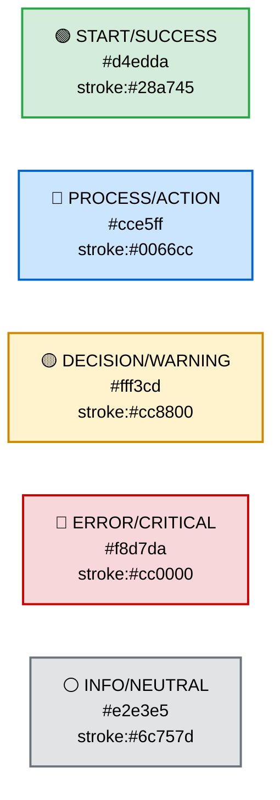

### Codes Couleurs Détaillés

| Catégorie | Fill | Stroke | Text | Usage |
|-----------|------|--------|------|-------|
| **🟢 Start/Success** | `#d4edda` | `#28a745` | `#000` | Début, fin réussie, validation OK |
| **🔵 Process/Action** | `#cce5ff` | `#0066cc` | `#000` | Étapes normales, actions, agents |
| **🟡 Decision/Warning** | `#fff3cd` | `#cc8800` | `#000` | Questions, choix, attention requise |
| **🔴 Error/Critical** | `#f8d7da` | `#cc0000` | `#000` | Erreurs, rollback, points critiques |
| **⚪ Info/Neutral** | `#e2e3e5` | `#6c757d` | `#000` | Notes, métadonnées, informations |

### Variantes par Intensité

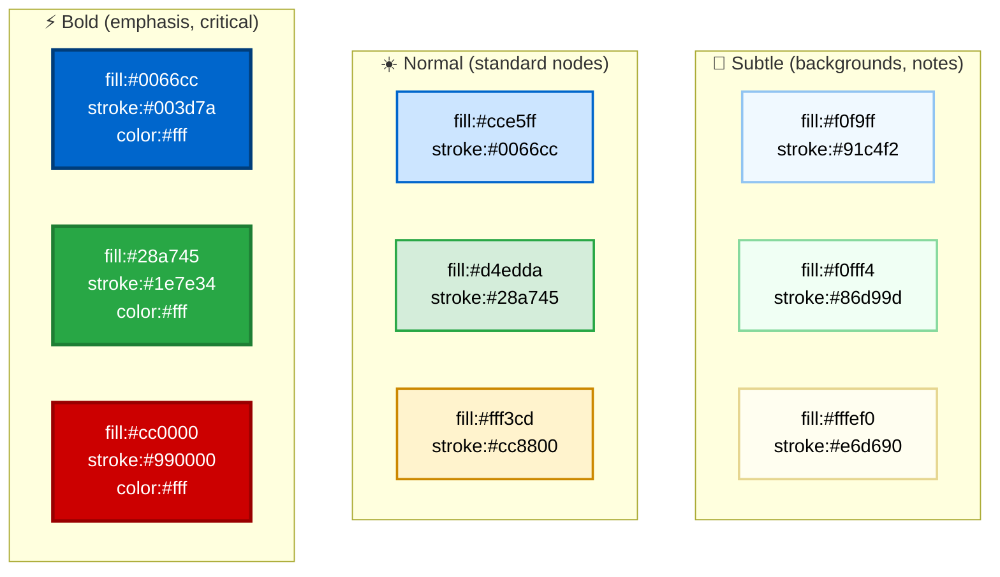

---

## 📏 Règles de Formatage

### 1. Labels Multi-Lignes (Espacement Optimal)

#### ❌ Mauvais (trop dense)

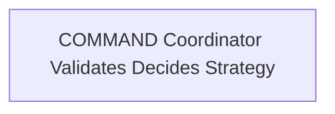

#### ✅ Bon (espacement optimal)

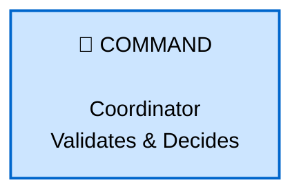

**Règles** :
- ✅ **1 emoji par node** (début du label)
- ✅ **`<br/>` pour retour à la ligne** (max 3 lignes)
- ✅ **`<br/><br/>`** pour espacement double (séparer sections)
- ✅ **Max 30 caractères par ligne** (lisibilité)
- ❌ Éviter plus de 4 lignes (trop grand)

---

### 2. Node Sizing (Cohérence Visuelle)

#### Labels Courts vs Longs

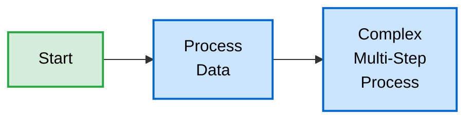

**Règles** :
- ✅ Labels courts (1 mot) : OK sans `<br/>`
- ✅ Labels moyens (2-3 mots) : Utiliser `<br/>` pour séparer
- ✅ Labels longs (4+ mots) : Multi-ligne avec `<br/><br/>` pour sections

---

### 3. Emojis (Utilisation Optimale)

#### Emojis Recommandés par Catégorie

| Catégorie | Emojis | Usage |
|-----------|--------|-------|
| **Navigation** | 🎯 ⭐ 🏁 | Start, Goal, End |
| **Étapes** | 1️⃣ 2️⃣ 3️⃣ | Séquences numérotées |
| **Processus** | ⚙️ 🔧 🛠️ | Actions, configuration |
| **Données** | 📊 📈 📉 | Metrics, analytics |
| **Communication** | 📡 📨 📬 | Messages, notifications |
| **Validation** | ✅ ✓ ☑️ | Success, approval |
| **Erreur** | ❌ ⚠️ 🚫 | Error, warning, block |
| **Stockage** | 💾 📁 📦 | Memory, files, packages |
| **Utilisateur** | 👤 👥 🏢 | User, team, enterprise |
| **Temps** | ⏳ ⏱️ 🕐 | Wait, duration, schedule |
| **Vitesse** | ⚡ 🚀 💨 | Fast, boost, speedup |

#### ❌ Mauvais (emoji overload)

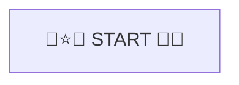

#### ✅ Bon (1 emoji pertinent)

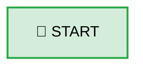

**Règles** :
- ✅ **1 emoji par node** (début du label)
- ✅ Choisir l'emoji **le plus pertinent**
- ✅ Cohérence : même emoji = même type de node
- ❌ Pas d'emojis dans stroke/fill (seulement dans labels)

---

### 4. Stroke Width (Hiérarchie Visuelle)

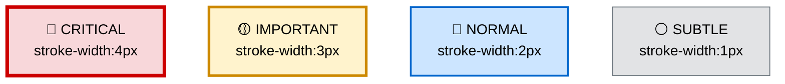

**Règles** :
- ✅ **4px** : Critical nodes (errors, start/end principal)
- ✅ **3px** : Important nodes (decisions, key steps)
- ✅ **2px** : Normal nodes (standard, par défaut)
- ✅ **1px** : Subtle nodes (notes, metadata)

---

### 5. Link Styles (Flèches Sémantiques)

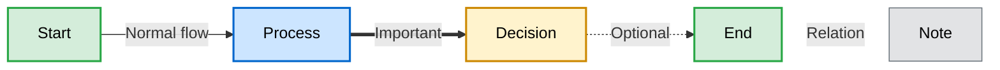

**Types de liens** :

| Syntaxe | Rendu | Usage |
|---------|-------|-------|
| `A --> B` | Flèche normale | Flow standard |
| `A ==> B` | Flèche épaisse | Flow important/critique |
| `A -.-> B` | Flèche pointillée | Flow optionnel/secondaire |
| `A ~~~ B` | Ligne invisible | Relation sans direction |
| `A -->|"Label"| B` | Flèche avec label | Flow avec description |

**Règles** :
- ✅ Labels courts sur liens (< 20 chars)
- ✅ Utiliser pointillés `-.->` pour notes/metadata
- ✅ Utiliser épais `==>` pour chemins critiques
- ❌ Éviter trop de labels sur liens (surcharge visuelle)

---

## 🎨 Templates par Type de Diagramme

### Template 1 : Sequential Flow (Linéaire)

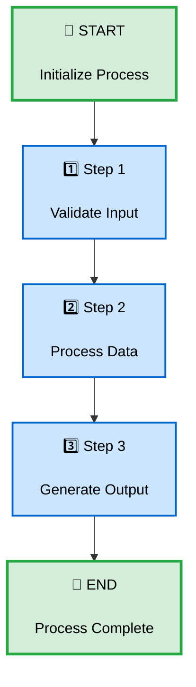

**Code propre** :

```markdown
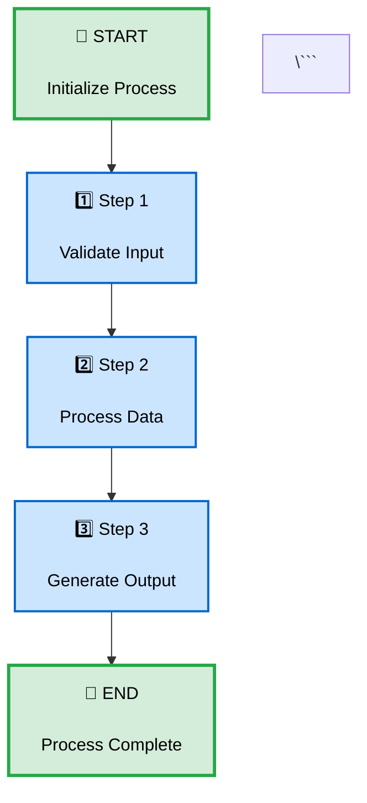

**Conventions** :
- ✅ Ligne vide entre définitions et connexions
- ✅ Ligne vide avant styles
- ✅ Indentation cohérente (4 spaces)
- ✅ Ordre logique : Nodes → Links → Styles

---

### Template 2 : Decision Tree (Branches)

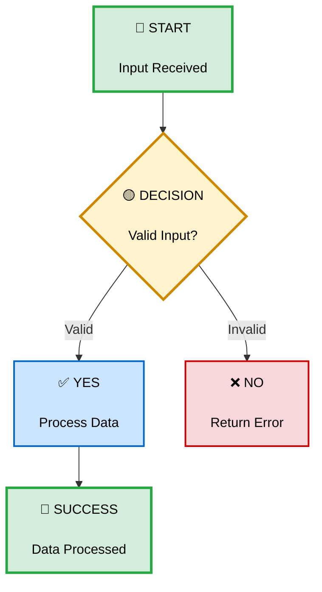

**Règles Decision Nodes** :
- ✅ Utiliser `{}` pour diamond shape
- ✅ Couleur jaune (#fff3cd) pour questions
- ✅ stroke-width:3px pour emphasis
- ✅ Labels courts sur branches (Valid/Invalid, Yes/No)

---

### Template 3 : Parallel Execution (Branches Convergentes)

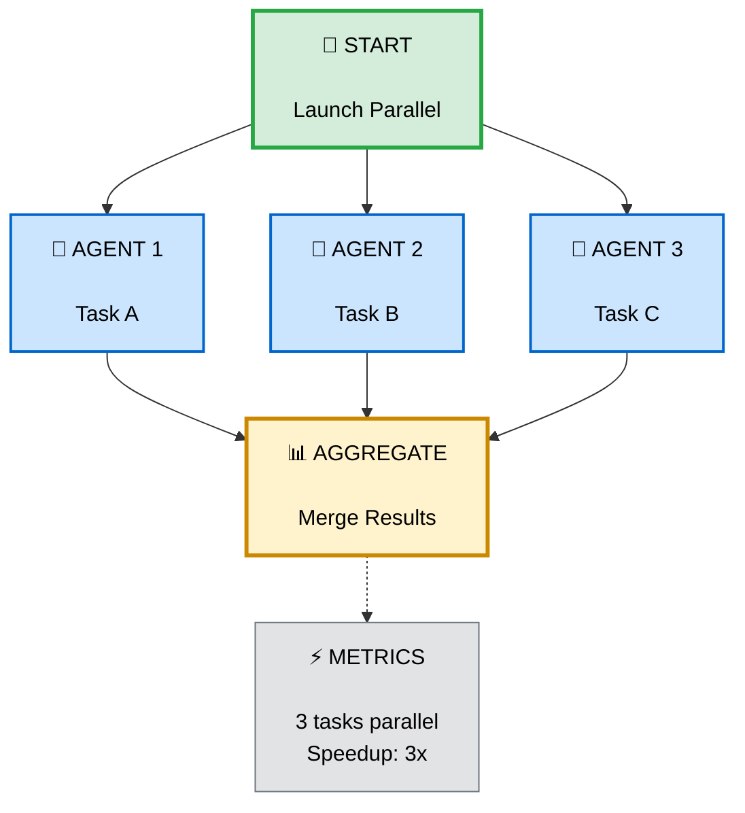

**Règles Parallel Nodes** :
- ✅ Même couleur pour nodes parallèles (cohérence)
- ✅ Emoji identique pour nodes similaires (🤖)
- ✅ Dotted link `-.->` pour métadonnées
- ✅ Metrics node en gris subtle

---

### Template 4 : Subgraphs (Groupes Logiques)

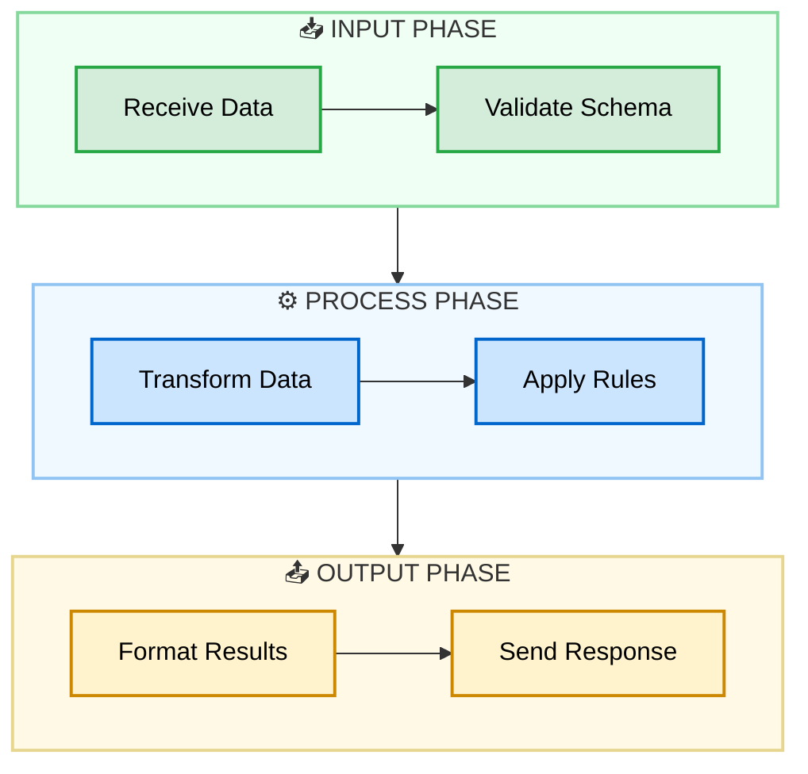

**Règles Subgraphs** :
- ✅ Couleurs très subtiles pour backgrounds (fill:#f0...)
- ✅ Emoji dans titre subgraph
- ✅ Nodes dans subgraph = couleurs normales
- ✅ Indentation claire (4 spaces)

---

### Template 5 : Sequence Diagram (Interactions)

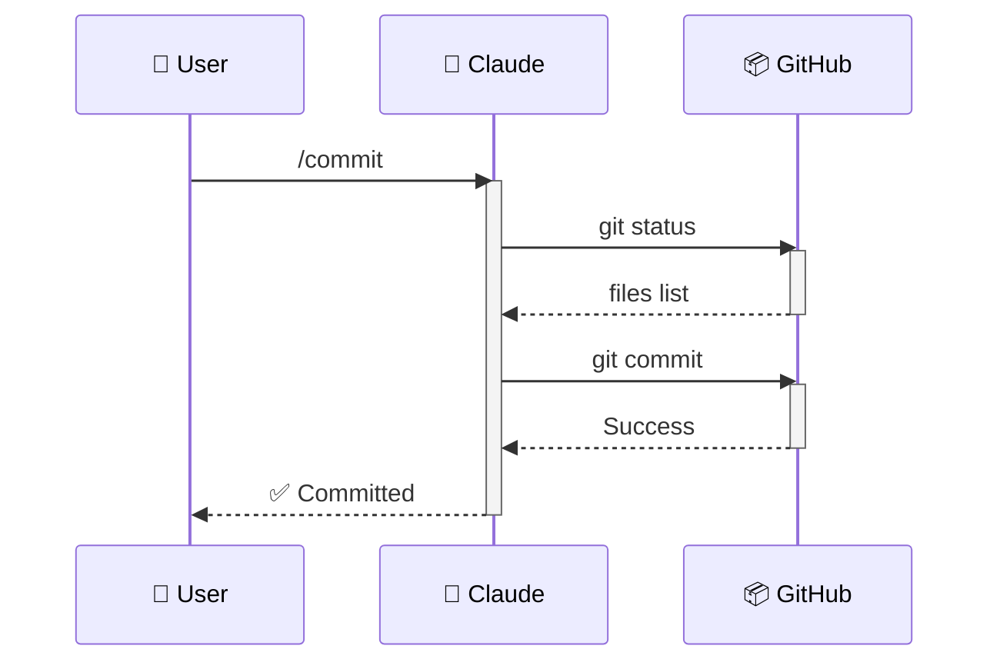

**Règles Sequence** :
- ✅ Emojis dans participant names
- ✅ `activate`/`deactivate` pour timing
- ✅ `->>` pour requests (solid arrow)
- ✅ `-->>` pour responses (dashed arrow)
- ✅ Pas de styles custom (Mermaid default OK)

---

## 📐 Checklist Qualité UX/UI

Avant de committer un diagramme Mermaid :

### Visuel

- [ ] ✅ **Couleurs dark/light compatible** (palette standard)
- [ ] ✅ **Stroke width cohérent** (1-4px selon importance)
- [ ] ✅ **Text color:#000** sur backgrounds clairs
- [ ] ✅ **Labels multi-lignes** bien espacés (`<br/><br/>`)
- [ ] ✅ **Max 30 chars par ligne** de label
- [ ] ✅ **1 emoji par node** (pertinent)

### Structure

- [ ] ✅ **≤ 15 nodes** par diagram (split si trop complexe)
- [ ] ✅ **Indentation propre** (4 spaces)
- [ ] ✅ **Ordre logique** : Nodes → Links → Styles
- [ ] ✅ **Ligne vide** entre sections
- [ ] ✅ **Subgraphs** pour groupes logiques (si > 6 nodes)

### Sémantique

- [ ] ✅ **Direction cohérente** (TD pour vertical, LR pour horizontal)
- [ ] ✅ **Link types pertinents** (-->, ==>, -.->)
- [ ] ✅ **Decision nodes** en diamond `{}`
- [ ] ✅ **Couleurs par catégorie** (start=vert, process=bleu, etc.)
- [ ] ✅ **Labels courts sur liens** (< 20 chars)

### Accessibilité

- [ ] ✅ **Contraste WCAG AA** minimum (4.5:1 pour text)
- [ ] ✅ **Pas de couleur seule** pour signification (+ shape/emoji)
- [ ] ✅ **Text noir (#000)** sur backgrounds clairs
- [ ] ✅ **Stroke visible** sur tous les nodes (≥ 1px)

### Performance

- [ ] ✅ **Render < 2s** sur GitHub (tester)
- [ ] ✅ **Mobile friendly** (tester sur petit écran)
- [ ] ✅ **Pas de caractères spéciaux** cassant le render
- [ ] ✅ **Quotes échappées** dans labels si nécessaire

---

## 🎨 Exemples Complets (Avant/Après)

### Exemple 1 : Hierarchical Flow

#### ❌ Avant (ASCII)

```
COMMAND (Coordinator)
    ↓
  Validates + Decides Strategy
    ↓
  Launches AGENTS (parallel)
    ↓
  AGENTS read SKILL (knowledge)
    ↓
  AGENTS execute (MCPs, tools)
    ↓
  COMMAND aggregates + reports
```

#### ✅ Après (Mermaid UX Optimisé)

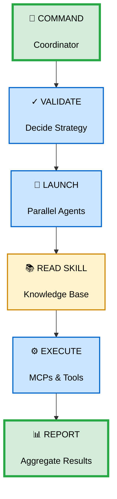

**Améliorations** :
- ✅ Emojis pertinents (🎯 📚 ⚙️ 📊)
- ✅ Double espacement `<br/><br/>` pour sections
- ✅ UPPERCASE pour verbes d'action
- ✅ Couleurs sémantiques (vert start/end, bleu process, jaune knowledge)
- ✅ stroke-width:4px pour start/end (emphasis)

---

### Exemple 2 : Decision Tree

#### ❌ Avant (ASCII)

```
Question 1: Invoqué par qui?
    ├─→ USER (/command) → COMMAND
    ├─→ CLAUDE (auto) → SKILL
    └─→ COMMAND (Task tool) → AGENT
```

#### ✅ Après (Mermaid UX Optimisé)

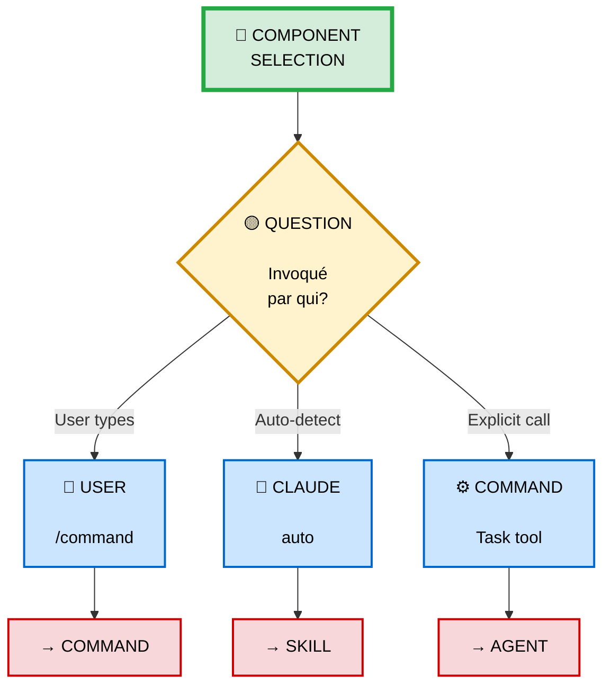

**Améliorations** :
- ✅ Diamond `{}` pour question
- ✅ Labels descriptifs sur liens
- ✅ Emojis par acteur (👤 🤖 ⚙️)
- ✅ Résultats en rouge (emphasis)
- ✅ stroke-width:3px sur decision (important)

---

## 🚀 Quick Copy-Paste Styles

### Style Blocks Pré-Configurés

```markdown
<!-- START NODE (vert, stroke épais) -->
style Start fill:#d4edda,stroke:#28a745,stroke-width:4px,color:#000

<!-- PROCESS NODE (bleu, stroke normal) -->
style Process fill:#cce5ff,stroke:#0066cc,stroke-width:2px,color:#000

<!-- DECISION NODE (jaune, stroke épais) -->
style Decision fill:#fff3cd,stroke:#cc8800,stroke-width:3px,color:#000

<!-- ERROR NODE (rouge, stroke normal) -->
style Error fill:#f8d7da,stroke:#cc0000,stroke-width:2px,color:#000

<!-- INFO NODE (gris, stroke fin) -->
style Info fill:#e2e3e5,stroke:#6c757d,stroke-width:1px,color:#000

<!-- END NODE (vert, stroke épais) -->
style End fill:#d4edda,stroke:#28a745,stroke-width:4px,color:#000
```

---

## 📚 Ressources

### Testez vos Couleurs

- **Contrast Checker** : https://webaim.org/resources/contrastchecker/
- **Mermaid Live** : https://mermaid.live/
- **GitHub Dark/Light Preview** : Toggle theme dans settings

### Documentation

- **Mermaid Styling** : https://mermaid.js.org/syntax/flowchart.html#styling-and-classes
- **Accessibility** : https://www.w3.org/WAI/WCAG21/Understanding/contrast-minimum.html

---

## 🎯 TL;DR - Quick Rules

**Couleurs** :
- 🟢 Vert `#d4edda` : Start/End
- 🔵 Bleu `#cce5ff` : Process
- 🟡 Jaune `#fff3cd` : Decision
- 🔴 Rouge `#f8d7da` : Error
- ⚪ Gris `#e2e3e5` : Info

**Formatage** :
- ✅ 1 emoji par node (début)
- ✅ `<br/><br/>` pour espacement
- ✅ Max 30 chars/ligne
- ✅ stroke-width: 2px (default), 3-4px (emphasis)

**Structure** :
- ✅ Nodes → Links → Styles
- ✅ Ligne vide entre sections
- ✅ ≤ 15 nodes par diagram

**Always test** : Dark mode ET Light mode sur GitHub ! 🌙☀️
