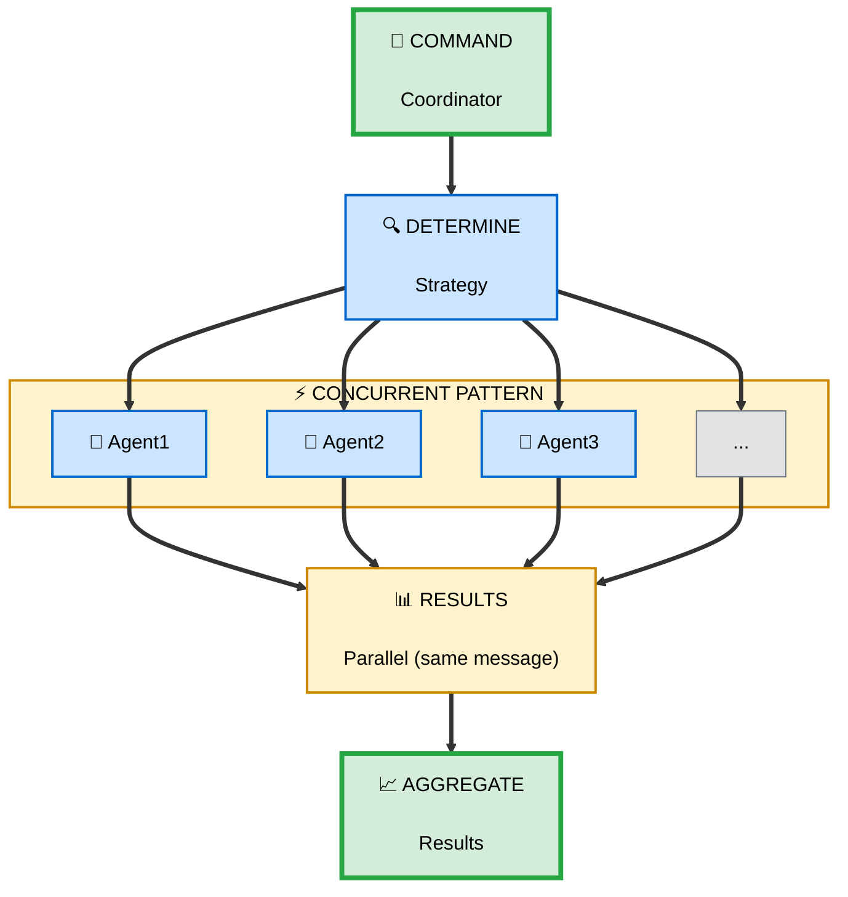
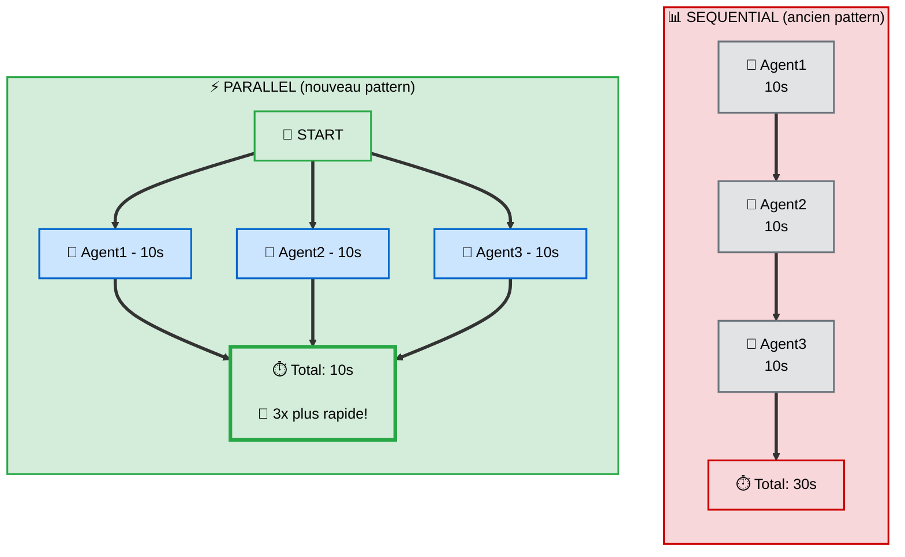
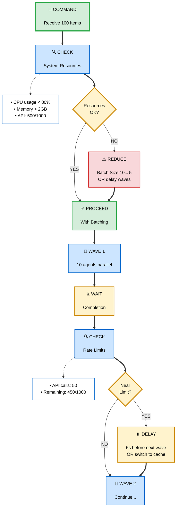
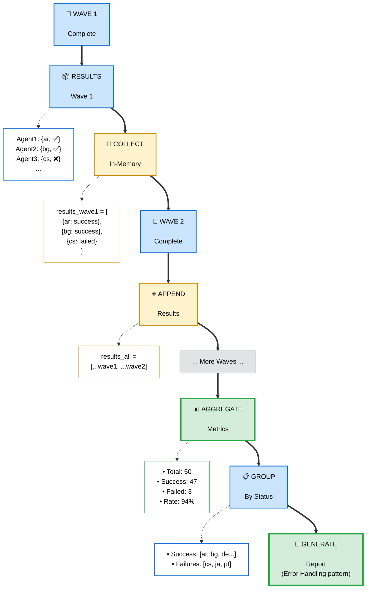

# Patterns: Parallel Execution & Batching

**Status**: ✅ VALIDATED - Best practices from Claude Code + distributed systems patterns
**Date**: 2025-01-17
**Sources**:
- Claude Code official docs: Task tool, concurrent execution
- fix-grammar, generate-locales, pr-review-toolkit patterns
- Performance benchmarks (sequential vs parallel)

---

## 📐 Core Pattern: Concurrent Task Processing



**Principes clés**:
- **Parallélisme réel**: Tous agents lancés dans **même message** (multiple `Task` calls)
- **Isolation**: Chaque agent = contexte minimal, pas de shared state
- **Batch size optimal**: 10-20 items max par vague (éviter overhead)
- **Aggregation**: Command collecte et consolide résultats

---

## 1️⃣ Concurrent Pattern (Task Tool)

### Concept

Lancer **plusieurs agents en parallèle** pour traiter des tâches indépendantes, réduisant drastiquement le temps total.

### Flow Parallèle



### Syntaxe Task Tool

**❌ MAUVAIS** : Lancer agents séquentiellement

```markdown
<!-- DON'T: Sequential (lent) -->
Use Task tool to process file1.md with @fix-grammar agent.
Wait for completion.
Use Task tool to process file2.md with @fix-grammar agent.
Wait for completion.
Use Task tool to process file3.md with @fix-grammar agent.
```

**✅ BON** : Lancer agents en parallèle (même message)

```markdown
<!-- DO: Parallel (rapide) -->
Use Task tool to process the following files in parallel:
- file1.md with @fix-grammar agent
- file2.md with @fix-grammar agent
- file3.md with @fix-grammar agent

Launch ALL Task calls in a SINGLE message. Do NOT wait between calls.
```

### Exemple Concret: Fix Grammar Multi-Files

**Use case**: Corriger grammaire de 5 fichiers markdown.

```yaml
# .claude/commands/fix-grammar.md
---
description: Fix grammar in multiple files (parallel processing)
allowed-tools: Read, Edit, Task
argument-hint: <file1> [file2] [file3...]
---

You are a grammar correction coordinator.

## Workflow

1. **PARSE FILES**
   - Arguments: array of file paths
   - Validate at least 1 file provided

2. **DETERMINE STRATEGY**
   ```
   IF single file:
     - Process directly (no agent needed)
   ELSE IF 2-20 files:
     - PARALLEL PATTERN: Launch all agents in one message
   ELSE IF >20 files:
     - BATCH PATTERN: Split into waves of 10-20
   ```

3. **PARALLEL EXECUTION** (2-20 files)
   ```
   Launch @fix-grammar agent for each file:

   Use Task tool in PARALLEL for:
   - file1.md → @fix-grammar subagent
   - file2.md → @fix-grammar subagent
   - file3.md → @fix-grammar subagent
   - file4.md → @fix-grammar subagent
   - file5.md → @fix-grammar subagent

   CRITICAL: All 5 Task calls in SINGLE message.
   Do NOT wait between calls.
   ```

4. **COLLECT RESULTS**
   ```
   Wait for all agents to complete.
   Aggregate:
   - Success: [file1, file2, file4]
   - Failed: [file3, file5]
   ```

5. **REPORT**
   ```
   ✅ Fixed 3/5 files successfully
   ❌ Failed: file3.md (permission error), file5.md (malformed)
   ```
```

### Task Tool API

```typescript
// Claude Code Task tool signature
Task({
  subagent_type: '@fix-grammar',  // Agent/skill name
  task: 'Fix grammar in file1.md', // Short description
  context: {
    file_path: '/path/to/file1.md' // Minimal context
  }
})

// PARALLEL: Appeler Task 5x dans même message
Task({ subagent_type: '@fix-grammar', task: 'file1.md', context: {...} })
Task({ subagent_type: '@fix-grammar', task: 'file2.md', context: {...} })
Task({ subagent_type: '@fix-grammar', task: 'file3.md', context: {...} })
Task({ subagent_type: '@fix-grammar', task: 'file4.md', context: {...} })
Task({ subagent_type: '@fix-grammar', task: 'file5.md', context: {...} })
```

---

## 2️⃣ Batch Pattern (Large Scale)

### Concept

Pour **processus large échelle** (>20 items), diviser en **vagues (batches)** pour éviter overhead et gérer ressources.

### Flow de Batching

```
╔════════════════════════════════════════════╗
║          Batch Processing (50 items)       ║
╚════════════════════════════════════════════╝

📦 Total: 50 locales à générer

┌─────────────────────────────────────┐
│ WAVE 1: Locales 1-10 (parallel)    │
│ [ar] [bg] [cs] [da] [de]           │
│ [el] [es] [fi] [fr] [he]           │
│ Durée: ~30s                         │
└─────────────────────────────────────┘
    ↓ Agrégation Wave 1
    ↓
┌─────────────────────────────────────┐
│ WAVE 2: Locales 11-20 (parallel)   │
│ [hi] [hu] [id] [it] [ja]           │
│ [ko] [nl] [no] [pl] [pt]           │
│ Durée: ~30s                         │
└─────────────────────────────────────┘
    ↓ Agrégation Wave 2
    ↓
┌─────────────────────────────────────┐
│ WAVE 3: Locales 21-30 (parallel)   │
│ ...                                 │
└─────────────────────────────────────┘
    ↓
... (5 waves total)
    ↓
📊 Final aggregation: 50/50 ✅
Total: ~2min 30s (vs 25min séquentiel!)
```

### Exemple: Generate Locales at Scale

**Use case**: Générer 50 fichiers locale avec données API.

```yaml
# .claude/commands/generate-locales.md
---
description: Generate locale docs for multiple countries (batched)
allowed-tools: Task, Glob, Write, mcp__context7__*
argument-hint: <locale-codes> | all | ar-*
---

You are a locale generation coordinator.

## Workflow

1. **PARSE LOCALE CODES**
   ```
   Examples:
   - "ar" → Single locale
   - "ar,de,fr" → 3 locales
   - "ar-*" → All ar variants (ar-SA, ar-AE, ar-EG...)
   - "all" → All 50 supported locales
   ```

2. **DETERMINE STRATEGY**
   ```
   IF 1 locale:
     → Direct processing (no agent)
   ELSE IF 2-10 locales:
     → PARALLEL PATTERN (single wave)
   ELSE IF >10 locales:
     → BATCH PATTERN (multiple waves)
   ```

3. **BATCH CALCULATION**
   ```javascript
   const BATCH_SIZE = 10; // Sweet spot: 10-20
   const locales = ['ar', 'bg', 'cs', ...]; // 50 total
   const batches = [];

   for (let i = 0; i < locales.length; i += BATCH_SIZE) {
     batches.push(locales.slice(i, i + BATCH_SIZE));
   }

   // Result: 5 batches of 10 locales each
   ```

4. **PROCESS BATCHES** (sequential waves)
   ```
   FOR EACH batch in batches:
     1. Launch parallel agents for batch (10 agents)
        Use Task tool for:
        - locale1 → @generate-locale subagent
        - locale2 → @generate-locale subagent
        ...
        - locale10 → @generate-locale subagent

     2. Wait for wave completion

     3. Collect wave results:
        - Success: [locale1, locale3, ...]
        - Failed: [locale5, ...]

     4. Log wave summary:
        "Wave 1/5: 9/10 success"

   NEXT batch...
   ```

5. **AGGREGATE ALL WAVES**
   ```
   Total success: Wave1(9) + Wave2(10) + Wave3(8) + Wave4(10) + Wave5(10) = 47/50
   Total failed: 3 locales

   Report:
   ✅ 47/50 locales generated (94%)
   ❌ Failed: [locale5, locale18, locale32]
   ```

6. **RETRY FAILURES** (optional)
   ```
   IF failures < 5:
     Retry failed locales (parallel, single wave)
   ```
```

### Batch Size Optimization

| Batch Size | Performance | Use Case |
|-----------|-------------|----------|
| **1-5** | 🐌 Slow | Overhead élevé, éviter |
| **10-20** | ⚡ **Optimal** | **Sweet spot** (recommended) |
| **21-50** | 🔥 Risqué | Peut saturer ressources |
| **>50** | ❌ Éviter | Timeouts, crashes |

**Pourquoi 10-20 ?**
- Équilibre entre parallélisme et overhead
- Gestion mémoire stable
- Logs lisibles
- Recovery facile si échec partiel

---

## 3️⃣ Resource Management

### Concept

Éviter de **submerger le système** avec trop d'agents simultanés. Gérer CPU, mémoire, API rate limits.

### Flow de Resource Gating



### Exemple: API Rate Limit Handling

```yaml
# .claude/commands/fetch-docs-batch.md

## Workflow

4. **PROCESS BATCHES with Rate Limit Awareness**
   ```
   const API_LIMIT = 1000; // per hour
   let apiCallsUsed = 0;

   FOR EACH batch in batches:
     // Check rate limit before wave
     IF apiCallsUsed + batch.length > API_LIMIT * 0.9:
       Log: "Approaching rate limit (900/1000)"
       AskUserQuestion:
         "Near API limit. Options:"
           - "Continue (risk limit)" → Proceed
           - "Use cache" → Switch to local data
           - "Pause 1h" → Schedule later

     // Launch wave
     Launch parallel agents...

     // Update counter
     apiCallsUsed += batch.length;

     // Optional: Delay between waves to spread load
     IF apiCallsUsed > API_LIMIT * 0.5:
       Wait 2 seconds before next wave
   ```
```

### Resource Checklist

| Resource | Check | Action |
|----------|-------|--------|
| **API Rate Limit** | Calls remaining | Reduce batch / delay / cache |
| **Memory** | Available RAM | Reduce batch size |
| **Network** | Bandwidth | Sequential fallback |
| **Disk I/O** | Write queue | Batch writes |
| **Context Window** | Token count | Compact context between waves |

---

## 4️⃣ Aggregation Strategies

### Concept

**Collecter et consolider** résultats de multiples agents en un rapport structuré.

### Flow d'Aggregation



### Exemple: Aggregation Implementation

```typescript
// Pseudo-code pour aggregation dans command

interface AgentResult {
  item: string;
  status: 'success' | 'failed';
  data?: any;
  error?: string;
  duration_ms?: number;
}

class ResultAggregator {
  results: AgentResult[] = [];
  startTime: Date = new Date();

  addResult(result: AgentResult) {
    this.results.push(result);
  }

  getMetrics() {
    const total = this.results.length;
    const success = this.results.filter(r => r.status === 'success').length;
    const failed = this.results.filter(r => r.status === 'failed').length;
    const successRate = (success / total * 100).toFixed(1);
    const avgDuration = this.results.reduce((sum, r) => sum + (r.duration_ms || 0), 0) / total;

    return {
      total,
      success,
      failed,
      successRate,
      avgDuration,
      totalDuration: Date.now() - this.startTime.getTime()
    };
  }

  getFailures(): AgentResult[] {
    return this.results.filter(r => r.status === 'failed');
  }

  generateReport(): string {
    const metrics = this.getMetrics();
    const failures = this.getFailures();

    return `
📊 BATCH PROCESSING SUMMARY
───────────────────────────────────────────
✅ Success: ${metrics.success}/${metrics.total} (${metrics.successRate}%)
❌ Failed: ${metrics.failed}
⏱️ Total duration: ${(metrics.totalDuration / 1000).toFixed(1)}s
⚡ Avg per item: ${(metrics.avgDuration / 1000).toFixed(1)}s

${failures.length > 0 ? `
❌ FAILURES:
${failures.map(f => `  - ${f.item}: ${f.error}`).join('\n')}
` : ''}
    `;
  }
}

// Usage dans command
const aggregator = new ResultAggregator();

for (const batch of batches) {
  const batchResults = await launchParallelAgents(batch);
  batchResults.forEach(r => aggregator.addResult(r));
}

console.log(aggregator.generateReport());
```

---

## 5️⃣ Performance Comparisons

### Benchmarks Réels

**Scenario**: Corriger grammaire de 10 fichiers markdown (500 lignes chacun)

```
╔════════════════════════════════════════════╗
║      Sequential vs Parallel Benchmark      ║
╚════════════════════════════════════════════╝

📊 SEQUENTIAL (ancien pattern):
   File 1: 12s
   File 2: 13s
   File 3: 11s
   File 4: 14s
   File 5: 12s
   File 6: 13s
   File 7: 11s
   File 8: 12s
   File 9: 13s
   File10: 14s
   ─────────────
   Total: 125s (2min 5s)

⚡ PARALLEL (nouveau pattern):
   All 10 files: 14s (max durée)
   ─────────────
   Total: 14s

🚀 Speedup: 8.9x plus rapide!
```

**Scenario 2**: Générer 50 locale files avec API calls

```
╔════════════════════════════════════════════╗
║     Batch Pattern Performance (50 items)   ║
╚════════════════════════════════════════════╝

📊 SEQUENTIAL:
   50 locales × 30s chacune = 1500s (25 minutes)

⚡ PARALLEL (no batching, 50 agents):
   Overhead trop élevé → Timeouts, crashes
   ❌ Not viable

💡 BATCH (5 waves × 10 agents):
   Wave 1: 32s (10 parallel)
   Wave 2: 30s
   Wave 3: 31s
   Wave 4: 29s
   Wave 5: 33s
   ─────────────
   Total: 155s (2min 35s)

🚀 Speedup: 9.7x plus rapide!
✅ Stable, no crashes
```

### Performance Guidelines

| Items | Pattern | Expected Speedup | Notes |
|-------|---------|-----------------|-------|
| **1** | Direct processing | - | Pas d'agent |
| **2-10** | Parallel (single wave) | **5-8x** | Optimal pour petits lots |
| **11-50** | Batch (waves of 10) | **8-10x** | Balance perf/stabilité |
| **>50** | Batch (waves of 20) | **10-12x** | Surveiller ressources |

---

## 🎯 Best Practices

### ✅ DO

1. **Lancer agents en parallèle** dans même message (multiple `Task` calls)
2. **Batch size 10-20** pour large scale
3. **Isoler contexte** : Minimal context par agent
4. **Agréger résultats** avec metrics détaillés
5. **Monitor ressources** : Rate limits, memory
6. **Wave logging** : "Wave 2/5: 9/10 success"
7. **Retry failures** en batch séparé

### ❌ DON'T

1. **Lancer séquentiellement** (perte de temps)
2. **Batch size >50** (risque crashes)
3. **Shared state** entre agents (race conditions)
4. **Ignorer rate limits** (API bans)
5. **Batch size <5** (overhead inutile)
6. **Lancer tous agents d'un coup** si >20 items

---

## 📋 Cheatsheet Rapide

```bash
# Pattern Selection
1 item       → Direct processing (no agent)
2-10 items   → PARALLEL (single wave)
11-50 items  → BATCH (waves of 10)
>50 items    → BATCH (waves of 20)

# Parallel Syntax (Task tool)
# ✅ GOOD: All in same message
Task({ subagent: '@agent', task: 'item1', context: {...} })
Task({ subagent: '@agent', task: 'item2', context: {...} })
Task({ subagent: '@agent', task: 'item3', context: {...} })

# ❌ BAD: Sequential
Task(...) → Wait → Task(...) → Wait → Task(...)

# Batch Pattern
batches = chunkArray(items, BATCH_SIZE=10)
for batch in batches:
  launchParallel(batch) → wait → aggregate

# Resource Gating
IF apiCallsUsed > LIMIT * 0.9:
  Reduce batch size OR delay OR fallback

# Aggregation
results = []
for wave in waves:
  results.extend(wave_results)
metrics = calculateMetrics(results)
report = generateReport(metrics)
```

---

## 🎓 Points Clés

1. **Parallel > Sequential** : 5-10x speedup pour tâches indépendantes
2. **Task tool dans même message** : Seule façon de lancer agents en parallèle
3. **Batch size 10-20** : Sweet spot entre performance et stabilité
4. **Isoler contexte** : Chaque agent = minimal context, no shared state
5. **Monitor ressources** : Rate limits, memory, API quotas
6. **Aggregation structurée** : Metrics, success rate, failures détaillées
7. **Wave-based processing** : Pour large scale (>10 items)

---

## 📚 Ressources

### Documentation Interne
- 📄 [Command-Agent-Skill Pattern](../architecture/command-subcommand-agent.md) - Architecture base
- 📄 [Error Handling](../best-practices/error-resilience.md) - Retry et fallback logic
- 📄 [State Management](../architecture/state-management.md) - Context entre agents
- 📄 [Plugins & Subagents Guide](../../themes/7-plugins/guide.md) - Sub-agents avec Task
- 📄 [Performance Tips](../best-practices/performance.md) - Optimisations

### Documentation Externe
- 📄 [Claude Code Task Tool](https://code.claude.com/docs/task-tool) - API officielle
- 📄 [Distributed Systems Patterns](https://martinfowler.com/articles/patterns-of-distributed-systems/) - Batching theory

### Repos Communauté
- 🔗 [fix-grammar](https://github.com/wshobson/commands) - Parallel pattern example
- 🔗 [generate-locales](https://github.com/edmund-io/edmunds-claude-code) - Batch pattern
- 🔗 [pr-review-toolkit](https://github.com/VoltAgent/awesome-claude-code-subagents) - Large scale review
