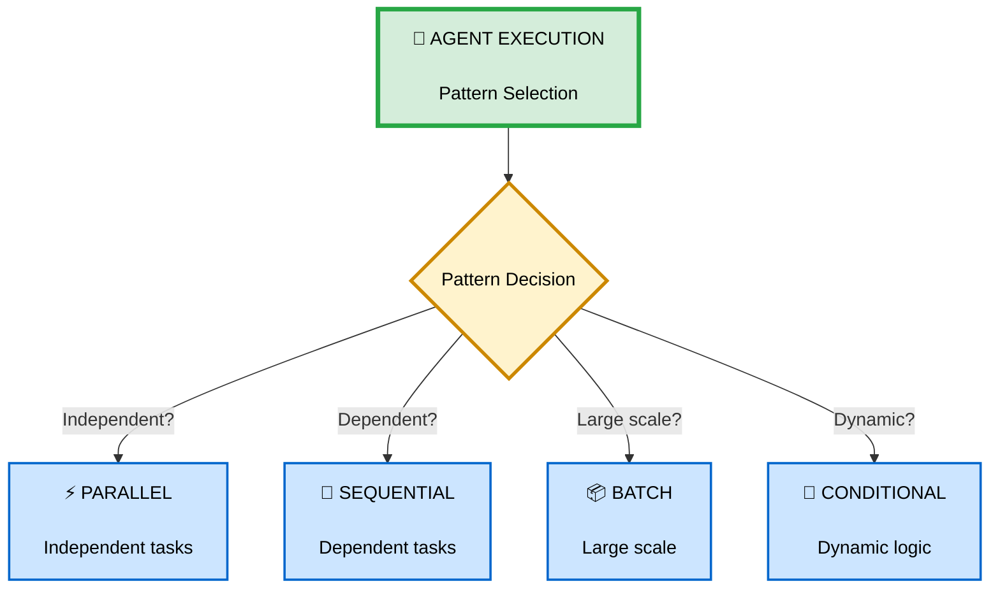
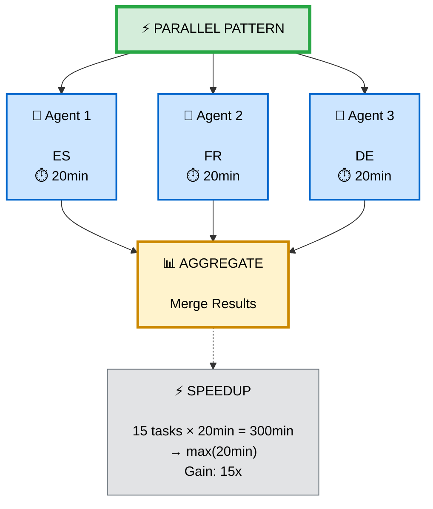
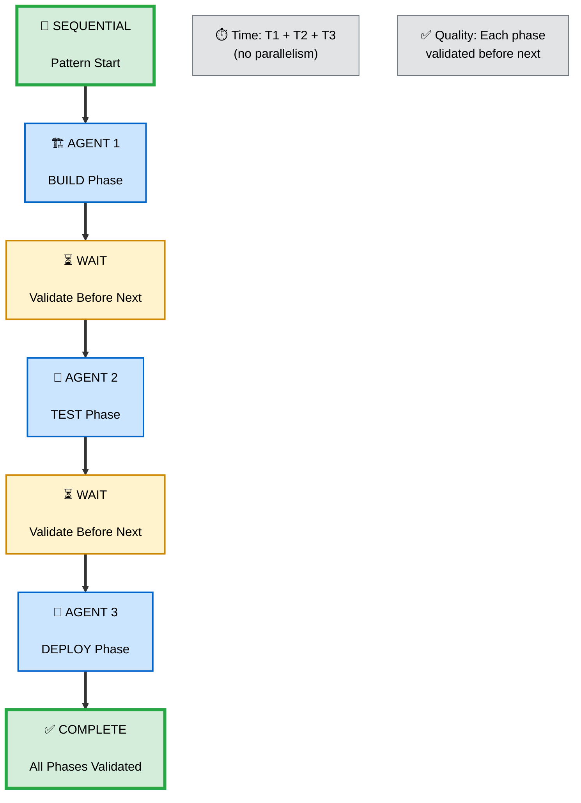
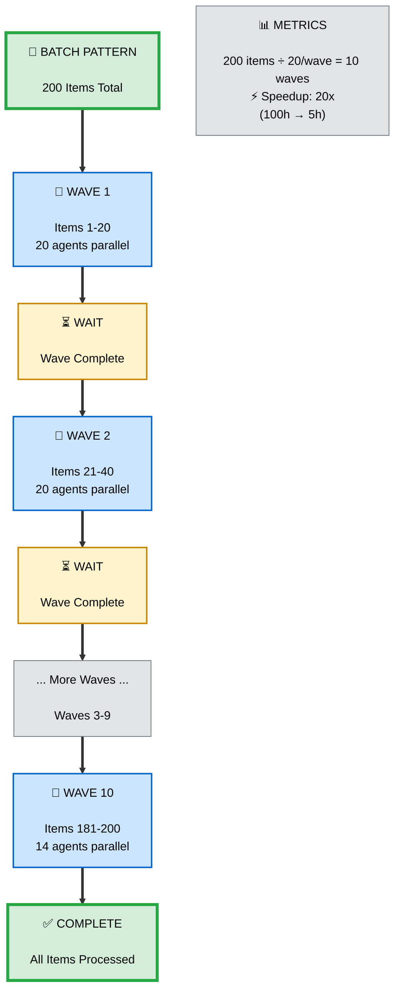

# Agent Orchestration - Execution Pattern

**Niveau** : Production
**Prérequis** : Agents, Orchestration Principles

---

## 📚 Vue d'Ensemble

Le **Agent Orchestration Pattern** définit comment optimiser l'exécution d'agents pour maximiser performance, qualité et coût.

> **"Agents execute, NEVER coordinate. Choose pattern based on task dependencies."**



---

## 🎯 Execution Patterns

### 1. Parallel Execution

**When** : Tasks are completely independent
**Speedup** : 5-20x (depends on # of agents)
**Resource** : High (multiple agents running concurrently)



**Use Cases** :
- ✅ Multi-language translation (15 languages)
- ✅ Parallel data processing (independent datasets)
- ✅ Multi-region deployments
- ✅ Batch file transformations

**Example** : Global Localization

```yaml
# COMMAND launches 15 agents in parallel

Task(subagent_type="translator-es", prompt="Translate to Spanish")
Task(subagent_type="translator-fr", prompt="Translate to French")
Task(subagent_type="translator-de", prompt="Translate to German")
# ... 12 more agents

All agents run concurrently → 15x speedup
```

---

### 2. Sequential Execution

**When** : Tasks must complete in specific order
**Speedup** : 1x (quality > speed)
**Resource** : Low (one agent at a time)



**Use Cases** :
- ✅ CI/CD pipelines (Build → Test → Deploy)
- ✅ Data pipelines (Extract → Transform → Load)
- ✅ Multi-step forms (validation at each step)
- ✅ Approval workflows

**Example** : CI/CD Pipeline

```yaml
# COMMAND launches agents sequentially

Phase 1: BUILD
Task(subagent_type="builder", prompt="Build app")
✅ Wait for completion, BLOCK if fails

Phase 2: TEST
Task(subagent_type="tester", prompt="Run tests, require coverage >80%")
✅ Wait for completion, BLOCK if fails

Phase 3: DEPLOY
Task(subagent_type="deployer", prompt="Deploy to production")
✅ Sequential ensures quality at each gate
```

---

### 3. Batch Processing

**When** : Large datasets (100+ items)
**Speedup** : 10-15x (balanced parallelism)
**Resource** : Medium (waves of N agents)
**Batch Size** : 10-20 items per wave



**Use Cases** :
- ✅ Locale generation (200 files)
- ✅ Image processing (1000+ images)
- ✅ Data migration (large databases)
- ✅ Batch API calls

**Example** : Locale Generation

```yaml
# COMMAND processes 200 locales in batches

Total: 200 locale files
Batch size: 20 files per wave

FOR each wave in [1..9]:
  Launch 20 agents in parallel
  Wait for wave completion
  Aggregate results (success/fail counts)
  IF failures: Retry once with fallback

Final aggregate: 200/200 success ✅
```

**Why Batch?** :
- ✅ Prevents resource exhaustion ((not 200 agents) at once)
- ✅ Better error handling (per-wave retry)
- ✅ Progress visibility (wave completion tracking)
- ✅ Cost control (can stop mid-process)

---

### 4. Conditional Execution

**When** : Dynamic workflows with if/else logic
**Speedup** : Varies (depends on branches)
**Resource** : Low-Medium (only active branches)

```
┌────────────────────────────────────────┐
│       CONDITIONAL PATTERN              │
└────────────────────────────────────────┘
                  ↓
            ┌─────────┐
            │ Agent 1 │
            │ TRIAGE  │
            └─────────┘
                  ↓
         ┌────────┴────────┐
         │                 │
    Severity P1       Severity P2+
         │                 │
         ↓                 ↓
   ┌─────────┐       ┌─────────┐
   │ Agent 2A│       │ Agent 2B│
   │ESCALATE │       │AUTO-FIX │
   └─────────┘       └─────────┘

🔀 Branching: Different agents based on condition
```

**Use Cases** :
- ✅ Security incident response (severity-based)
- ✅ Error handling (different fixes per error type)
- ✅ User routing (role-based workflows)
- ✅ A/B testing execution

**Example** : Security Incident Response

```yaml
# COMMAND uses conditional logic

Phase 1: TRIAGE
Task(subagent_type="triage-agent", prompt="Assess severity")

Result: severity = "P1" (critical)

Phase 2: RESPONSE (conditional on severity)
IF severity == "P1":
  # Human-in-loop for critical incidents
  Require approval (.claude/approvals/incident-{id}.txt)
  Task(subagent_type="escalation-agent", prompt="Alert SOC, coordinate response")
  Task(subagent_type="containment-agent", prompt="Immediate containment (block IPs)")

ELSE IF severity == "P2":
  # Auto-remediation for medium incidents
  Task(subagent_type="auto-remediate-agent", prompt="Apply known fix")

ELSE:
  # Logging only for low severity
  Task(subagent_type="logger-agent", prompt="Log to SIEM")
```

---

## 🏗️ Advanced Patterns

### Hybrid: Sequential + Parallel

**When** : Sequential phases, parallel within each
**Example** : RFP Response

```
┌──────────────────────────────────────────────┐
│         HYBRID PATTERN                       │
│  (Sequential Phases + Parallel Within)       │
└──────────────────────────────────────────────┘

Phase 1: ANALYSIS (Parallel agents within)
    ┌─────────┬─────────┬─────────┐
    │ Legal   │Technical│Financial│
    └─────────┴─────────┴─────────┘
              ↓ (wait for all)

Phase 2: WRITING (Parallel agents within)
    ┌─────────┬─────────┬─────────┐
    │Executive│Technical│ Pricing │
    │ Summary │Proposal │Proposal │
    └─────────┴─────────┴─────────┘
              ↓ (wait for all)

Phase 3: REVIEW (Parallel agents within)
    ┌─────────┬─────────┬─────────┐
    │  Legal  │Technical│  Final  │
    │ Review  │ Review  │  Edit   │
    └─────────┴─────────┴─────────┘

🎯 Combines sequential quality with parallel speed
```

---

### Hybrid: Batch + Conditional

**When** : Large datasets with dynamic routing
**Example** : Data Processing with Error Handling

```
┌──────────────────────────────────────────────┐
│    BATCH + CONDITIONAL PATTERN               │
└──────────────────────────────────────────────┘

Wave 1 (Items 1-20): Batch processing
    ↓
IF success: Continue Wave 2
IF failures: Retry with fallback
    ↓
    ├─ Success after retry → Wave 2
    └─ Still fails → Conditional routing:
         ├─ Data corrupt → Skip
         ├─ API timeout → Retry later
         └─ Unknown error → Alert user

📊 Intelligent error handling at scale
```

---

## 💡 Pattern Selection Framework

### Decision Tree

```
┌─────────────────────────────────────────┐
│       PATTERN DECISION TREE             │
└─────────────────────────────────────────┘
                  ↓
        Tasks independent?
                  ↓
         ┌────────┴────────┐
         │                 │
        YES               NO
         │                 │
         ↓                 ↓
   How many tasks?    Sequential
         ↓            dependencies?
    ┌────┴────┐            ↓
    │         │       ┌────┴────┐
  <100      100+     │         │
    │         │    Simple   Complex
    ↓         ↓      │         │
PARALLEL    BATCH    ↓         ↓
                SEQUENTIAL  CONDITIONAL
```

### Pattern Comparison

| Pattern | Speedup | Complexity | Resource | Best For |
|---------|---------|------------|----------|----------|
| **Parallel** | 5-20x | Low | High | Independent tasks (< 100) |
| **Sequential** | 1x | Low | Low | Dependent tasks, quality gates |
| **Batch** | 10-15x | Medium | Medium | Large datasets (100+) |
| **Conditional** | Varies | High | Low-Med | Dynamic workflows |
| **Hybrid** | 3-10x | High | Medium | Complex multi-phase |

---

## 🎯 Best Practices

### ✅ DO

**1. Choose pattern based on task dependencies**
```yaml
✅ Correct:
IF tasks independent AND count <100:
  Use PARALLEL

IF tasks independent AND count >100:
  Use BATCH (10-20 items/wave)

IF tasks dependent:
  Use SEQUENTIAL (with validation gates)
```

**2. Monitor resource usage**
```yaml
✅ Correct:
# Limit parallel agents to avoid overwhelm
Max parallel: 20 agents
IF more needed: Use BATCH pattern

❌ Incorrect:
# Launch 200 agents at once (resource exhaustion)
```

**3. Handle failures gracefully**
```yaml
✅ Correct:
FOR each wave:
  Launch agents
  Collect failures
  Retry once with fallback (Context7 → Perplexity)
  Report unrecoverable failures

❌ Incorrect:
Launch all agents, assume success
```

**4. Use Skills for shared knowledge**
```yaml
✅ Correct:
# All agents read shared Skill
.claude/skills/translation-memory/
  ├── glossary.md (shared terminology)
  ├── brand-voice.md (tone guidelines)
  └── examples.md (reference translations)

Each agent: Read skill → Translate with consistency

❌ Incorrect:
Each agent duplicates knowledge (inconsistent results)
```

---

### ❌ DON'T

**1. Don't over-parallelize**
```yaml
❌ WRONG:
Launch 200 agents concurrently (resource exhaustion)

✅ CORRECT:
Batch: 200 ÷ 20 = 10 waves (manageable load)
```

**2. Don't use parallel for dependent tasks**
```yaml
❌ WRONG:
Parallel: Build, Test, Deploy (breaks if build fails)

✅ CORRECT:
Sequential: Build → (wait) → Test → (wait) → Deploy
```

**3. Don't forget validation gates**
```yaml
❌ WRONG:
Sequential without checks (deploy even if tests fail)

✅ CORRECT:
Sequential with BLOCK:
Build → IF success → Test → IF coverage >80% → Deploy
```

**4. Don't let agents coordinate**
```yaml
❌ WRONG (in agent):
Task(subagent_type="another-agent", ...) # Agent spawning agent

✅ CORRECT:
Only COMMANDS launch agents (flat hierarchy)
```

---

## 📊 Real-World Examples

### Example 1: Global Localization (Batch + Parallel)

**Task** : Translate content to 15 languages
**Pattern** : Batch (3 regional waves) + Parallel (within each)

```yaml
# COMMAND: Global Localization

Parse: 15 languages grouped by region
- EMEA: ["en-GB", "fr-FR", "de-DE", "es-ES", "it-IT"]
- APAC: ["ja-JP", "zh-CN", "ko-KR", "th-TH", "vi-VN"]
- AMERICAS: ["en-US", "es-MX", "pt-BR", "fr-CA", "es-AR"]

Wave 1: EMEA (5 agents parallel)
  Task(subagent_type="translator-en-GB", ...)
  Task(subagent_type="translator-fr-FR", ...)
  Task(subagent_type="translator-de-DE", ...)
  Task(subagent_type="translator-es-ES", ...)
  Task(subagent_type="translator-it-IT", ...)
  Wait for completion

Wave 2: APAC (5 agents parallel)
  ... same pattern ...

Wave 3: AMERICAS (5 agents parallel)
  ... same pattern ...

Aggregate: 15/15 languages complete ✅
```

**Benchmarks** :
- Sequential: 15 × 20min = 300 min (5h)
- Parallel (all): 1 × 20min = 20 min (15x speedup, high resource)
- Batch (3 waves): 3 × 20min = 60 min (5x speedup, balanced)

---

### Example 2: CI/CD Pipeline (Sequential + Validation)

**Task** : Build → Test → Deploy
**Pattern** : Sequential with quality gates

```yaml
# COMMAND: CI/CD Pipeline

Phase 1: BUILD
Task(subagent_type="builder", prompt="Build frontend + backend")
✅ BLOCK if build fails

Hook: PostToolUse (check build artifacts exist)

Phase 2: TEST
Task(subagent_type="tester", prompt="Run full test suite")
✅ BLOCK if coverage <80% OR any test fails

Hook: PreToolUse (quality-gate checks coverage)

Phase 3: DEPLOY
Task(subagent_type="deployer", prompt="Deploy to production")

Hook: PostToolUse (health checks, auto-rollback if fail)

Aggregate: Pipeline complete (Build ✅, Test 87% coverage ✅, Deploy ✅)
```

**Benchmarks** :
- Manual: 4-8h (human intervention at each step)
- Automated Sequential: 60 min (6x speedup, quality maintained)

---

### Example 3: Security Incident (Conditional + Parallel)

**Task** : Detect → Triage → Respond based on severity
**Pattern** : Conditional branching with parallel execution

```yaml
# COMMAND: Security Incident Response

Phase 1: DETECTION
Task(subagent_type="detector", prompt="Scan SIEM for anomalies")

Result: 5 incidents detected

Phase 2: TRIAGE (5 agents parallel)
Task(subagent_type="triage-1", prompt="Assess incident 1 severity")
Task(subagent_type="triage-2", prompt="Assess incident 2 severity")
...

Results:
- Incident 1: P1 (critical)
- Incident 2-4: P2 (medium)
- Incident 5: P3 (low)

Phase 3: RESPONSE (conditional based on severity)

FOR incident 1 (P1):
  IF no approval: BLOCK, require human-in-loop
  IF approved:
    Parallel containment:
    - Task(subagent_type="firewall-blocker", ...)
    - Task(subagent_type="edr-isolator", ...)
    - Task(subagent_type="iam-disabler", ...)

FOR incidents 2-4 (P2):
  Parallel auto-remediation:
  - Task(subagent_type="auto-remediate-2", ...)
  - Task(subagent_type="auto-remediate-3", ...)
  - Task(subagent_type="auto-remediate-4", ...)

FOR incident 5 (P3):
  Task(subagent_type="logger", prompt="Log to SIEM, no action needed")
```

**Benchmarks** :
- Manual: 2-6h (human triage + manual remediation)
- Automated Conditional: 15-30 min (10-15x speedup)

---

## 🎓 Points Clés

✅ **Parallel** = Independent tasks, 5-20x speedup (resource intensive)
✅ **Sequential** = Dependent tasks, quality gates, 1x speed (quality > speed)
✅ **Batch** = Large datasets (100+), 10-15x speedup, balanced resources
✅ **Conditional** = Dynamic workflows, if/else routing, varies
✅ **Hybrid** = Combine patterns (sequential phases + parallel within)
✅ **Skills** = Shared knowledge across agents (consistency)
✅ **Flat hierarchy** = Only COMMANDS launch agents, never agent→agent

**Impact** : Bon pattern = 5-20x speedup + qualité maintenue ✨

---

## 📚 Ressources

### Documentation Interne
- 🎓 [Orchestration Principles](../orchestration-principles.md)
- 🔗 [Command Coordination](./command-coordination.md)
- 🔗 [Hook Automation](./hook-automation.md)
- 🚀 [Workflows](../workflows/README.md)

### Documentation Officielle
- 📄 [Sub-Agents Guide](https://code.claude.com/docs/en/sub-agents)
- 📄 [Sub-Agents Coordination](https://code.claude.com/docs/en/sub-agents#coordination)

### Workflows Utilisant Ce Pattern
- 🎯 [Global Localization](../workflows/global-localization.md) - Batch + Parallel
- 🎯 [CI/CD Pipeline](../workflows/ci-cd-pipeline.md) - Sequential + Validation
- 🎯 [Security Incident Response](../workflows/security-incident-response.md) - Conditional + Parallel
- 🎯 [Enterprise RFP](../workflows/enterprise-rfp.md) - Hybrid (Sequential + Parallel)

---

**Prochaines Étapes** :
1. Expérimenter avec parallel execution (small dataset first)
2. Créer votre premier batch workflow (100+ items)
3. Combiner patterns dans workflows production
