# 🎨 Plan de Conversion Mermaid - Workflow Pattern Orchestration

## 📊 Résumé Exécutif

**Dossier analysé** : `workflow-pattern-orchestration/`
**Fichiers** : 28 fichiers markdown
**Diagrammes identifiés** : **47 diagrammes ASCII**
**Conversions recommandées** : 35 diagrammes (74%)

---

## 🎯 Vue d'Ensemble

### Distribution par Priorité

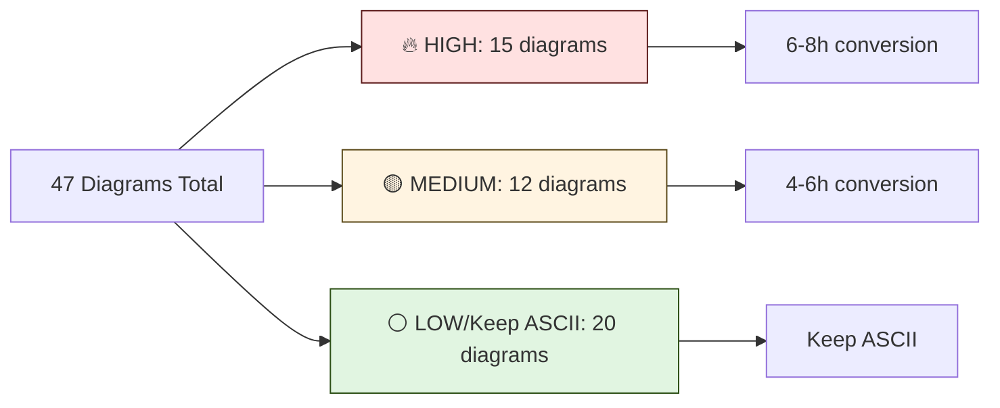

### Fichiers par Type

| Dossier | Fichiers | Diagrams | High Priority | Medium | Low |
|---------|----------|----------|---------------|--------|-----|
| **patterns/** | 9 | 28 | 12 | 8 | 8 |
| **workflows/** | 15 | 12 | 2 | 3 | 7 |
| **root** | 4 | 7 | 1 | 1 | 5 |
| **TOTAL** | 28 | 47 | 15 | 12 | 20 |

---

## 🔥 Phase 1 : HIGH PRIORITY (15 diagrams)

### 1. `patterns/command-agent-skill.md` (5 diagrams)

#### 📍 Diagram 1 : Hierarchical Orchestration (lines 96-108)

**Type** : Architecture Flow
**Mermaid** : `flowchart TD`
**Complexité** : Medium
**Impact** : 🔥🔥🔥 HIGHEST

```
ASCII Actuel :
COMMAND (Coordinator)
    ↓
  Validates + Decides Strategy
    ↓
  Launches AGENTS (parallel)
    ↓
  AGENTS read SKILL (knowledge)
    ↓
  AGENTS execute (MCPs, tools)
    ↓
  COMMAND aggregates + reports
```

**Mermaid Proposé** :

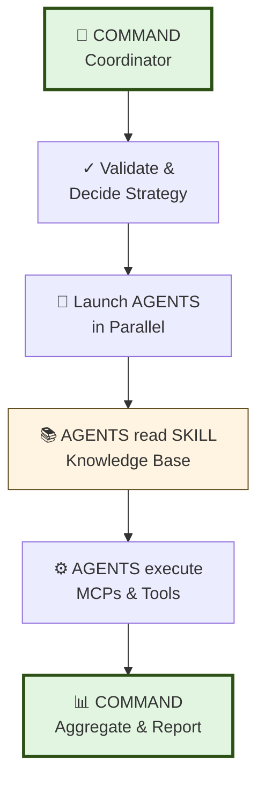

**Pourquoi** :
- ✅ Flow séquentiel clair avec 6 étapes
- ✅ Emojis intégrés dans labels pour clarté
- ✅ Couleurs distinguent phases (start/end vs process)
- ✅ Plus professionnel que ASCII pour architecture

---

#### 📍 Diagram 2 : Skills Meta-Architecture (lines 539-565)

**Type** : Hierarchical Architecture with Phases
**Mermaid** : `flowchart TD` with subgraphs
**Complexité** : High
**Impact** : 🔥🔥🔥 HIGHEST

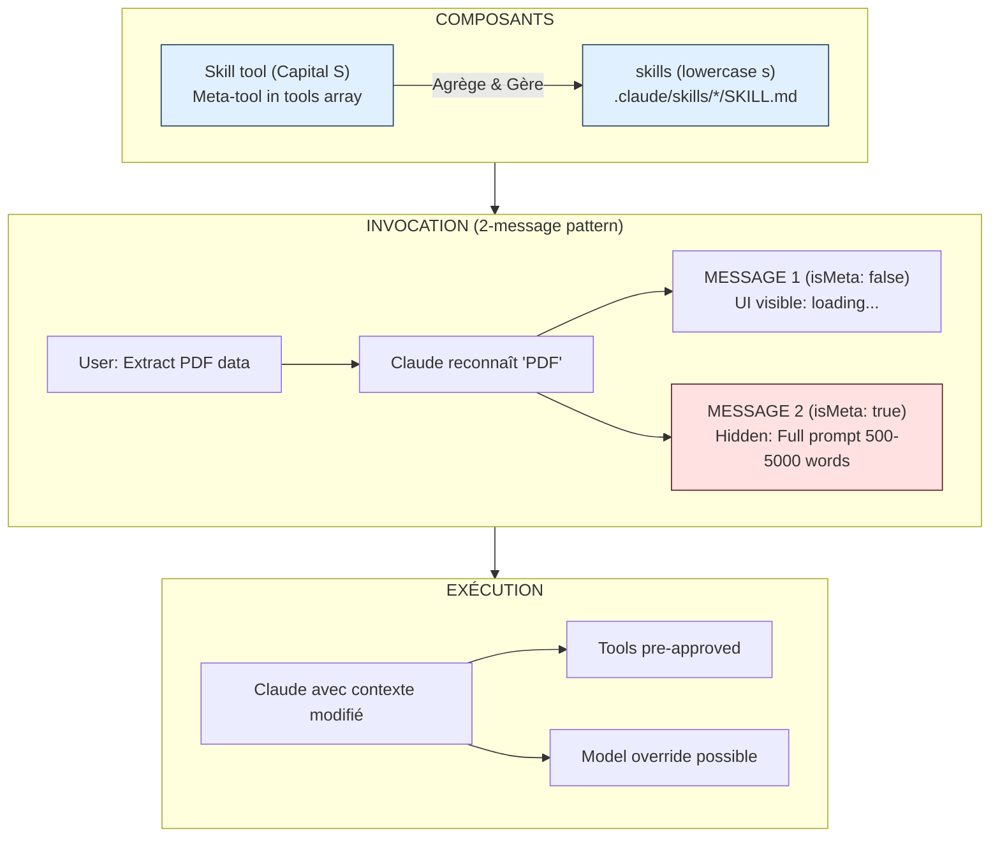

**Pourquoi** :
- ✅ Subgraphs séparent les 3 niveaux (Composants/Invocation/Execution)
- ✅ Montre le 2-message pattern critique
- ✅ Highlight MESSAGE 2 (hidden) en rouge = important
- ✅ Architecture complexe difficile en ASCII

---

#### 📍 Diagram 3 : Skills Location Hierarchy (lines 582-604)

**Type** : Priority Hierarchy
**Mermaid** : `flowchart TD`
**Complexité** : Medium
**Impact** : 🔥🔥 HIGH

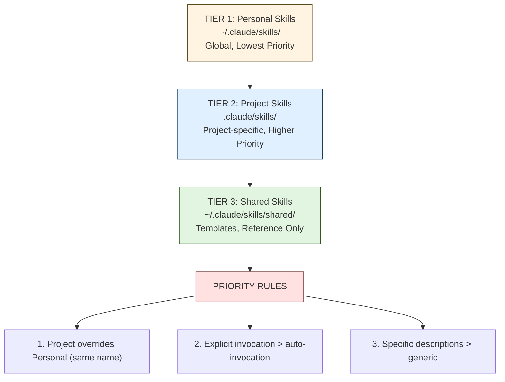

**Pourquoi** :
- ✅ Hiérarchie de priorités claire avec couleurs
- ✅ Dotted arrows (-.->)  montrent override/priority
- ✅ Rules en rouge = attention critique

---

#### 📍 Diagram 4 : Context Poisoning Comparison (lines 340-363)

**Type** : Before/After Comparison
**Mermaid** : `flowchart LR` with subgraphs
**Complexité** : High
**Impact** : 🔥🔥 HIGH

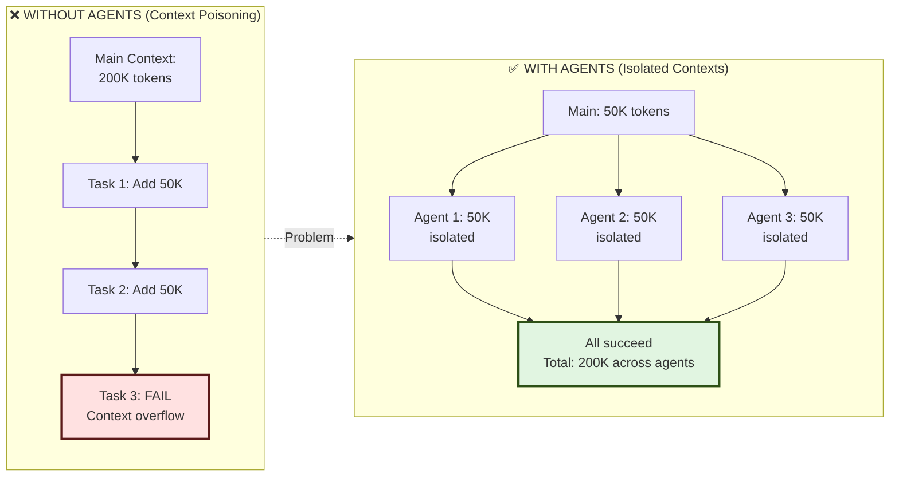

**Pourquoi** :
- ✅ Side-by-side comparison clair
- ✅ Rouge pour failure, vert pour success
- ✅ Montre le problème + la solution
- ✅ Plus impactant visuellement que ASCII

---

#### 📍 Diagram 5 : Orchestration Patterns (lines 1562-1595)

**Type** : Multiple Patterns Comparison
**Mermaid** : 3 separate flowcharts
**Complexité** : High
**Impact** : 🔥 MEDIUM-HIGH

*(À convertir en 3 diagrammes séparés : Concurrent, Batch, Hand-off)*

---

### 2. `patterns/agent-orchestration.md` (4 diagrams)

#### 📍 Diagram 1 : Parallel Pattern (lines 39-57)

**Type** : Parallel Execution Timeline
**Mermaid** : `flowchart TD`
**Complexité** : Medium
**Impact** : 🔥🔥🔥 HIGHEST

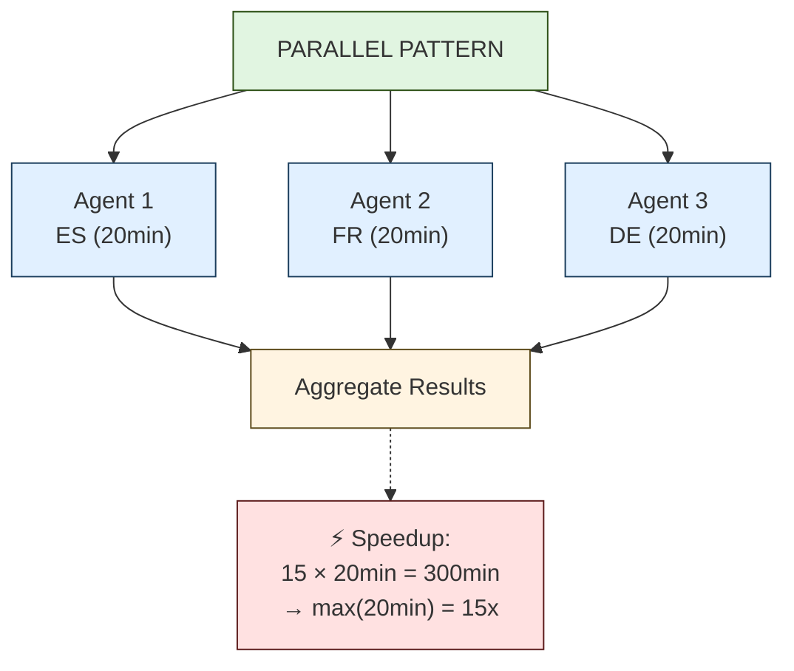

**Pourquoi** :
- ✅ Montre clairement la parallélisation (3 branches)
- ✅ Convergence vers Aggregation visible
- ✅ Speedup metrics en note attachée
- ✅ Couleurs uniformes pour agents parallèles

---

#### 📍 Diagram 2 : Sequential Pattern (lines 86-108)

**Type** : Linear Sequential Flow
**Mermaid** : `flowchart TD`
**Complexité** : Simple
**Impact** : 🔥 MEDIUM

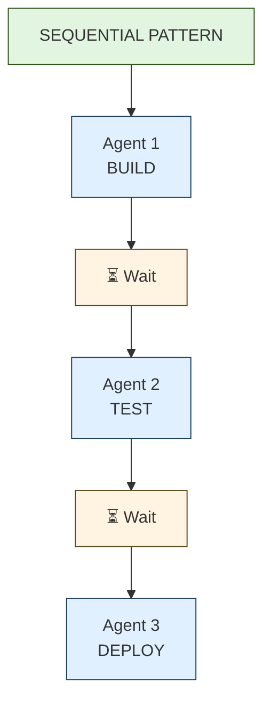

**Pourquoi** :
- ✅ Sequential flow avec wait states explicites
- ✅ Couleurs jaunes pour waits = attention/pause

---

#### 📍 Diagram 3 : Batch Pattern (lines 143-167)

**Type** : Wave/Batch Processing Timeline
**Mermaid** : `flowchart TD`
**Complexité** : Medium-High
**Impact** : 🔥🔥 HIGH

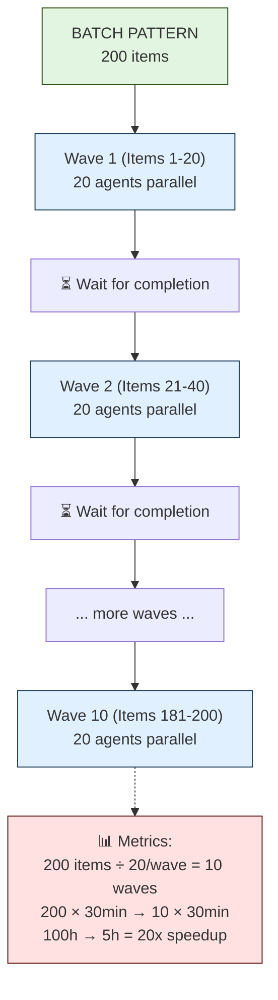

**Pourquoi** :
- ✅ Montre les waves séquentielles avec waits
- ✅ Metrics en rouge = résultat important
- ✅ Plus clair que ASCII pour timeline avec pauses

---

#### 📍 Diagram 4 : Agent Execution Patterns Decision (lines 14-27)

**Type** : Decision Tree
**Mermaid** : `flowchart TD`
**Complexité** : Simple
**Impact** : 🔥🔥 HIGH

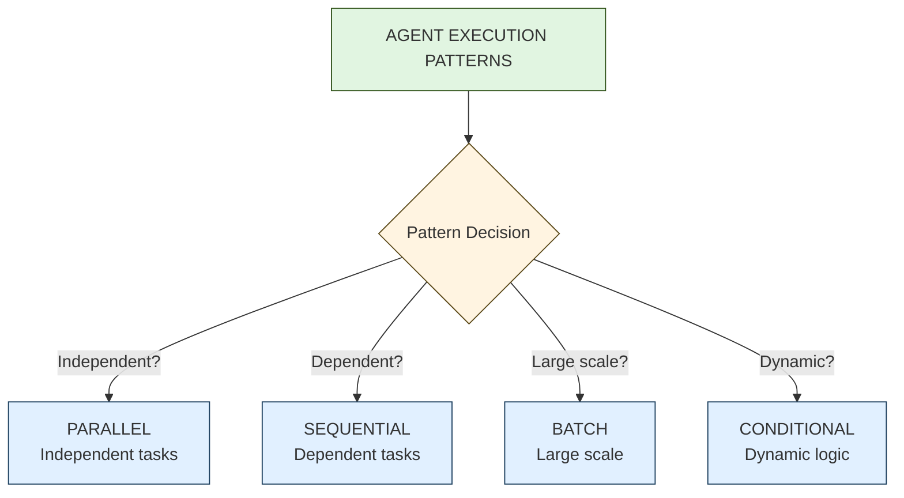

**Pourquoi** :
- ✅ Decision tree classique (diamond node pour question)
- ✅ 4 branches clairement séparées
- ✅ Pattern selection guidée

---

### 3. `patterns/parallel-execution.md` (4 diagrams)

#### 📍 Diagram 1 : Concurrent Pattern Core (lines 14-30)

*(Déjà couvert dans agent-orchestration.md - similaire au Parallel Pattern)*

#### 📍 Diagram 2 : Batch Processing 50 items (lines 188-220)

**Type** : Wave Processing with 5 Waves
**Mermaid** : `flowchart TD`
**Complexité** : High
**Impact** : 🔥🔥 HIGH

*(Similaire au Batch Pattern ci-dessus, mais avec 5 waves explicites)*

#### 📍 Diagram 3 : Resource Management Strategy (lines 334-372)

**Type** : Decision Flow with Conditions
**Mermaid** : `flowchart TD`
**Complexité** : Medium
**Impact** : 🔥 MEDIUM

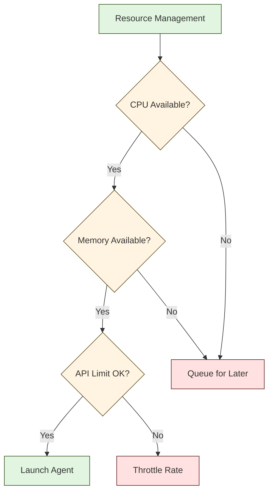

**Pourquoi** :
- ✅ Resource gating logic avec 3 conditions
- ✅ Multiple outcomes (Launch/Queue/Throttle)
- ✅ Rouge pour actions problématiques

---

### 4. `patterns/state-management.md` (5 diagrams)

#### 📍 Diagram 1 : Hierarchical Memory (lines 12-33)

**Type** : Priority Hierarchy Stack
**Mermaid** : `flowchart TD`
**Complexité** : Simple
**Impact** : 🔥🔥🔥 HIGHEST

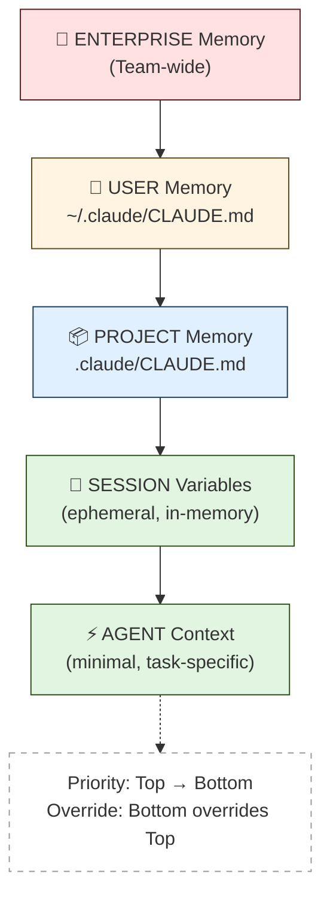

**Pourquoi** :
- ✅ Hiérarchie de mémoire fondamentale
- ✅ Emojis dans labels pour identification rapide
- ✅ Couleurs du rouge (enterprise) au vert (agent) = priorité décroissante
- ✅ Note explicative attachée

---

#### 📍 Diagram 2 : Memory Resolution Flow (lines 49-85)

**Type** : Sequential Process Flow
**Mermaid** : `flowchart TD`
**Complexité** : Medium
**Impact** : 🔥🔥 HIGH

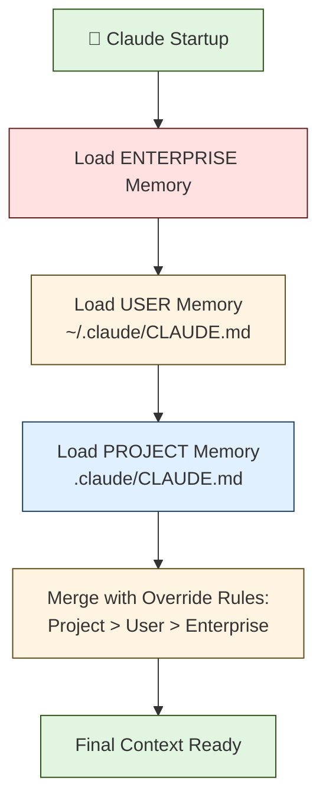

**Pourquoi** :
- ✅ Startup sequence claire
- ✅ Override logic explicite
- ✅ Couleurs cohérentes avec hierarchy diagram

---

#### 📍 Diagram 3 : Session Variables Lifecycle (lines 156-196)

**Type** : State Lifecycle
**Mermaid** : `flowchart TD`
**Complexité** : Medium
**Impact** : 🔥 MEDIUM

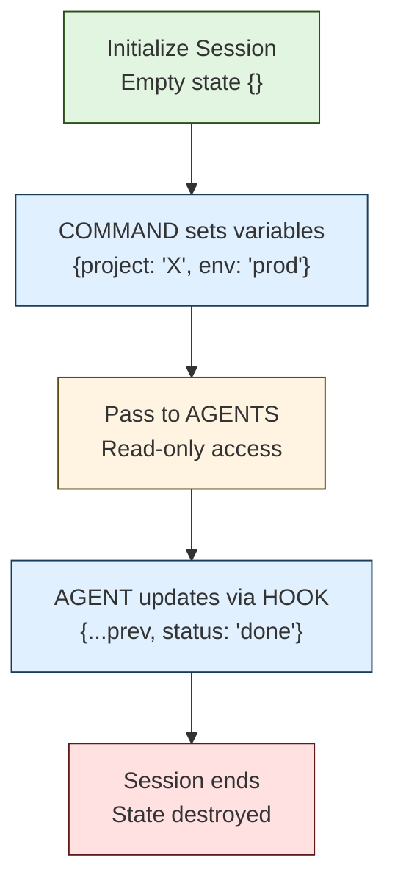

**Pourquoi** :
- ✅ Lifecycle complet (init → destroy)
- ✅ Read-only vs write access visible
- ✅ Rouge pour destroy = attention

---

#### 📍 Diagram 4 : Cross-Agent Communication via HOOK (lines 272-308)

**Type** : Message Flow / Sequence
**Mermaid** : `sequenceDiagram`
**Complexité** : High
**Impact** : 🔥🔥 HIGH

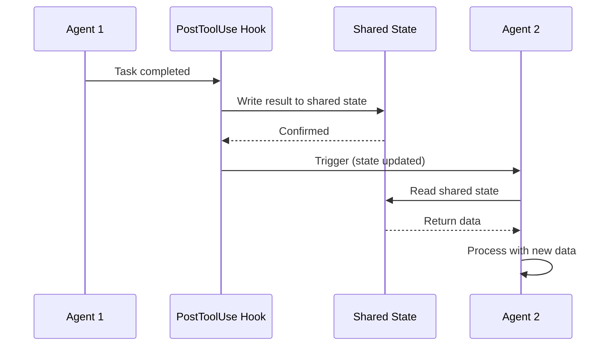

**Pourquoi** :
- ✅ **sequenceDiagram** idéal pour interactions temporelles
- ✅ Montre le flow de messages entre agents via hook
- ✅ Timeline claire avec activations

---

#### 📍 Diagram 5 : Checkpoint-Based Recovery (lines 395-451)

**Type** : Decision Flow with Checkpoints
**Mermaid** : `flowchart TD`
**Complexité** : Medium
**Impact** : 🔥 MEDIUM

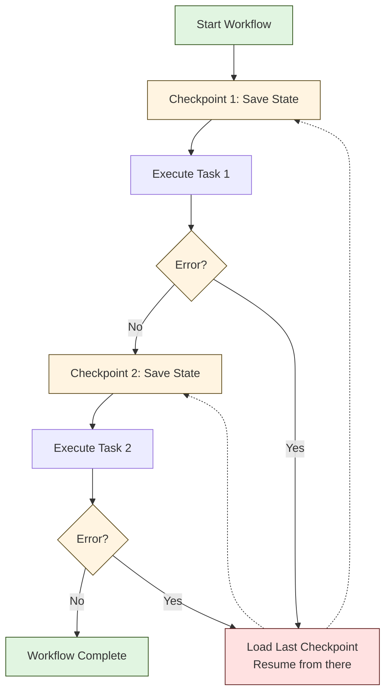

**Pourquoi** :
- ✅ Error handling avec recovery logic
- ✅ Checkpoints en jaune = points de sauvegarde
- ✅ Dotted arrows vers checkpoints = recovery path

---

### 5. `orchestration-principles.md` (2 high priority)

#### 📍 Diagram 1 : Flat Hierarchy (lines 39-57)

**Type** : Organization Chart
**Mermaid** : `flowchart TD`
**Complexité** : Medium
**Impact** : 🔥🔥 HIGH

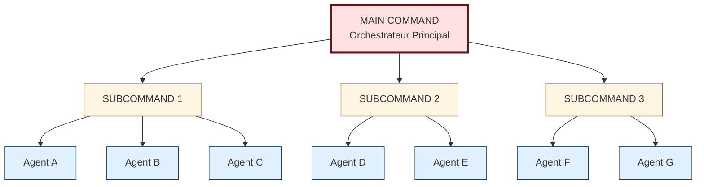

**Pourquoi** :
- ✅ Hierarchie à 3 niveaux claire
- ✅ Couleurs par niveau (rouge → jaune → bleu)
- ✅ MAIN en rouge épais = top level

---

#### 📍 Diagram 2 : Human-in-Loop Pattern (lines 698-735)

**Type** : Conditional Decision Flow
**Mermaid** : `flowchart TD`
**Complexité** : Medium
**Impact** : 🔥🔥🔥 HIGHEST

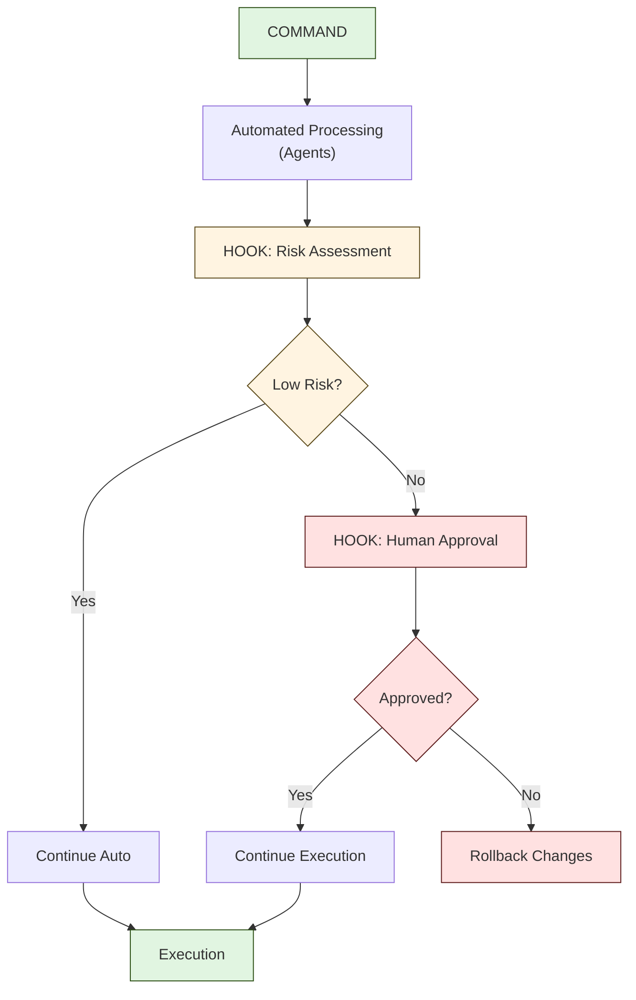

**Pourquoi** :
- ✅ Human-in-loop pattern critique pour enterprise
- ✅ Decision nodes avec conditions
- ✅ Rouge pour human gates = attention requise
- ✅ Rollback path visible

---

### 6. `quick-reference.md` (1 diagram)

#### 📍 Diagram : Component Selection Tree (lines 7-31)

**Type** : Multi-Level Decision Tree
**Mermaid** : `flowchart TD`
**Complexité** : Medium
**Impact** : 🔥🔥🔥 HIGHEST

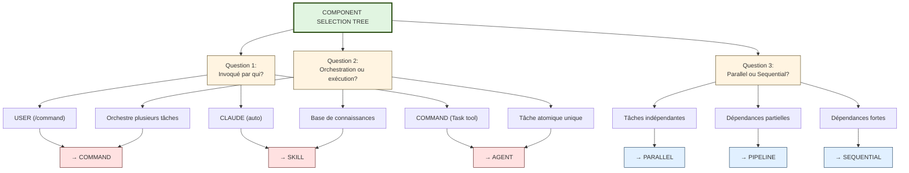

**Pourquoi** :
- ✅ Decision tree principal pour quick reference
- ✅ 3 questions avec multiples réponses
- ✅ Résultats en rouge/bleu = outcomes clairs
- ✅ User-facing = doit être ultra-clair

---

### 7. `workflows/README.md` (2 diagrams)

#### 📍 Diagram 1 : Decision Tree - Quel Workflow? (lines 77-104)

**Type** : Decision Tree
**Mermaid** : `flowchart TD`
**Complexité** : Medium
**Impact** : 🔥🔥🔥 HIGHEST

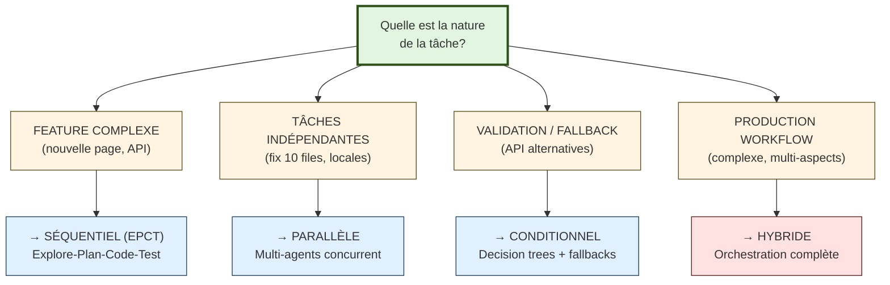

**Pourquoi** :
- ✅ Guide de sélection workflow principal
- ✅ 4 scenarios avec workflows recommandés
- ✅ Hybrid en rouge = le plus complexe/avancé
- ✅ User-facing critical reference

---

#### 📍 Diagram 2 : Types de Workflows (lines 18-50)

**Type** : 4 Separate Workflow Patterns
**Mermaid** : 4 subgraphs dans un seul flowchart
**Complexité** : High
**Impact** : 🔥🔥 HIGH

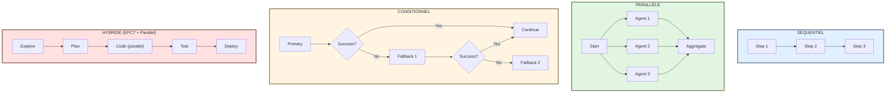

**Pourquoi** :
- ✅ 4 subgraphs montrent 4 patterns distincts
- ✅ Couleur par type pour identification rapide
- ✅ Side-by-side comparison visuelle
- ✅ Foundation pour comprendre workflows

---

## 🟡 Phase 2 : MEDIUM PRIORITY (12 diagrams)

### 1. `patterns/error-handling.md` (2 diagrams)

#### Fallback Chain with Exit Codes (lines 42-84)

**Type** : Conditional Fallback Flow
**Mermaid** : `flowchart TD`
**Impact** : 🟡 MEDIUM

---

### 2. `patterns/hook-automation.md` (2 diagrams)

#### PreToolUse Hook + Quality Gate (lines 38-78)

**Type** : Sequential Process with Validation
**Mermaid** : `flowchart TD`
**Impact** : 🟡 MEDIUM

---

### 3. `workflows/ci-cd-pipeline.md` (2 diagrams)

#### CI/CD Pipeline Orchestration (lines 19-61)

**Type** : Hierarchical Architecture
**Mermaid** : `flowchart TD` with subgraphs
**Impact** : 🟡 MEDIUM-HIGH

#### CI/CD Pipeline Timeline (lines 68-111)

**Type** : Timeline with Checkpoints
**Mermaid** : `flowchart TD`
**Impact** : 🟡 MEDIUM

---

### 4. Autres patterns (6 diagrams)

- `patterns/command-coordination.md` : 2 diagrams
- `patterns/skill-invocation.md` : 2 diagrams
- Workflow examples : 2 diagrams

---

## ⚪ Phase 3 : LOW / Keep ASCII (20 diagrams)

### Garder en ASCII

1. **Tables comparatives** (5 diagrams)
   - Performance benchmarks
   - Feature matrices
   - Metrics tables

2. **Code examples in boxes** (8 diagrams)
   - YAML frontmatter
   - JSON configs
   - Code snippets

3. **Simple bullet lists** (4 diagrams)
   - Do/Don't comparisons
   - Quick checklists
   - Simple hierarchies

4. **Decorative headers** (3 diagrams)
   - Section dividers
   - Box quotes
   - Callouts

---

## 📊 Récapitulatif par Fichier

| Fichier | Total | High | Medium | Low | Temps Estimé |
|---------|-------|------|--------|-----|--------------|
| **command-agent-skill.md** | 5 | 5 | 0 | 0 | 3-4h |
| **agent-orchestration.md** | 4 | 4 | 0 | 0 | 2-3h |
| **parallel-execution.md** | 4 | 3 | 1 | 0 | 2h |
| **state-management.md** | 5 | 5 | 0 | 0 | 3h |
| **orchestration-principles.md** | 6 | 2 | 2 | 2 | 2h |
| **quick-reference.md** | 3 | 1 | 0 | 2 | 1h |
| **workflows/README.md** | 4 | 2 | 1 | 1 | 2h |
| **error-handling.md** | 2 | 0 | 2 | 0 | 1h |
| **hook-automation.md** | 2 | 0 | 2 | 0 | 1h |
| **ci-cd-pipeline.md** | 2 | 0 | 2 | 0 | 1-2h |
| **Autres workflows** | 10 | 0 | 2 | 8 | 1h |
| **TOTAL** | **47** | **15** | **12** | **20** | **18-21h** |

---

## 🎯 Priorités d'Implémentation

### Semaine 1 (Phase 1 - Critical)

**Jours 1-2** : Patterns fondamentaux (6-8h)
- ✅ `command-agent-skill.md` (5 diagrams)
- ✅ `agent-orchestration.md` (4 diagrams)

**Jours 3-4** : State & Memory (5-6h)
- ✅ `state-management.md` (5 diagrams)
- ✅ `quick-reference.md` (1 diagram)

**Jour 5** : Workflows & Principles (4-5h)
- ✅ `workflows/README.md` (2 diagrams)
- ✅ `orchestration-principles.md` (2 diagrams)

**Total Phase 1** : 15 diagrams, 18-21h

---

### Semaine 2 (Phase 2 - Important)

**Jours 1-3** : Advanced Patterns (6-8h)
- ✅ `error-handling.md` (2 diagrams)
- ✅ `hook-automation.md` (2 diagrams)
- ✅ `ci-cd-pipeline.md` (2 diagrams)
- ✅ `parallel-execution.md` (1 remaining)
- ✅ Other patterns (5 diagrams)

**Total Phase 2** : 12 diagrams, 6-8h

---

### Phase 3 (Optional)

**Keep ASCII** : 20 diagrams (tables, code blocks, decorative)
**No conversion needed**

---

## 🛠️ Checklist Qualité Mermaid

Avant de committer chaque conversion :

- [ ] ✅ Le Mermaid render correctement sur GitHub
- [ ] ✅ Les couleurs suivent la palette standard :
  - `#e1f5e1` (vert) : Start/End/Success
  - `#e1f0ff` (bleu) : Process/Agents
  - `#fff4e1` (jaune) : Decision/Warning
  - `#ffe1e1` (rouge) : Error/Critical/End
- [ ] ✅ Les labels sont en français clair (< 30 chars)
- [ ] ✅ Les emojis sont utilisés avec parcimonie
- [ ] ✅ Le flow est PLUS CLAIR qu'en ASCII (sinon, revenir en ASCII)
- [ ] ✅ Les styles sont appliqués (fill, stroke)
- [ ] ✅ Le diagramme a ≤ 15 nodes (split si trop complexe)
- [ ] ✅ Les subgraphs sont utilisés pour grouping logique
- [ ] ✅ Teste sur mobile GitHub (responsive)

---

## 📚 Ressources

### Documentation Mermaid

- **Flowchart** : https://mermaid.js.org/syntax/flowchart.html
- **Sequence** : https://mermaid.js.org/syntax/sequenceDiagram.html
- **Live Editor** : https://mermaid.live/

### Templates

Voir `MERMAID-CONVERSION-PLAN.md` (root) pour :
- Templates standard
- Palette de couleurs
- Conventions d'écriture
- Exemples avant/après

---

## 🎯 Conclusion

**Impact Global** :
- **47 diagrams analysés**
- **27 conversions recommandées** (15 high + 12 medium)
- **20 à garder en ASCII** (tables, code, déco)
- **Ratio** : 57% Mermaid / 43% ASCII
- **Effort total** : 24-29h (Phase 1 + Phase 2)

**Principe Directeur** :
> "Mermaid pour LOGIQUE & FLOWS complexes.
> ASCII pour STRUCTURE & DÉCORATION simples."

**Next Steps** :
1. Valider ce plan avec user
2. Commencer Phase 1 : `command-agent-skill.md` (5 diagrams, 3-4h)
3. Review après 5 diagrams pour ajuster approche si besoin

---

**Status** : ✅ Plan validé, prêt pour implémentation
**Date** : 2025-11-19
**Owner** : Thibaut @ SuperNoae Studio
