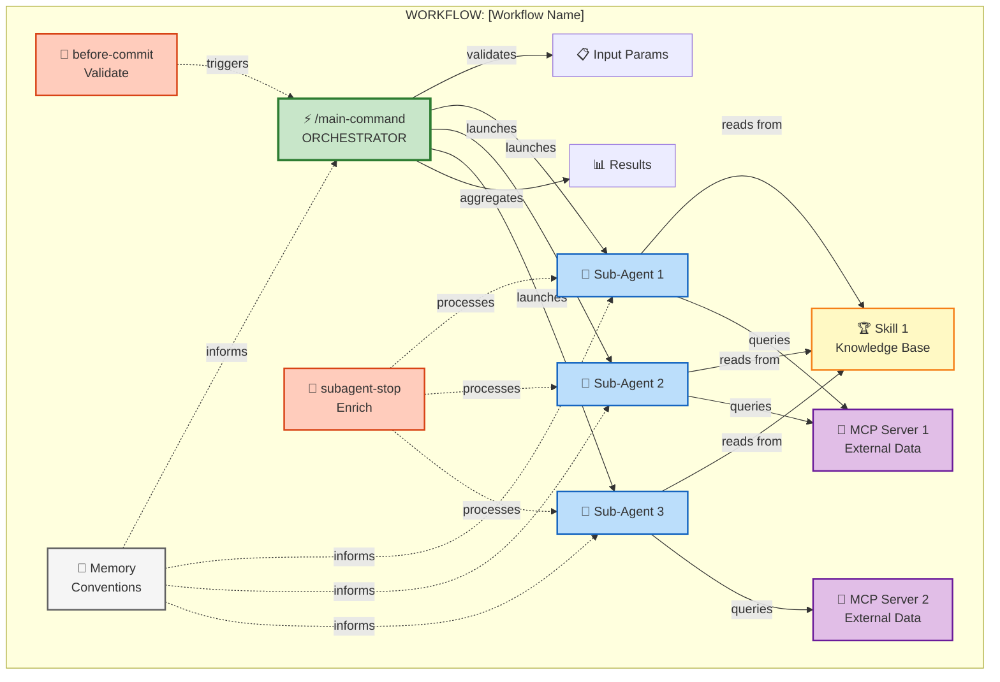
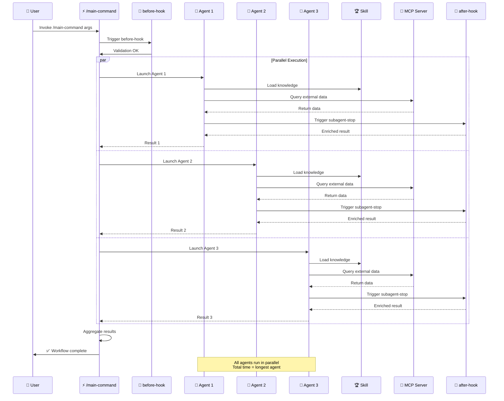
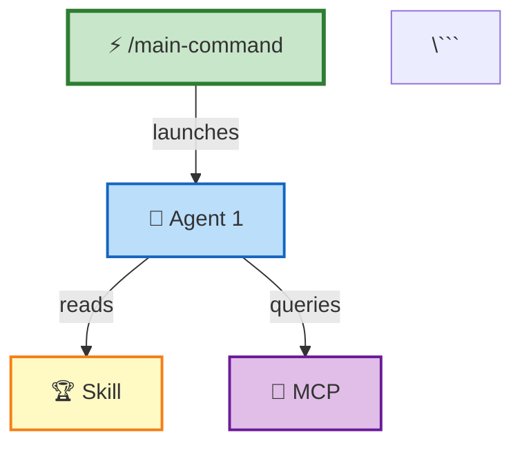

# 📋 Workflow Structure Template - Detailed Guide

> **Guide détaillé complet** pour structurer workflows Claude Code selon la philosophie Dan.
>
> **Need quick templates?** → [STRUCTURE-QUICK-REFERENCE.md](./STRUCTURE-QUICK-REFERENCE.md) (copy/paste)

---

## ⚡ Quick Links

- 📄 **[Quick Reference](./STRUCTURE-QUICK-REFERENCE.md)** - Copy/paste templates
- 📚 **[Core 4 & Fundamentals](../themes/8-advanced/core-4-fundamentals.md)** - Philosophy Dan
- 🎯 **[Decision Trees](../themes/8-advanced/decision-trees.md)** - When to use what
- 🏗️ **[Pattern Guide](./patterns/command-agent-skill.md)** - Real example

---

## 📦 Structure Standard d'un Workflow

**7 Sections Requises** (dans cet ordre) :

```
1. 📋 Component Inventory (Inventaire des Features)
2. 🏗️ Component Roles (Rôles et Responsabilités)
3. 📊 Architecture Diagram (Mermaid)
4. 🔄 Workflow Flow (Mermaid Sequence)
5. 💻 Implementation (Code)
6. 🎯 Usage Examples
7. 📚 References
```

**Philosophy Dan** : Start with /command → Test → Compose IF needed

---

## 1️⃣ Component Inventory Template

**Copiez cette section au DÉBUT de chaque workflow** :

### 📦 Component Inventory

#### ⚡ Slash Commands

| Command | File | Purpose | Trigger |
|---------|------|---------|---------|
| `/command-name` | `.claude/commands/command-name.md` | Brief description | 👤 Manual |
| `/subcommand-name` | `.claude/commands/subcommand-name.md` | Brief description | 👤 Manual |

**Total Commands** : X

#### 🤖 Skills

| Skill | File | Purpose | Type |
|-------|------|---------|------|
| `@skill-name` | `.claude/skills/skill-name/SKILL.md` | Brief description | 📚 Knowledge Base / 🏗️ Composition |

**Total Skills** : X

#### 🧑‍💼 Sub-Agents

| Agent | Invoked By | Purpose | Parallel |
|-------|-----------|---------|----------|
| `@agent-name` | `/command-name` | Brief description | ✅ YES / ❌ NO |

**Total Agents** : X

#### 🔌 MCP Servers

| MCP Server | Purpose | Tools Used | External Service |
|-----------|---------|------------|------------------|
| `mcp-server-name` | Brief description | `tool1`, `tool2` | API/DB name |

**Total MCP Servers** : X

#### 🎣 Hooks

| Hook | File | Event | Purpose |
|------|------|-------|---------|
| `hook-name` | `.claude/hooks/hook-name.md` | `before-commit` / `after-mcp` / etc. | Brief description |

**Total Hooks** : X

#### 🔌 Plugins

| Plugin | Source | Purpose | Components |
|--------|--------|---------|------------|
| `plugin-name` | npm / GitHub / Local | Brief description | Commands + Skills + Hooks |

**Total Plugins** : X

#### 🧠 Memory

| Memory Type | File | Purpose | Scope |
|------------|------|---------|-------|
| User | `~/.claude/CLAUDE.md` | Global preferences | All projects |
| Project | `.claude/CLAUDE.md` | Project-specific config | Current project |
| Enterprise | Workspace | Team standards | Organization |

---

## 2️⃣ Component Roles Template

**Expliquez le rôle de chaque feature** :

### 🏗️ Component Roles

#### Main Orchestrator: `/command-name`

**Role** : Orchestrate the entire workflow
**Responsibilities** :
- Validate input parameters
- Launch sub-agents in parallel
- Aggregate results
- Handle errors

**Why /command** :
- 👤 Manual trigger (YOU control WHEN)
- ⚡ Primitive (base unit)
- 🏗️ Orchestration layer

#### Skills: `@skill-name`

**Role** : Shared knowledge base
**Type** :
- 📚 **Knowledge Base** : Domain-specific context (like extended CLAUDE.md)
- 🏗️ **Composition Layer** : Orchestrates commands/MCP/agents

**Why Skill** :
- 🤖 Auto-invoked (AGENT decides WHEN)
- 📈 Progressive Disclosure (efficient context loading)
- 🔄 Reusable across multiple commands/agents

#### Sub-Agents: `@agent-name`

**Role** : Parallel execution unit
**Responsibilities** :
- Process individual tasks independently
- Isolated context (no shared state)
- Return results to orchestrator

**Why Sub-Agents** :
- ⚡ Parallelizable (20+ simultaneous)
- 🔒 Isolated context
- 🎯 Single responsibility

#### MCP Servers: `mcp-server-name`

**Role** : External data source
**Provides** :
- API access (REST, GraphQL)
- Database queries (SQL, NoSQL)
- File operations (read/write)

**Why MCP** :
- 🔌 External data needed
- 🔀 Both manual and auto trigger
- ⚠️ Context explosion risk (use with Skills for progressive disclosure)

#### Hooks: `hook-name`

**Role** : Event-driven automation
**Triggers** :
- `before-commit` : Validate before git commit
- `after-mcp-call` : Process MCP responses
- `subagent-stop` : Enrich agent results
- `command-complete` : Post-workflow actions

**Why Hooks** :
- 🤖 Auto-triggered (AGENT decides WHEN)
- 🎯 Event-driven (react to lifecycle events)
- 🔒 Validation/Enrichment layer

#### Memory: `.claude/CLAUDE.md`

**Role** : Persistent preferences and conventions
**Stores** :
- Code style preferences
- Commit message format
- Tech stack conventions
- API endpoints

**Why Memory** :
- 📝 Static configuration (not workflows)
- 🔄 Reusable conventions
- 🎯 DRY principle (Don't Repeat Yourself)

---

## 3️⃣ Architecture Diagram Template

**Mermaid diagram showing hierarchy** :



### Legend

| Symbol | Meaning |
|--------|---------|
| ⚡ | Slash Command (Manual trigger) |
| 🤖 | Sub-Agent (Parallel execution) |
| 🏆 | Skill (Knowledge Base + Composition) |
| 🔌 | MCP Server (External data) |
| 🎣 | Hook (Auto-trigger event) |
| 🧠 | Memory (Preferences/Conventions) |
| `─>` | Direct invocation |
| `-.->` | Indirect influence |

---

## 4️⃣ Workflow Flow Template

**Mermaid sequence diagram showing execution flow** :



### Timeline Example

```
T+0min   : User invokes /main-command
T+0min   : before-hook validates
T+1min   : Launch 3 agents in parallel
T+1-10min: Agents process (simultaneous)
           ├─> Agent 1: 8min
           ├─> Agent 2: 10min (longest)
           └─> Agent 3: 6min
T+11min  : Aggregate results
T+12min  : ✅ Complete (total: 12min)
```

**Key** : Parallel = Total time = Longest agent (not sum of all agents)

---

## 5️⃣ Implementation Template

### File Structure

```
project/
├── .claude/
│   ├── CLAUDE.md                    # Memory (conventions)
│   ├── commands/
│   │   ├── main-command.md          # Main orchestrator
│   │   └── subcommand.md            # Sub-command (if needed)
│   ├── skills/
│   │   └── skill-name/
│   │       ├── SKILL.md             # Skill definition
│   │       └── references/          # Knowledge base
│   │           ├── knowledge.md
│   │           └── sources.yaml
│   ├── hooks/
│   │   ├── before-commit.md         # Validation hook
│   │   └── subagent-stop.md         # Enrichment hook
│   └── config.json                  # MCP server config
└── workflow-docs/
    └── this-workflow.md             # This documentation
```

### Code: Main Command

```markdown
<!-- .claude/commands/main-command.md -->

# Main Command: [Name]

## Description
Brief description of what this command does.

## Arguments
- `arg1` - Description
- `arg2` - Description (optional)

## Workflow

1. Validate input parameters
2. Launch sub-agents in parallel
3. Aggregate results
4. Return output

## Implementation

Task tool invocations:
- `subagent_type`: '@agent-1'
- `subagent_type`: '@agent-2'
- `subagent_type`: '@agent-3'

Parallel execution via multiple Task calls in single message.

## Example

```bash
/main-command arg1 arg2
```
```

### Code: Sub-Agent (Skill)

```markdown
<!-- .claude/skills/agent-name/SKILL.md -->

# Agent Skill: [Name]

## Role
Brief description of agent's responsibility.

## Context
What knowledge this agent needs to complete its task.

## Process
1. Step 1
2. Step 2
3. Step 3

## External Dependencies
- MCP Server: `mcp-server-name` (for external data)
- Skill: `@shared-knowledge` (for common context)

## Output
What this agent returns to orchestrator.
```

### Code: MCP Configuration

```json
// .claude/config.json
{
  "mcpServers": {
    "mcp-server-name": {
      "command": "npx",
      "args": ["-y", "@scope/mcp-server"],
      "env": {
        "API_KEY": "from-1password-or-env"
      }
    }
  }
}
```

### Code: Hook

```markdown
<!-- .claude/hooks/before-commit.md -->

# Before Commit Hook

## Trigger
Automatically runs before git commit.

## Purpose
Validate code before committing.

## Steps
1. Scan for secrets/credentials
2. Validate commit message format
3. Run tests (optional)
4. Block commit if fail

## Implementation

Check patterns:
- Secrets: `API_KEY`, `PASSWORD`, `SECRET`
- Commit format: `<type>(<scope>): <message>`

If invalid → Block commit with error message.
```

---

## 6️⃣ Usage Examples Template

### Example 1: Basic Usage

```bash
# Invoke main command
/main-command arg1 arg2

# Expected output:
Processing...
✅ Agent 1 complete (8min)
✅ Agent 2 complete (10min)
✅ Agent 3 complete (6min)
Aggregating results...
✅ Workflow complete (12min total)

Results:
- Result 1: [output]
- Result 2: [output]
- Result 3: [output]
```

### Example 2: With Options

```bash
# Invoke with additional options
/main-command arg1 arg2 --parallel=5 --verbose

# Launches 5 agents in parallel with verbose logging
```

### Example 3: Error Handling

```bash
# If validation fails
/main-command invalid-arg

# Output:
❌ Error: Invalid argument 'invalid-arg'
Expected: [format description]

# If agent fails
/main-command arg1 arg2

# Output:
⚠️ Agent 2 failed: [error message]
Retrying...
✅ Agent 2 complete (retry successful)
```

---

## 7️⃣ References Template

### Internal Documentation

- 📄 [Core 4 & Fundamentals](../themes/8-advanced/core-4-fundamentals.md) - Base philosophy
- 📄 [Decision Trees](../themes/8-advanced/decision-trees.md) - Feature selection
- 📄 [Commands Guide](../themes/2-commands/guide.md) - Slash commands
- 📄 [Skills Guide](../themes/4-skills/guide.md) - Agent skills
- 📄 [Agents Guide](../themes/6-agents/guide.md) - Sub-agents
- 📄 [MCP Guide](../themes/5-mcp/guide.md) - MCP servers
- 📄 [Hooks Guide](../themes/3-hooks/guide.md) - Hooks

### External Resources

- 📄 [Claude Code Docs](https://code.claude.com/docs) - Official documentation
- 📄 [MCP Protocol](https://modelcontextprotocol.io/) - MCP specification
- 🎥 [Dan - Skills vs Commands](../../ressources/videos/skills-vs-slash-commands-vs-subagents-vs-mcp-dan.md) - Philosophy

### Related Workflows

- 📄 [Similar Workflow 1](./similar-workflow-1.md)
- 📄 [Similar Workflow 2](./similar-workflow-2.md)

---

## 🎯 Checklist: Creating a New Workflow

Avant de créer un workflow, vérifiez :

- [ ] ✅ **Component Inventory** : Listé tous les commands, skills, agents, MCP, hooks, plugins
- [ ] ✅ **Component Roles** : Expliqué le rôle de chaque feature
- [ ] ✅ **Architecture Diagram** : Mermaid graph showing hierarchy
- [ ] ✅ **Workflow Flow** : Mermaid sequence showing execution
- [ ] ✅ **File Structure** : Documented file locations
- [ ] ✅ **Implementation Code** : Complete code examples
- [ ] ✅ **Usage Examples** : Real usage scenarios
- [ ] ✅ **References** : Links to docs and related workflows
- [ ] ✅ **Dan's Philosophy** : Started with /command, validated, then composed to Skill if needed
- [ ] ✅ **Parallel Execution** : Used sub-agents for parallelizable tasks
- [ ] ✅ **Progressive Disclosure** : Used Skills (not MCP alone) for efficient context

---

## 💡 Tips

**DO ✅** :
1. Start with `/command` (the primitive)
2. Use sub-agents for **parallel** tasks only
3. Use Skills for **progressive disclosure** (efficient context)
4. Use Hooks for **auto-trigger** events
5. Use MCP **with Skills** (avoid context explosion)
6. Document **ALL** components in inventory

**DON'T ❌** :
1. Skip `/command` and start with Skill (over-engineering)
2. Use agents for **sequential** tasks (use direct execution)
3. Use MCP alone (context explosion risk)
4. Forget to list components at the beginning
5. Mix manual and auto triggers without clarity

---

## 📚 Template Files

### Copy-Paste: Component Inventory Section

```markdown
## 📦 Component Inventory

### ⚡ Slash Commands
| Command | File | Purpose | Trigger |
|---------|------|---------|---------|
| `/cmd` | `.claude/commands/cmd.md` | Description | 👤 Manual |

**Total** : 1

### 🤖 Skills
| Skill | File | Purpose | Type |
|-------|------|---------|------|
| `@skill` | `.claude/skills/skill/SKILL.md` | Description | 📚 Knowledge Base |

**Total** : 1

### 🧑‍💼 Sub-Agents
| Agent | Invoked By | Purpose | Parallel |
|-------|-----------|---------|----------|
| `@agent` | `/cmd` | Description | ✅ YES |

**Total** : 1

### 🔌 MCP Servers
| MCP | Purpose | Tools | External |
|-----|---------|-------|----------|
| `mcp` | Description | `tool1` | API |

**Total** : 1

### 🎣 Hooks
| Hook | File | Event | Purpose |
|------|------|-------|---------|
| `hook` | `.claude/hooks/hook.md` | `before-commit` | Description |

**Total** : 1

### 🔌 Plugins
| Plugin | Source | Purpose | Components |
|--------|--------|---------|------------|
| `plugin` | npm | Description | Cmds+Skills |

**Total** : 1

### 🧠 Memory
| Type | File | Purpose | Scope |
|------|------|---------|-------|
| Project | `.claude/CLAUDE.md` | Config | Current |

**Total** : 1
```

### Copy-Paste: Mermaid Architecture

```markdown


### Copy-Paste: Mermaid Sequence

```markdown
```mermaid
sequenceDiagram
    participant U as 👤 User
    participant CMD as ⚡ Command
    participant SA as 🤖 Agent
    participant MCP as 🔌 MCP

    U->>CMD: Invoke /command
    CMD->>SA: Launch agent
    SA->>MCP: Query data
    MCP-->>SA: Return data
    SA-->>CMD: Result
    CMD->>U: ✅ Complete
\```
```

---

## 🎓 Points Clés

1. **TOUJOURS** lister les components au début (inventory + roles)
2. **TOUJOURS** inclure Mermaid diagrams (architecture + flow)
3. **TOUJOURS** suivre Dan's Golden Rule : /command → Test → Compose to Skill IF needed
4. **Clarté** : Reader should understand structure in < 2 minutes
5. **Cohérence** : Use same structure across ALL workflows

---

**Ce template est LA référence** pour tous les workflows du projet. Utilisez-le systématiquement ! 🚀
