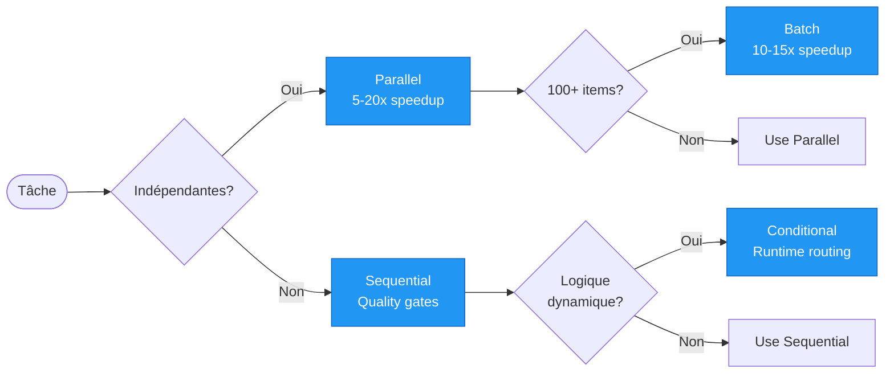

## 🎯 Bienvenue

Cette documentation fournit des **visualisations avancées** des patterns d'orchestration et workflows réels pour **Claude Code** (Anthropic 2025).

Chaque pattern et workflow dispose de **3 fichiers Quarto (.qmd)** avec diagrammes Mermaid interactifs :

- **overview.qmd** - Vue d'ensemble et concepts
- **diagrams.qmd** - Diagrammes visuels (flowcharts, sequence, state, Gantt)
- **examples.qmd** - Exemples concrets avec code

## 📚 Patterns d'Orchestration

Les **patterns** définissent comment orchestrer l'exécution d'agents Claude Code.

### [Agent Orchestration](patterns/agent-orchestration/overview.qmd)

Optimiser l'exécution d'agents pour maximiser performance, qualité et coût.

**4 patterns d'exécution** :



- **Parallel** : Tâches indépendantes (15x speedup)
- **Sequential** : Dépendances strictes (quality > speed)
- **Batch** : Large scale 100+ items (waves de 10-20)
- **Conditional** : Routing dynamique basé sur contexte

[📖 Overview](patterns/agent-orchestration/overview.qmd) | [📊 Diagrams](patterns/agent-orchestration/diagrams.qmd) | [💻 Examples](patterns/agent-orchestration/examples.qmd)

---

### [Command Coordination](patterns/command-coordination/overview.qmd)

Principe fondamental d'Anthropic : **"COMMAND orchestrate, NEVER execute"**

**Responsabilités d'un COMMAND** :

```
╔══════════════════════════════╗
║  COMMAND = ORCHESTRATOR      ║
╚══════════════════════════════╝
         ↓
    ┌────────────────┐
    │ ✅ DOES:       │
    │ • Parse args   │
    │ • Validate     │
    │ • Launch agents│
    │ • Aggregate    │
    │ • Report       │
    └────────────────┘
         ↓
    ┌────────────────┐
    │ ❌ NEVER:      │
    │ • Execute tasks│
    │ • Read files   │
    │ • Call APIs    │
    └────────────────┘
```

[📖 Overview](patterns/command-coordination/overview.qmd) | [📊 Diagrams](patterns/command-coordination/diagrams.qmd) | [💻 Examples](patterns/command-coordination/examples.qmd)

---

### [Hook Automation](patterns/hook-automation/overview.qmd)

Automatiser le lifecycle avec des hooks : **"If you do it 2+ times, automate with a hook"**

**6 types de hooks** :

- **SessionStart** : Initialisation projet
- **UserPromptSubmit** : Validation inputs
- **PreToolUse** : Quality gates (bloquer si coverage <80%)
- **PostToolUse** : Audit trail, logging
- **SubagentStop** : Aggregation progressive
- **SessionEnd** : Cleanup, reports

[📖 Overview](patterns/hook-automation/overview.qmd) | [📊 Diagrams](patterns/hook-automation/diagrams.qmd) | [💻 Examples](patterns/hook-automation/examples.qmd)

---

## 🚀 Workflows Réels

Les **workflows** sont des implémentations concrètes combinant plusieurs patterns.

### Enterprise Workflows

#### [Enterprise RFP Response](workflows/enterprise-rfp/overview.qmd)

Répondre aux appels d'offres en **96x plus rapide** (30 jours → 150 min).

**Pattern** : Sequential + Parallel

- Phase 1 : Analyse (25 min) - Sequential
- Phase 2 : Écriture (65 min) - Parallel (10 agents)
- Phase 3 : Revue (60 min) - Sequential

**ROI** : $3.2M/an pour 50 RFPs, +55% win rate

[📖 Overview](workflows/enterprise-rfp/overview.qmd) | [📊 Diagrams](workflows/enterprise-rfp/diagrams.qmd) | [💻 Examples](workflows/enterprise-rfp/examples.qmd)

---

#### [CI/CD Pipeline](workflows/ci-cd-pipeline/overview.qmd)

Pipeline automatisé Build → Test → Deploy avec quality gates.

**Pattern** : Sequential + Hooks

- Build → Test (coverage >80%) → Deploy
- Hooks : Quality-Gate, Health-Check, Auto-Rollback

**Metrics** : 60 min (vs 4-8h manual), 97% success rate

[📖 Overview](workflows/ci-cd-pipeline/overview.qmd) | [📊 Diagrams](workflows/ci-cd-pipeline/diagrams.qmd) | [💻 Examples](workflows/ci-cd-pipeline/examples.qmd)

---

#### [Security Incident Response](workflows/security-incident-response/overview.qmd)

Automatiser la réponse aux incidents de sécurité.

**Pattern** : Sequential + Conditional

- Triage (2-6 min) → Response (8-14 min) → Recovery (15-32 min)
- 4 niveaux de sévérité (P1-P4) avec routing dynamique

**MTTR** : 55 min (vs 9h manual), $3-4M savings/breach prevented

[📖 Overview](workflows/security-incident-response/overview.qmd) | [📊 Diagrams](workflows/security-incident-response/diagrams.qmd) | [💻 Examples](workflows/security-incident-response/examples.qmd)

---

### Global Expansion Workflows

#### [Global Localization](workflows/global-localization/overview.qmd)

Traduire en **15 langues simultanément** avec Translation Memory.

**Pattern** : Parallel (3 régions)

- EMEA (6 langues) + APAC (6 langues) + AMERICAS (3 langues)
- 15 agents en parallèle = 15x speedup

**ROI** : $943k/an → $16.8k/an (98% reduction)

[📖 Overview](workflows/global-localization/overview.qmd) | [📊 Diagrams](workflows/global-localization/diagrams.qmd) | [💻 Examples](workflows/global-localization/examples.qmd)

---

#### [Multi-Language Content](workflows/multi-language-content-startup/overview.qmd)

Créer et distribuer du contenu en **14 langues** chaque semaine.

**Pattern** : Parallel + Batch

- Création (EN) → Traduction (13 langues) → Distribution
- Weekly automation : Monday création → Tuesday live

**Metrics** : 99% cost reduction, 98% time reduction

[📖 Overview](workflows/multi-language-content-startup/overview.qmd) | [📊 Diagrams](workflows/multi-language-content-startup/diagrams.qmd) | [💻 Examples](workflows/multi-language-content-startup/examples.qmd)

---

### Content Marketing Workflows

#### [Blog Automation](workflows/blog-automation-startup/overview.qmd)

Automatiser la création de contenu blog de A à Z.

**Pattern** : Sequential (4 phases)

- Research → Plan → Write → Publish
- 96% time reduction (20h → 50 min)

[📖 Overview](workflows/blog-automation-startup/overview.qmd) | [📊 Diagrams](workflows/blog-automation-startup/diagrams.qmd) | [💻 Examples](workflows/blog-automation-startup/examples.qmd)

---

#### [Content Repurposing](workflows/content-repurposing-startup/overview.qmd)

Transformer **1 blog post en 50+ contenus** multi-plateformes.

**Pattern** : Parallel (12 agents)

- Twitter threads, LinkedIn posts, Instagram carousels, YouTube scripts
- 92% time reduction, 10x ROI

[📖 Overview](workflows/content-repurposing-startup/overview.qmd) | [📊 Diagrams](workflows/content-repurposing-startup/diagrams.qmd) | [💻 Examples](workflows/content-repurposing-startup/examples.qmd)

---

#### [Social Media Automation](workflows/social-media-automation-startup/overview.qmd)

Automatiser la création de contenu pour **5 plateformes**.

**Pattern** : Parallel

- Twitter, LinkedIn, Instagram, Facebook, TikTok
- 86% time reduction, 96% cost reduction

[📖 Overview](workflows/social-media-automation-startup/overview.qmd) | [📊 Diagrams](workflows/social-media-automation-startup/diagrams.qmd) | [💻 Examples](workflows/social-media-automation-startup/examples.qmd)

---

### Community Workflows

#### [Community Management](workflows/community-management-startup/overview.qmd)

Gérer **500+ messages** Discord/Slack par batch.

**Pattern** : Batch (25 waves de 20)

- Monitoring → Triage → Response → Analytics
- 76% time reduction, 71% cost reduction

[📖 Overview](workflows/community-management-startup/overview.qmd) | [📊 Diagrams](workflows/community-management-startup/diagrams.qmd) | [💻 Examples](workflows/community-management-startup/examples.qmd)

---

## 📊 Quick Reference

### Patterns vs Workflows

| Type | Quoi | Exemples |
|------|------|----------|
| **Pattern** | Comment orchestrer | Parallel, Sequential, Batch, Conditional |
| **Workflow** | Cas d'usage réel | RFP Response, CI/CD, Localization |

### Quand Utiliser Quel Pattern?

| Situation | Pattern | Speedup |
|-----------|---------|---------|
| Tâches indépendantes | **Parallel** | 5-20x |
| Dépendances strictes | **Sequential** | 1x (quality) |
| 100+ items | **Batch** | 10-15x |
| Logique dynamique | **Conditional** | Variable |

---

## 🔗 Ressources

- **Documentation originale (.md)** : Chaque pattern/workflow inclut le lien vers sa doc markdown complète
- **Quarto Docs** : [https://quarto.org/](https://quarto.org/)
- **Claude Code Docs** : [https://code.claude.com/docs](https://code.claude.com/docs)
- **Repository GitHub** : [claude-anthropic-comprhension](https://github.com/ThibautMelen/claude-anthropic-comprhension)

---

**© 2025 Thibaut Melen - SuperNovae Studio**
