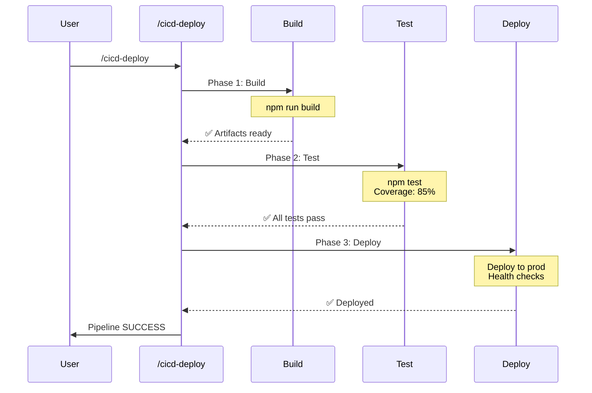
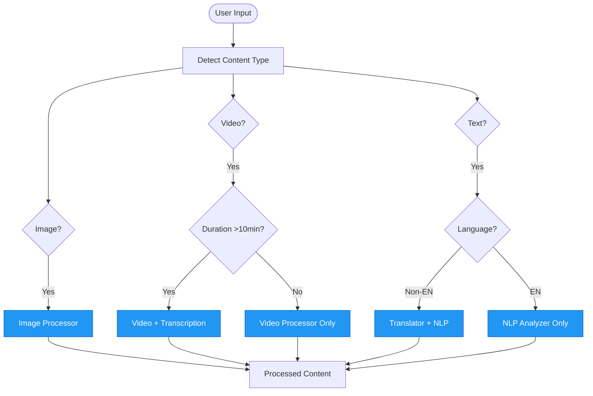

## 🚀 Parallel Execution Examples

### Exemple 1: Global Localization (15 langues)

**Contexte** : Traduire du contenu marketing en 15 langues simultanément.

**Command Implementation** :

```yaml
# .claude/commands/translate-global.md

You are a translation orchestrator.

When the user provides content to translate:

1. Launch 15 translation agents in PARALLEL
2. Each agent translates to one target language
3. Aggregate all translations
4. Return combined results

Execute this with a SINGLE message containing 15 Task tool calls.

Languages: Spanish, French, German, Italian, Portuguese,
           Dutch, Polish, Russian, Japanese, Korean,
           Chinese, Arabic, Hindi, Turkish, Swedish

Expected speedup: ~15x (15×20min → 20min)
```

**Usage** :

```bash
/translate-global "Launch our new AI product next week!"
```

**Output Structure** :

```
✅ Spanish: "¡Lanzamos nuestro nuevo producto de IA la próxima semana!"
✅ French: "Lancement de notre nouveau produit IA la semaine prochaine !"
✅ German: "Einführung unseres neuen KI-Produkts nächste Woche!"
... (12 more languages)

⏱️ Completed in 20 minutes (vs 300 min sequential)
```

### Exemple 2: Multi-Region Deployment

**Contexte** : Déployer une application sur 10 régions AWS simultanément.

```yaml
# Command: /deploy-multi-region

Launch parallel deployment agents for:
- us-east-1
- us-west-2
- eu-west-1
- eu-central-1
- ap-southeast-1
- ap-northeast-1
- ap-south-1
- sa-east-1
- ca-central-1
- af-south-1

Each agent:
1. Provisions infrastructure
2. Deploys application
3. Runs health checks
4. Reports status

Use PARALLEL pattern for 10x speedup.
```

## ⛓️ Sequential Execution Examples

### Exemple 1: CI/CD Pipeline

**Contexte** : Build → Test → Deploy avec validation à chaque étape.

```yaml
# .claude/commands/cicd-deploy.md

You are a CI/CD orchestrator.

Execute these phases SEQUENTIALLY:

Phase 1: BUILD
- Task(subagent_type="builder")
- Compile code, generate artifacts
- ✅ BLOCK if build fails

Phase 2: TEST
- Task(subagent_type="tester")
- Run unit tests (coverage >80%)
- Run integration tests
- ✅ BLOCK if tests fail

Phase 3: DEPLOY
- Task(subagent_type="deployer")
- Deploy to production
- Run smoke tests
- ✅ Report final status

Quality gates at each phase.
```

**Execution Flow** :



### Exemple 2: Data Pipeline (ETL)

```yaml
# .claude/commands/etl-pipeline.md

Sequential ETL pipeline:

Step 1: EXTRACT
- Task(subagent_type="extractor")
- Pull data from APIs, databases
- Validate data integrity

Step 2: TRANSFORM
- Task(subagent_type="transformer")
- Clean, normalize, enrich data
- Apply business rules

Step 3: LOAD
- Task(subagent_type="loader")
- Insert into data warehouse
- Update indexes

Sequential ensures data quality at each step.
```

## 📦 Batch Processing Examples

### Exemple 1: Community Management (500 membres)

**Contexte** : Analyser 500 feedbacks utilisateurs par vagues de 20.

```yaml
# .claude/commands/analyze-feedback.md

You are a feedback analysis orchestrator.

Input: 500 user feedback entries

Batch Processing Configuration:
- Batch size: 20 items
- Pattern: Process in waves
- Error handling: Stop on first error

For each batch:
1. Launch 20 agents in parallel (one per feedback)
2. Each agent:
   - Analyzes sentiment
   - Extracts key topics
   - Suggests actions
3. Aggregate batch results
4. Proceed to next batch

Expected time: ~12 hours (vs 10 days sequential)
```

**Batch Timeline** :

```mermaid
%%| label: fig-batch-timeline
%%| fig-cap: "Timeline de traitement par batch"
gantt
    title Feedback Analysis (500 items, 20/batch)
    dateFormat HH:mm
    axisFormat %H:%M

    section Batch 1-5
    Batch 1 (1-20)      :b1, 00:00, 30m
    Batch 2 (21-40)     :b2, after b1, 30m
    Batch 3 (41-60)     :b3, after b2, 30m
    Batch 4 (61-80)     :b4, after b3, 30m
    Batch 5 (81-100)    :b5, after b4, 30m

    section Batch 20-25
    Batch 20 (381-400)  :b20, 09:30, 30m
    Batch 21 (401-420)  :b21, after b20, 30m
    Batch 22 (421-440)  :b22, after b21, 30m
    Batch 23 (441-460)  :b23, after b22, 30m
    Batch 24 (461-480)  :b24, after b23, 30m
    Batch 25 (481-500)  :b25, after b24, 30m
    Final Aggregation   :milestone, done, after b25, 0m
```



### Exemple 2: Image Processing (1000 images)

```yaml
# Command: /process-images-batch

Batch image processing:

Input: 1000 product images
Batch size: 50 images/wave

Per image (within batch):
- Resize to multiple formats
- Optimize for web
- Generate thumbnails
- Extract metadata
- Upload to CDN

Process 50 in parallel, then next 50.
Total: 20 waves × 2min = 40min (vs 33 hours sequential)
```

## 🔄 Conditional Execution Examples

### Exemple 1: Content Type Router

**Contexte** : Traiter différents types de contenu de façon adaptative.

```yaml
# .claude/commands/process-content.md

You are a content processing router.

Analyze input and route to appropriate agent:

IF content_type == "image":
  → Task(subagent_type="image-processor")
     - OCR if needed
     - Resize/optimize

ELSE IF content_type == "video":
  → Task(subagent_type="video-processor")
     - Transcription if >10min
     - Generate thumbnails

ELSE IF content_type == "text":
  IF language != "en":
    → Task(subagent_type="translator")
  THEN Task(subagent_type="nlp-analyzer")

ELSE:
  → Task(subagent_type="fallback-handler")

Dynamic routing based on content characteristics.
```

**Flow Diagram** :



### Exemple 2: Support Ticket Prioritization

```yaml
# .claude/commands/route-ticket.md

Conditional ticket routing:

EVALUATE ticket:
- Priority: urgent/high/normal/low
- Department: tech/billing/sales
- Sentiment: positive/neutral/negative

ROUTING LOGIC:

IF priority == "urgent" OR sentiment == "negative":
  → Task(subagent_type="escalation-handler")
     - Notify on-call team
     - Create incident

ELSE IF department == "tech" AND complexity == "high":
  → Task(subagent_type="senior-tech-support")

ELSE IF ticket_count_user > 3:
  → Task(subagent_type="vip-handler")
     - Special attention
     - Executive notification

ELSE:
  → Task(subagent_type="auto-responder")
     - Check knowledge base
     - Suggest solutions

Dynamic agent selection based on ticket attributes.
```

## 🎯 Real-World Workflow Examples

### Enterprise RFP Response

**Pattern Combination** : Sequential + Parallel

```yaml
# High-level flow:

Phase 1: ANALYSIS (Sequential)
  1. Parse RFP document
  2. Extract requirements
  3. Create response structure

Phase 2: CONTENT (Parallel)
  Launch 10 agents in parallel:
  - Technical response
  - Pricing
  - Case studies
  - Timeline
  - Team bios
  - Security compliance
  - etc.

Phase 3: FINALIZATION (Sequential)
  1. Aggregate content
  2. Quality review
  3. Format document
  4. Final approval
```

### Multi-Language Content Startup

**Pattern** : Parallel + Batch

```yaml
# Workflow: Weekly blog post distribution

Step 1: Create original content (EN)

Step 2: PARALLEL translation to 14 languages
  - 14 agents × 1 hour = 1 hour

Step 3: BATCH social media posts (500 posts)
  - Batch 1: Facebook posts (14 languages)
  - Batch 2: Twitter threads (14 languages)
  - Batch 3: LinkedIn posts (14 languages)
  - etc.

Total: 3 hours (vs 50+ hours manual)
```

## 📊 Performance Metrics

### Speedup Comparison Table

| Use Case | Sequential Time | Optimized Pattern | Time | Speedup |
|----------|----------------|-------------------|------|---------|
| Global Translation (15 languages) | 300 min | Parallel | 20 min | **15x** |
| CI/CD Pipeline | 45 min | Sequential | 45 min | 1x (quality) |
| Feedback Analysis (500 items) | 250 hours | Batch | 12.5 hours | **20x** |
| Image Processing (1000 images) | 33 hours | Batch | 40 min | **50x** |
| Content Router | Variable | Conditional | Variable | Optimized |

---

## 🔗 Navigation

- **Vue d'ensemble** : [overview.qmd](overview.qmd)
- **Diagrammes visuels** : [diagrams.qmd](diagrams.qmd)
- **Documentation complète** : [agent-orchestration.md](agent-orchestration.md)
