## Hook Trigger Lifecycle

The complete flow from event trigger through action to continuation:

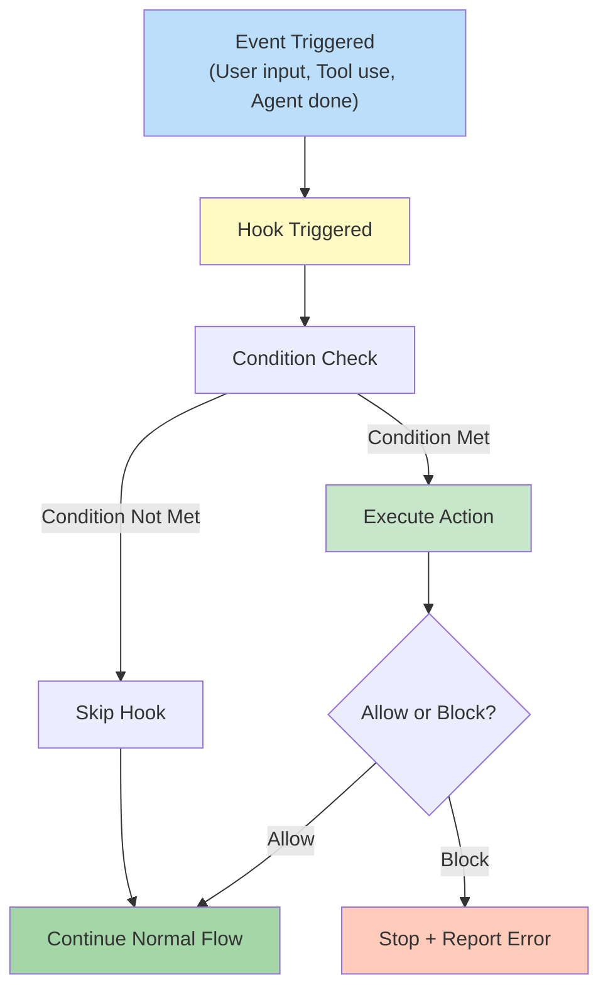

---

## Session-Wide Hook Lifecycle

Complete hook execution order during a Claude Code session:

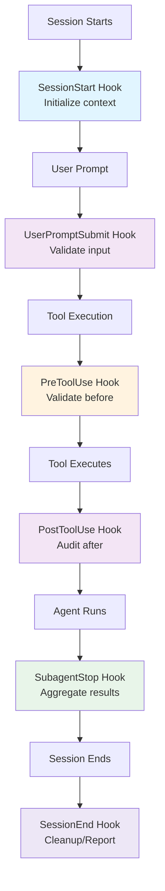

---

## PreToolUse Hook - Validation Gate

Hook that prevents tool execution if conditions fail:

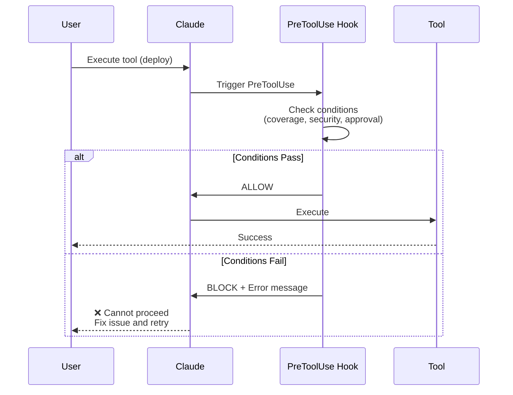

---

## PostToolUse Hook - Audit Trail

Hook that logs and monitors after tool execution:

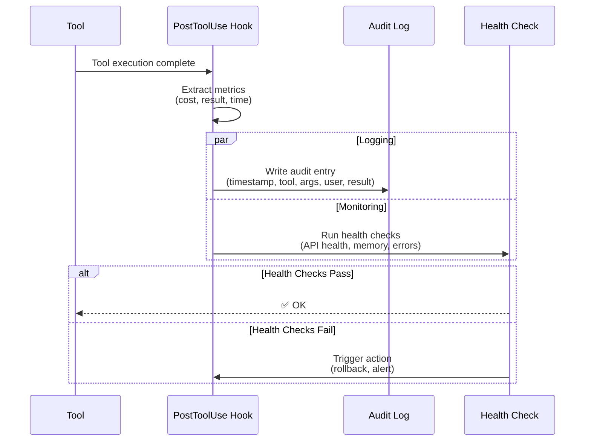

---

## Hook State Machine

Different states a hook can be in during execution:

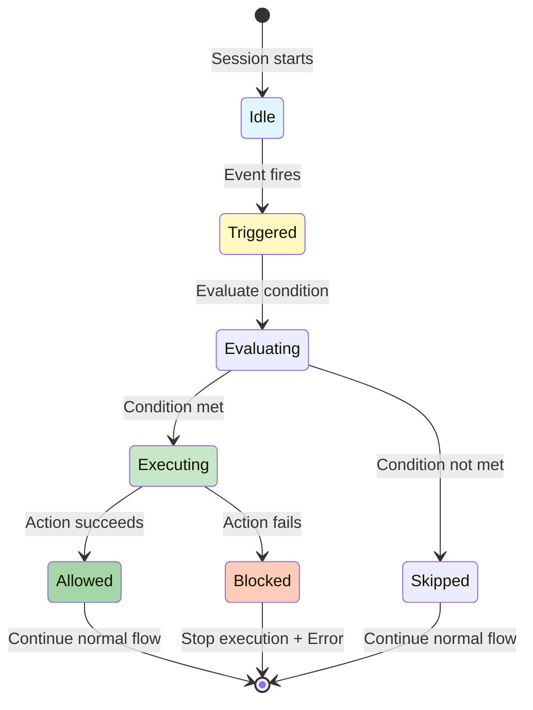

---

## Hook vs Command vs Agent - Decision Tree

When to use which automation mechanism:

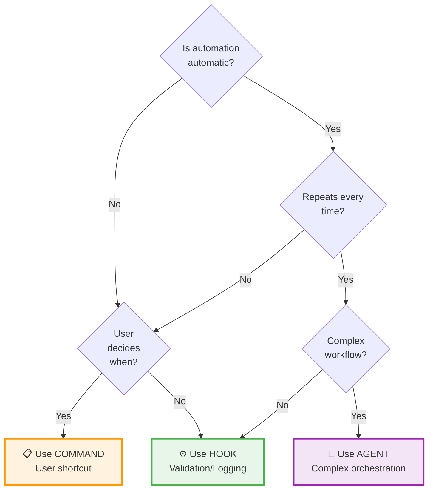

---

## Validation Chain Pattern

Multiple hooks running in sequence for comprehensive validation:

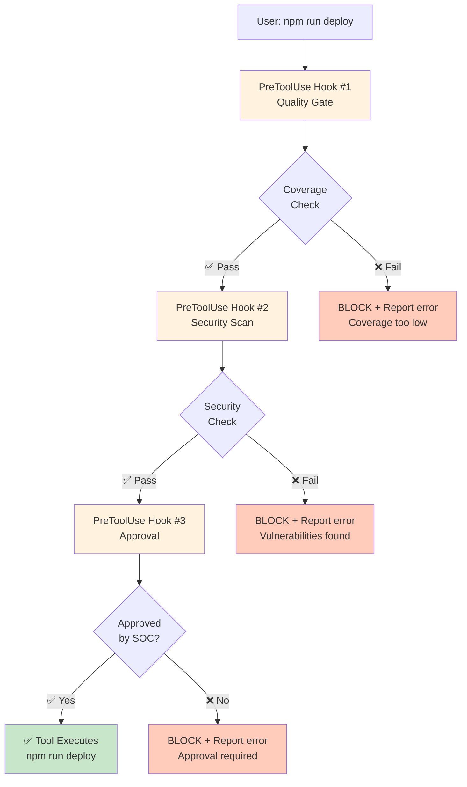

---

## Auto-Rollback Pattern

PostToolUse hook monitoring deployment health:

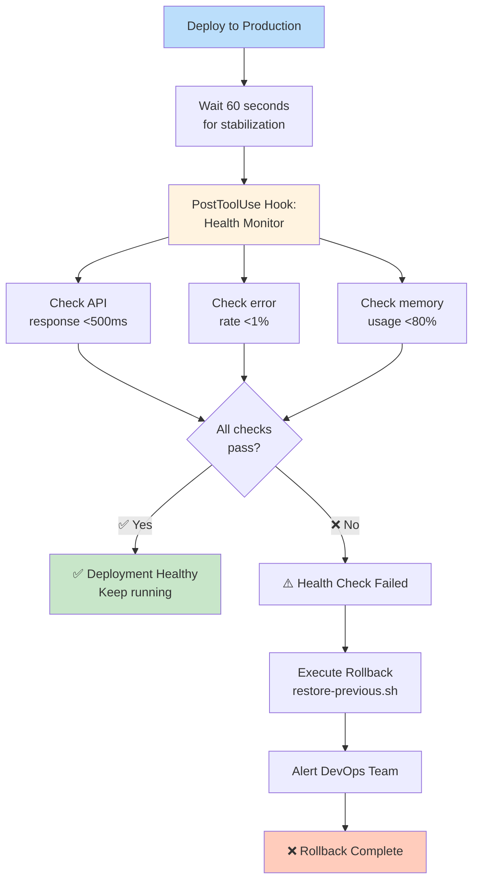

---

## Cost Tracking Timeline

PostToolUse hook tracking costs across session:

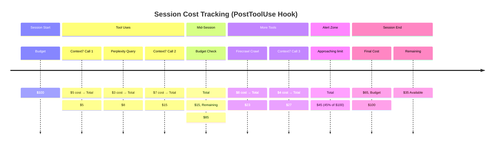

---

## SubagentStop - Progress Aggregation

Tracking multiple agents completing in parallel:

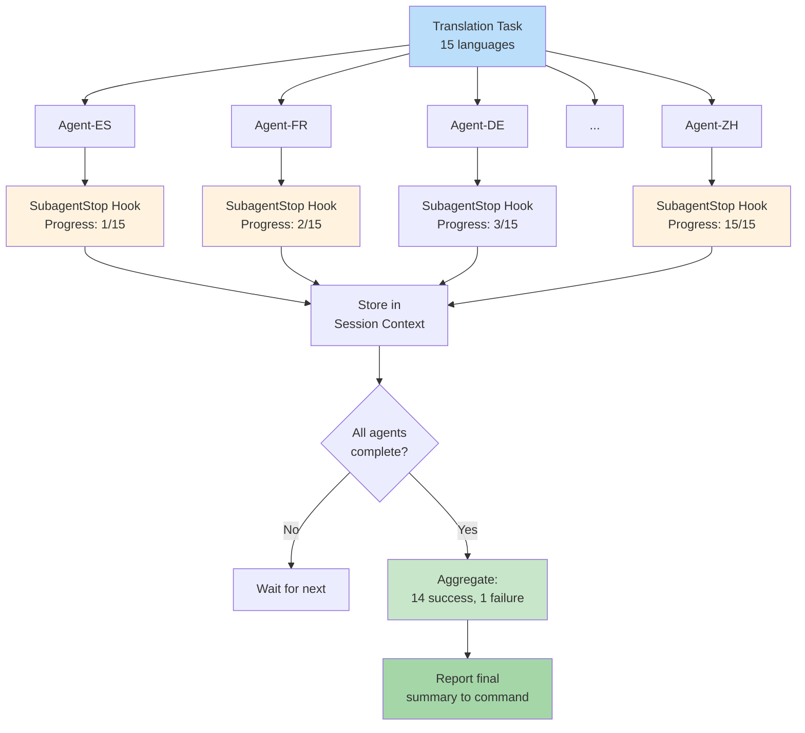

---

## Hook Timing vs Command Timing

When hooks fire vs when commands run:

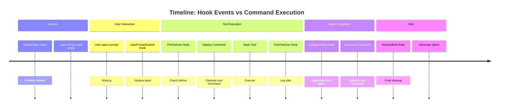

---

## Error Handling in Hooks

Hook error flows and fallback strategies:

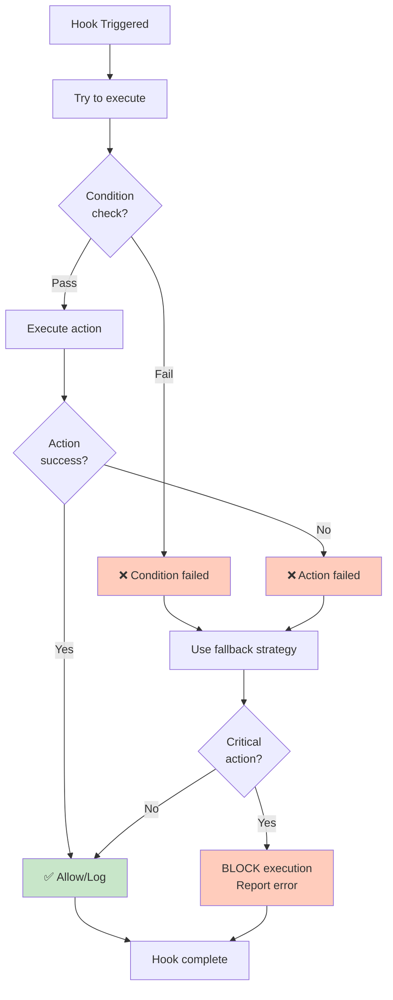

---

## Real-World Example: CI/CD Pipeline Flow

Complete deployment workflow with hooks at each stage:

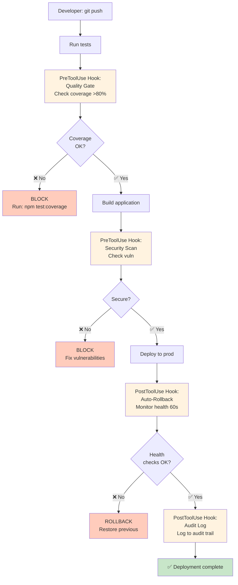

---

## Hook Architecture in Claude Code Stack

Where hooks fit in the overall architecture:

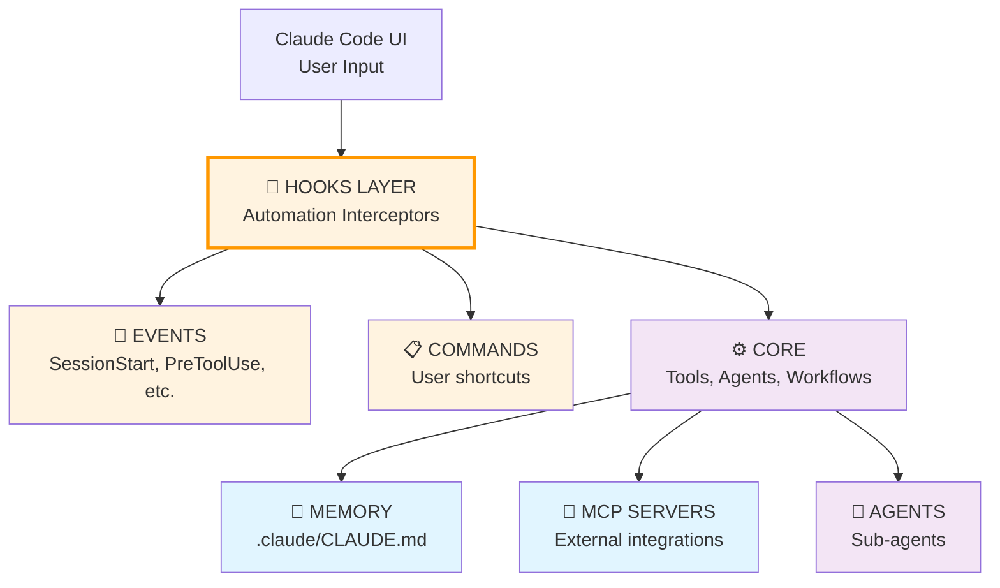

---

## Hook Complexity vs Logic Lines

Decision matrix for hook vs script vs agent:

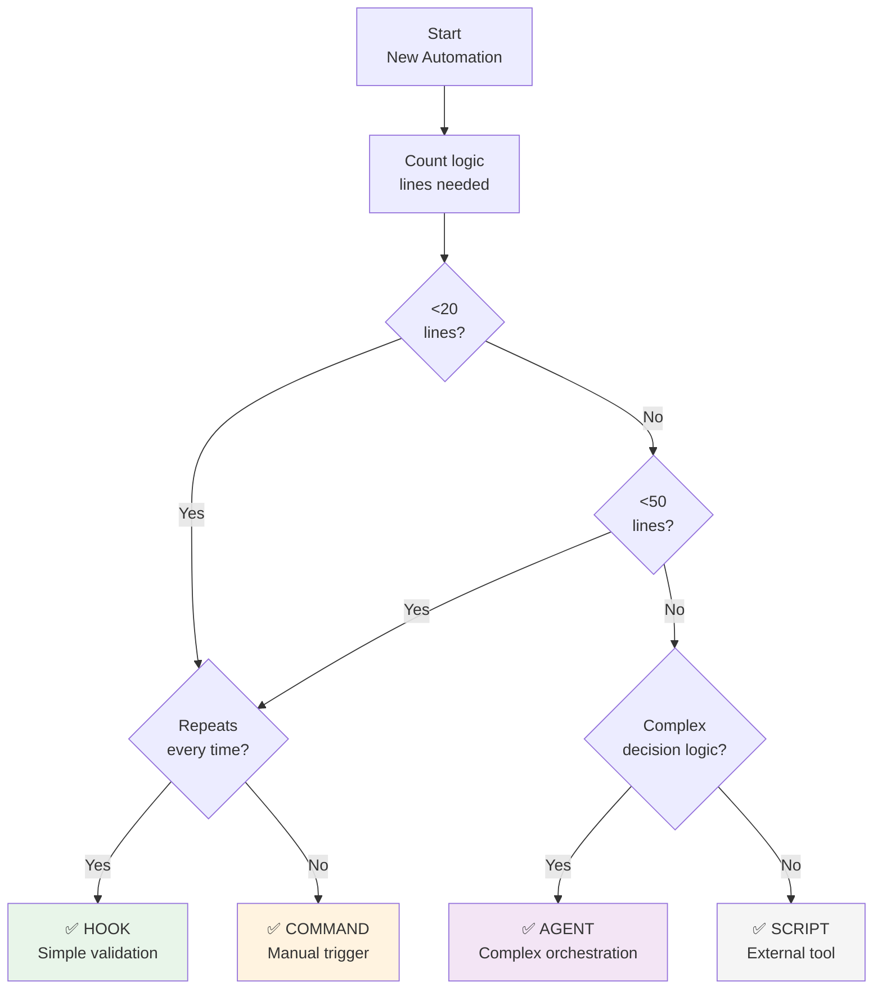

---

## Key Diagrams Summary

| Diagram | Purpose |
|---------|---------|
| **Hook Trigger Lifecycle** | How hooks detect events and take action |
| **Session-Wide Lifecycle** | Order hooks fire during a session |
| **Validation Gate** | PreToolUse blocking bad actions |
| **Audit Trail** | PostToolUse logging everything |
| **State Machine** | Hook states from Idle to Completion |
| **Decision Tree** | Hook vs Command vs Agent choice |
| **Validation Chain** | Multiple hooks in sequence |
| **Auto-Rollback** | Monitoring deployment health |
| **Cost Tracking** | Timeline of costs during session |
| **Progress Aggregation** | SubagentStop tracking parallel agents |
| **Timing** | When hooks fire vs commands run |
| **Error Handling** | Fallback strategies for failures |
| **CI/CD Example** | Real workflow with hooks at each stage |
| **Architecture** | Hooks in Claude Code stack |
| **Complexity Matrix** | Hook vs script vs agent decision |

---

## Related Documentation

- 📖 [Hook Overview](./overview.qmd) — Concepts and types
- 💻 [Hook Examples](./examples.qmd) — Real implementations
- 📝 [Hook Automation Pattern](./hook-automation.md) — Complete reference
