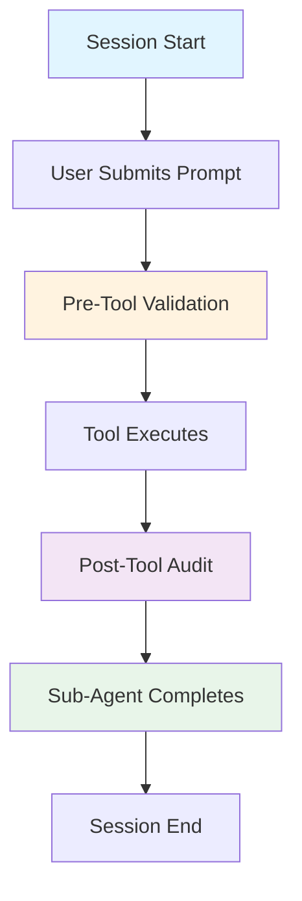
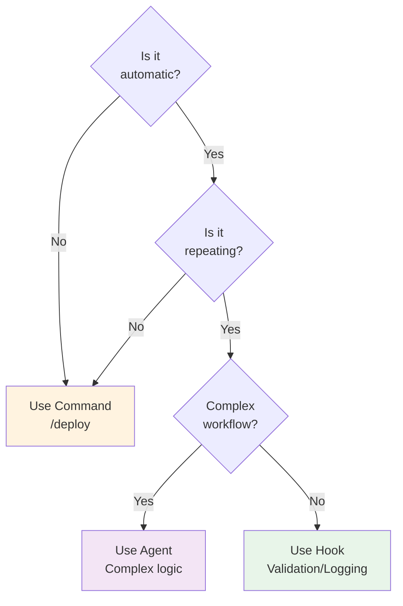

## Introduction

**Hooks are Claude Code's automation layer.** They intercept lifecycle events and automate what would otherwise require manual intervention.

> "Hooks = Automation. If you do something manually 2+ times, automate it with a hook." — Hook Automation Pattern

This guide covers:
- What hooks are and why they matter
- When to use hooks vs commands vs agents
- Hook lifecycle and trigger points
- Real-world automation strategies

### Quick Comparison

| Aspect | Hooks | Commands | Agents |
|--------|-------|----------|--------|
| **Trigger** | Lifecycle events | User invocation | Complex workflows |
| **Automation** | Automatic | Manual | Autonomous |
| **Scope** | Single action | Single task | Multi-step journey |
| **Config** | `.claude/hooks/` | `.claude/commands/` | External agents |
| **Use Case** | Validation, logging | Shortcuts | Complex automation |

---

## What Are Hooks?

Hooks are **event-driven functions** that intercept Claude Code's lifecycle and automate actions without user intervention.

### Hook Anatomy

```yaml
---
description: What this hook does
trigger: <event-name>
---

IF <condition>:
  <action>
  Report: <feedback>
```

### Key Characteristics

- **Automatic**: Fire without user interaction
- **Synchronous**: Block execution until complete
- **Chainable**: Multiple hooks run in sequence
- **Conditional**: Can block or allow actions
- **Auditable**: Log all automation decisions

---

## Hook Lifecycle Events

Claude Code provides multiple trigger points for automation:



### Hook Types by Event

#### 1. **SessionStart** — Initialization
Runs when Claude Code session begins.

**Purpose**: Initialize project context, load configuration, validate environment.

**Use Cases**:
- Load `.claude/CLAUDE.md` (memory)
- Verify MCP servers connected
- Load skills and templates
- Check environment variables

```yaml
# Example: Project Initialization
trigger: session start
---

IF project is RFP workflow:
  Load: company-profile.json
  Load: template-library/
  Connect: MCP Contracts-DB

Report: "✅ Project initialized with 3 templates"
```

---

#### 2. **UserPromptSubmit** — Input Validation
Runs BEFORE user's prompt is processed by Claude.

**Purpose**: Validate user input, prevent malicious requests, sanitize commands.

**Use Cases**:
- Security filtering (SQL injection, path traversal)
- Input validation (required fields, format)
- Auto-formatting (normalize JSON, YAML)
- Rate limiting (prevent abuse)

```yaml
# Example: Security Filter
trigger: before user prompt submitted
---

Scan prompt for:
  - SQL injection attempts (DROP, DELETE)
  - Command injection (`;`, `&&`, `|`)
  - Path traversal (`../../etc/passwd`)

IF malicious pattern detected:
  BLOCK prompt
  Alert: "❌ Potentially unsafe command detected"
  Log attempt

ELSE:
  ALLOW prompt
```

---

#### 3. **PreToolUse** — Validation Gates
Runs BEFORE any tool is executed.

**Purpose**: Validate inputs, check prerequisites, enforce approval workflows.

**Use Cases**:
- Quality gates (test coverage >80%)
- Security scans (vulnerability check)
- Human approval (P1 incidents)
- Dependency checks (API available)

```yaml
# Example: Quality Gate
trigger: before tool Bash(npm run deploy)
---

Read coverage/coverage-summary.json
Check: coverage >80%

IF coverage <80%:
  BLOCK deployment
  Report: "❌ Coverage {value}% (require 80%+)"

ELSE:
  ALLOW deployment
  Report: "✅ Coverage {value}% - Deploy approved"
```

---

#### 4. **PostToolUse** — Audit & Logging
Runs AFTER tool executes successfully.

**Purpose**: Log actions, track metrics, trigger follow-ups.

**Use Cases**:
- Audit trails (compliance, SOC logs)
- Cost tracking (API usage, billing)
- Auto-rollback (health check monitoring)
- Notifications (alerts, summaries)

```yaml
# Example: Auto-Rollback
trigger: after tool Bash(deploy-to-production.sh)
---

Wait 60 seconds for stabilization
Run health checks:
  - API endpoint: /health (response <500ms)
  - Error rate <1%
  - Memory usage <80%

IF any check fails:
  Execute: rollback-to-previous.sh
  Alert: "❌ Auto-rollback triggered"

ELSE:
  Report: "✅ Deployment healthy"
```

---

#### 5. **SubagentStop** — Result Aggregation
Runs AFTER sub-agent completes.

**Purpose**: Collect results, aggregate metrics, track progress.

**Use Cases**:
- Multi-agent coordination (parallel workflows)
- Batch processing progress (real-time updates)
- Result aggregation (merge outputs)
- Final reporting

```yaml
# Example: Progress Tracking
trigger: after translation agent completes
---

Store result:
  language: {lang}
  status: {success/failure}
  word_count: {count}

IF all agents done:
  Aggregate:
    - Total: {count} languages
    - Successes: {n}/15
    - Total words: {count}

  Report to command: Final summary
```

---

#### 6. **SessionEnd** — Cleanup
Runs when session closes.

**Purpose**: Final reporting, cleanup, save state.

**Use Cases**:
- Generate final reports (summary, metrics)
- Save session state (for resuming)
- Cleanup temporary files
- Cost summary

---

## Hook Decision Tree: Hook vs Command vs Agent

When should you use hooks instead of commands or agents?



### Decision Criteria

#### When to Use **Hooks** ✅

- ✅ Automatic validation (runs without user action)
- ✅ Before/after specific actions (quality gates, audit trails)
- ✅ Repeating pattern (same logic on every deploy)
- ✅ Blocking capability matters (prevent bad deploys)
- ✅ Simple logic (<50 lines YAML)

**Examples**:
- Validation before deploy
- Logging after database change
- Progress tracking during batch jobs

#### When to Use **Commands** ✅

- ✅ User initiates the action (explicit invocation)
- ✅ Optional / not every time (shortcut)
- ✅ Manual control needed
- ✅ Returns specific output

**Examples**:
```bash
/deploy          # User decides when to deploy
/format-code     # User chooses to format
/check-coverage  # On-demand coverage check
```

#### When to Use **Agents** ✅

- ✅ Complex multi-step workflows
- ✅ Autonomous decision-making
- ✅ External integrations (fetch data, call APIs)
- ✅ Logic >50 lines YAML
- ✅ Handles errors and retries

**Examples**:
- Global localization (translate 15 languages)
- Security incident response (contain, investigate, remediate)
- CI/CD pipeline orchestration (build, test, deploy, rollback)

---

## Hook Coordination Patterns

### Pattern 1: Validation Chain (PreToolUse)

Combine multiple hooks to create validation pipeline:

```yaml
# Hook 1: Test Coverage
trigger: before Bash(deploy)
Check coverage >80%

# Hook 2: Security Scan
trigger: before Bash(deploy)
Check security scan (0 critical vulns)

# Hook 3: Human Approval
trigger: before Bash(deploy)
Check approval file exists
```

Flow:
```
User: npm run deploy
  ↓
PreToolUse Hook #1: Check coverage
  ✅ Pass? Continue
  ❌ Fail? BLOCK + message
  ↓
PreToolUse Hook #2: Check security
  ✅ Pass? Continue
  ❌ Fail? BLOCK + message
  ↓
PreToolUse Hook #3: Check approval
  ✅ Approved? Continue
  ❌ Not approved? BLOCK + message
  ↓
Tool executes (only if all gates pass)
```

### Pattern 2: Audit Trail (PostToolUse)

Log all critical actions for compliance:

```yaml
trigger: after tool Bash(rm), Bash(git push --force), etc.
---

Log destructive operation:
  - Timestamp
  - Tool used
  - Arguments
  - User
  - Result

IF on production:
  Send alert to SOC team
  Require post-incident review
```

### Pattern 3: Progressive Aggregation (SubagentStop)

Track batch processing in real-time:

```yaml
trigger: after each translation agent completes
---

Store result in session context
Update progress counter

IF all agents done:
  Generate final report:
    - Total processed: 174/174
    - Success rate: 93%
    - Failed: 1 (zh-CN)
    - Total time: 22 minutes
    - Cost: $12.50
```

---

## Best Practices

### ✅ DO

**1. Use hooks for repeating patterns**
```yaml
✅ CORRECT:
Hook that validates before every deploy

❌ INCORRECT:
Manual check each time (error-prone)
```

**2. Keep hooks focused (single responsibility)**
```yaml
✅ CORRECT:
Hook: check-test-coverage.md (one job)

❌ INCORRECT:
Hook: check-everything.md (tests, security, docs)
```

**3. Provide clear error messages**
```yaml
✅ CORRECT:
"❌ Coverage too low: 76% (require 80%+)
Run: npm run test:coverage
Then retry deploy."

❌ INCORRECT:
"Coverage check failed."
```

**4. Chain hooks for validation pipelines**
```yaml
✅ CORRECT:
PreToolUse Hook #1: Check coverage
PreToolUse Hook #2: Check security
PreToolUse Hook #3: Check approval

❌ INCORRECT:
One mega-hook checking everything
```

### ❌ DON'T

**1. Don't use hooks for one-time tasks**
```yaml
❌ WRONG: Hook runs once per project
✅ CORRECT: Manual command or script
```

**2. Don't make hooks too complex**
```yaml
❌ WRONG: Hook with 200 lines of logic
✅ CORRECT: Hook calls agent if >50 lines
```

**3. Don't skip error handling**
```yaml
❌ WRONG: Hook assumes all checks pass
✅ CORRECT: Handle failures gracefully
```

**4. Don't create hook conflicts**
```yaml
❌ WRONG: Two hooks BLOCKING same action
✅ CORRECT: Combine into single hook
```

---

## Hook Configuration

Hooks are stored in `.claude/hooks/` by event type:

```
.claude/
├── hooks/
│   ├── session-start/
│   │   └── project-init.md
│   ├── user-prompt-submit/
│   │   └── security-filter.md
│   ├── pre-tool-use/
│   │   ├── quality-gate.md
│   │   ├── approval-check.md
│   │   └── security-scan.md
│   ├── post-tool-use/
│   │   ├── auto-rollback.md
│   │   ├── cost-tracker.md
│   │   └── audit-logger.md
│   ├── subagent-stop/
│   │   └── aggregate-results.md
│   └── session-end/
│       └── cleanup-report.md
```

### Hook File Format

```yaml
---
description: What this hook does
trigger: <event-name>
---

IF <condition>:
  <action>
  Report: <feedback>
```

---

## Key Takeaways

| Concept | Key Point |
|---------|-----------|
| **Purpose** | Hooks automate what would otherwise be manual |
| **Trigger Events** | SessionStart, UserPromptSubmit, PreToolUse, PostToolUse, SubagentStop, SessionEnd |
| **Validation Gates** | PreToolUse blocks bad actions before they happen |
| **Audit Trail** | PostToolUse logs everything for compliance |
| **Aggregation** | SubagentStop coordinates multi-agent workflows |
| **Chaining** | Multiple hooks run in sequence for complex workflows |
| **Decision** | Use hooks for automatic + repeating; use commands for manual; use agents for complex |

---

## Related Documentation

- 📊 [Hook Diagrams](./diagrams.qmd) — Visual flow of hook lifecycle and patterns
- 💻 [Hook Examples](./examples.qmd) — Real implementations with code
- 📖 [Hook Automation Pattern](./hook-automation.md) — Complete reference guide
- 🎯 [Orchestration Principles](../orchestration-principles.md) — Overall strategy
- 🚀 [Workflows](../workflows/README.md) — Production use cases
