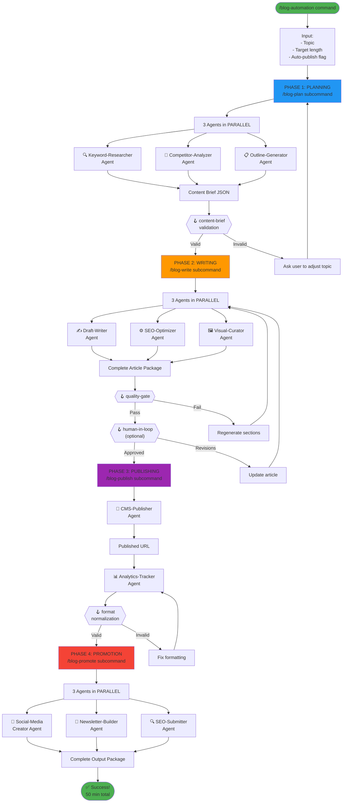
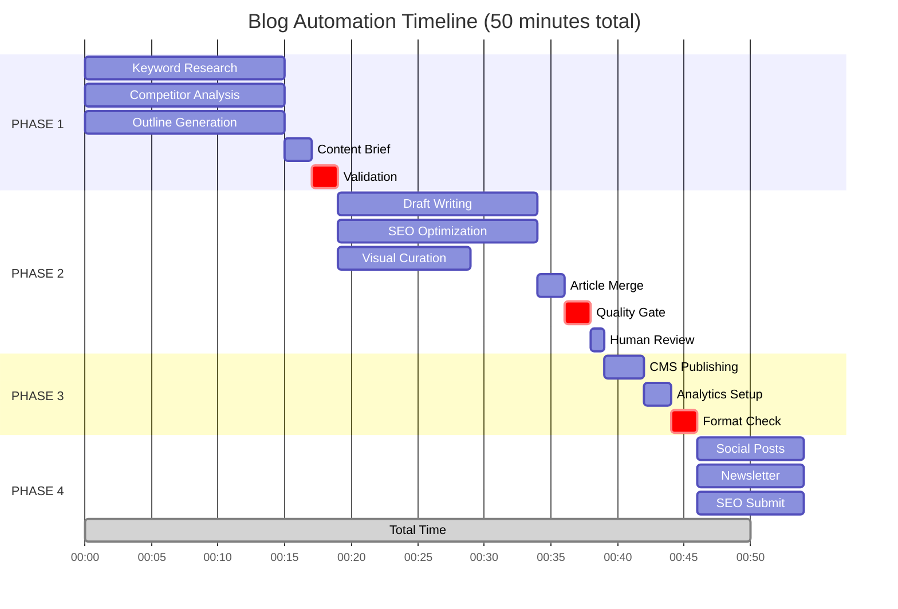
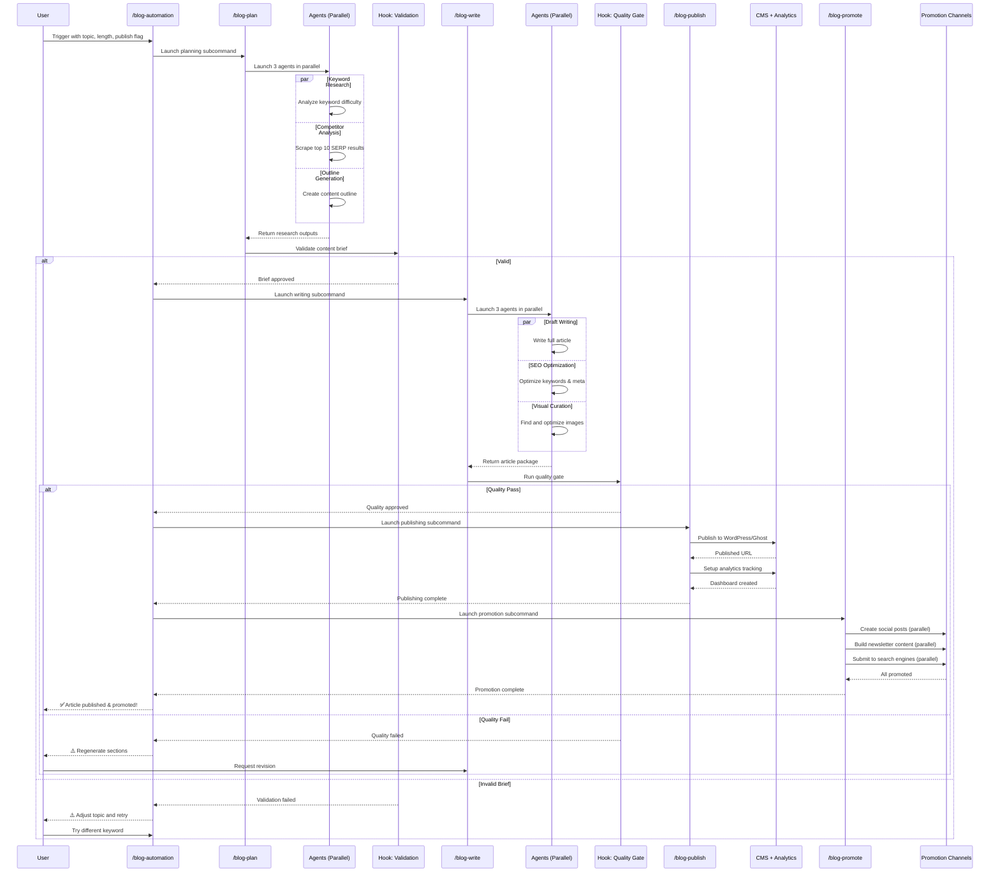
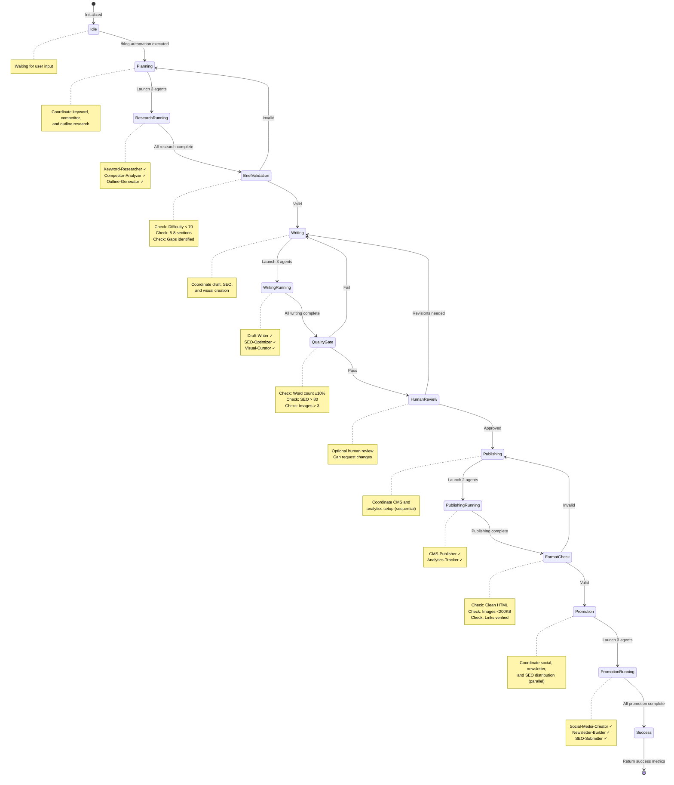
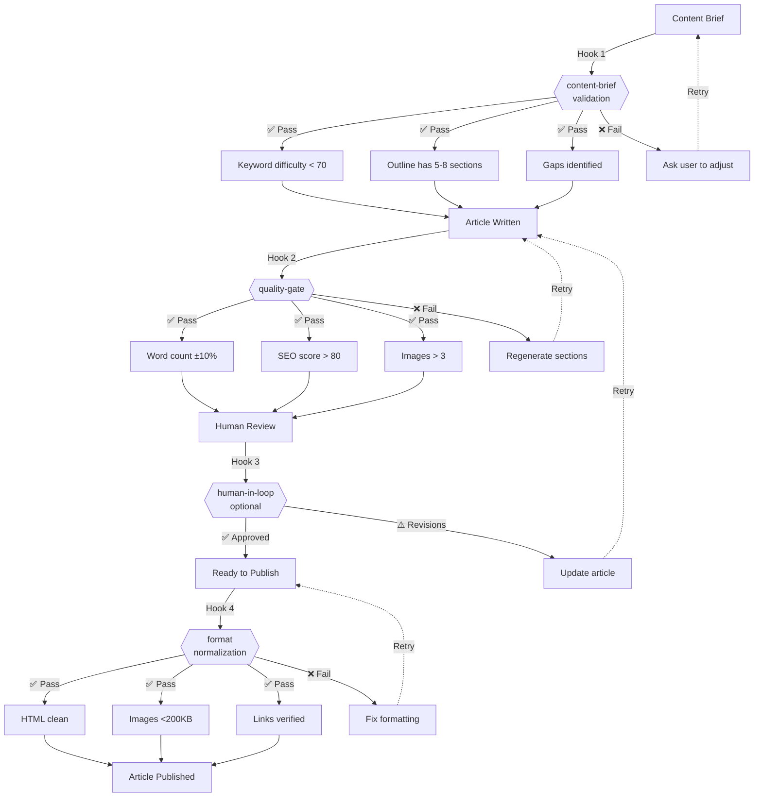

# Workflow Diagrams

## Main Orchestration Flow



## Parallel Execution Timeline



## Sequence Diagram (Detailed Interaction)



## State Machine Diagram



## Agent Hierarchy Tree

```
📦 /blog-automation
│  (Main orchestrator)
│
├─ 📋 /blog-plan (Subcommand)
│  │  Coordinates research phase
│  │
│  ├─ 🔍 Keyword-Researcher Agent
│  │  └─ Uses: mcp__ahrefs__keywords-explorer
│  │  └─ Finds: primary + secondary keywords
│  │  └─ Output: keyword_metrics.json
│  │
│  ├─ 🎯 Competitor-Analyzer Agent
│  │  └─ Uses: mcp__firecrawl__search + scrape
│  │  └─ Analyzes: top 10 SERP results
│  │  └─ Output: competitor_gaps.json
│  │
│  └─ 📋 Outline-Generator Agent
│     └─ Uses: Brand-Voice skill + SEO-Best-Practices skill
│     └─ Creates: structured outline
│     └─ Output: content_outline.json
│
├─ 🪝 HOOK: content-brief-validation
│  │  Validates keyword, sections, gaps
│  │  Fail-fast if criteria not met
│
├─ ✍️ /blog-write (Subcommand)
│  │  Coordinates content creation
│  │
│  ├─ ✍️ Draft-Writer Agent
│  │  └─ Uses: Brand-Voice skill + Content-Templates skill
│  │  └─ Reads: CLAUDE.md for preferences
│  │  └─ Writes: full article body
│  │  └─ Output: draft.md
│  │
│  ├─ ⚙️ SEO-Optimizer Agent
│  │  └─ Uses: SEO-Best-Practices skill
│  │  └─ Optimizes: keywords, meta, headers
│  │  └─ Output: optimized_article.html
│  │
│  └─ 🖼️ Visual-Curator Agent
│     └─ Uses: mcp__firecrawl__search
│     └─ Finds: relevant images
│     └─ Optimizes: file size, alt text
│     └─ Output: images.json + assets
│
├─ 🪝 HOOK: quality-gate
│  │  Checks: word count, SEO, readability
│  │
├─ 🪝 HOOK: human-in-loop
│  │  Optional review before publish
│
├─ 📱 /blog-publish (Subcommand)
│  │  Coordinates publishing (SEQUENTIAL)
│  │
│  ├─ 📱 CMS-Publisher Agent
│  │  └─ Uses: WordPress REST API
│  │  └─ Uploads: images + creates post
│  │  └─ Output: published_url.txt
│  │
│  └─ 📊 Analytics-Tracker Agent
│     └─ Runs AFTER CMS-Publisher
│     └─ Uses: Google Analytics API
│     └─ Creates: UTM links + dashboard
│     └─ Output: analytics_config.json
│
├─ 🪝 HOOK: format-normalization
│  │  Validates HTML, images, links
│
└─ 📢 /blog-promote (Subcommand)
   │  Coordinates distribution
   │
   ├─ 📱 Social-Media-Creator Agent
   │  └─ Uses: Brand-Voice skill
   │  └─ Creates: Twitter, LinkedIn, Facebook posts
   │  └─ Output: social_posts.json
   │
   ├─ 📧 Newsletter-Builder Agent
   │  └─ Uses: Email-Templates skill
   │  └─ Builds: email content + subject lines
   │  └─ Output: newsletter.html
   │
   └─ 🔍 SEO-Submitter Agent
      └─ Uses: Google Search Console API
      └─ Submits: to search engines + aggregators
      └─ Output: submission_confirmations.json
```

## Data Flow Diagram

```mermaid
graph LR
    subgraph Input["📥 INPUT"]
        Topic["Topic"]
        Length["Target Length"]
        Flag["Auto-publish Flag"]
    end

    subgraph Phase1["🔍 PHASE 1: RESEARCH"]
        Keywords["Keywords"]
        Difficulty["Difficulty Score"]
        CompAnalysis["Competitor Analysis"]
        Gaps["Content Gaps"]
    end

    subgraph Phase2["✍️ PHASE 2: WRITING"]
        Draft["Draft Article"]
        SEOMeta["SEO Metadata"]
        Images["Images & Visuals"]
        Score["SEO Score"]
    end

    subgraph Phase3["📱 PHASE 3: PUBLISHING"]
        URL["Published URL"]
        UTM["UTM Links"]
        Dashboard["Analytics Dashboard"]
    end

    subgraph Phase4["📢 PHASE 4: PROMOTION"]
        SocialPosts["Social Posts"]
        Newsletter["Newsletter Content"]
        Submissions["Search Submissions"]
    end

    subgraph Output["📤 OUTPUT"]
        PublishedArticle["Published Article"]
        Metrics["Quality Metrics"]
        PromotionalAssets["Promotional Assets"]
        Analytics["Analytics Setup"]
    end

    Input -->|Research| Phase1
    Phase1 -->|Brief| Phase2
    Phase2 -->|Complete Article| Phase3
    Phase3 -->|Published| Phase4

    Phase1 -.->|Keywords| Phase2
    Phase2 -.->|URL| Phase3
    Phase3 -.->|URL| Phase4

    Phase1 --> Output
    Phase2 --> Output
    Phase3 --> Output
    Phase4 --> Output

    style Input fill:#E3F2FD
    style Phase1 fill:#E8F5E9
    style Phase2 fill:#FFF3E0
    style Phase3 fill:#F3E5F5
    style Phase4 fill:#FCE4EC
    style Output fill:#E0F2F1
```



## Parallelization vs Sequential

```
PHASE 1: RESEARCH (All Parallel)
┌─────────────────────────────────────┐
│ Keyword Research     (if sequential) │  Total: 15m
│ + Competitor Analysis               │  if sequential
│ + Outline Generation                │  = 45m
└─────────────────────────────────────┘
                │
            Parallel
                │
          Takes: 15m
          (not 45m!)


PHASE 2: WRITING (All Parallel)
┌─────────────────────────────────────┐
│ Draft Writing         (if sequential)│  Total: 20m
│ + SEO Optimization                  │  if sequential
│ + Visual Curation                   │  = 40m
└─────────────────────────────────────┘
                │
            Parallel
                │
          Takes: 20m
          (not 40m!)


PHASE 3: PUBLISHING (Sequential)
┌─────────────────────────────────────┐
│ CMS Publishing        ⏱️  3m          │
│   (must complete)                   │
│         │                           │
│         ├→ Get Published URL         │
│         │                           │
│         ▼                           │
│ Analytics Setup       ⏱️  2m         │
│   (uses URL from ^)                 │
└─────────────────────────────────────┘

      Total: 5m (must be sequential)


PHASE 4: PROMOTION (All Parallel)
┌─────────────────────────────────────┐
│ Social Media Creator  (if sequential)│  Total: 10m
│ + Newsletter Builder                │  if sequential
│ + SEO Submitter                     │  = 25m
└─────────────────────────────────────┘
                │
            Parallel
                │
          Takes: 10m
          (not 25m!)
```

## Hook Execution Points



## Cross-References

- [See Overview for architecture details](./overview.qmd#workflow-architecture)
- [See Examples for implementation code](./examples.qmd)
