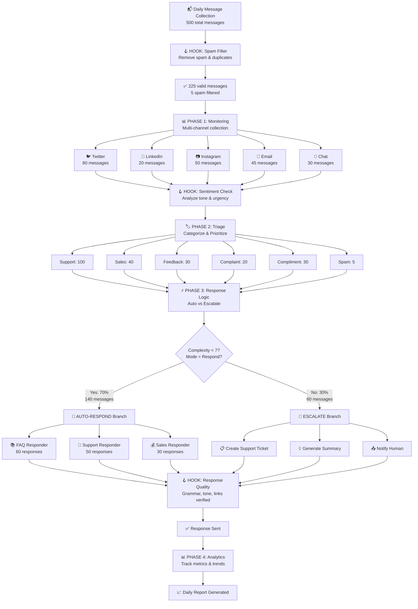
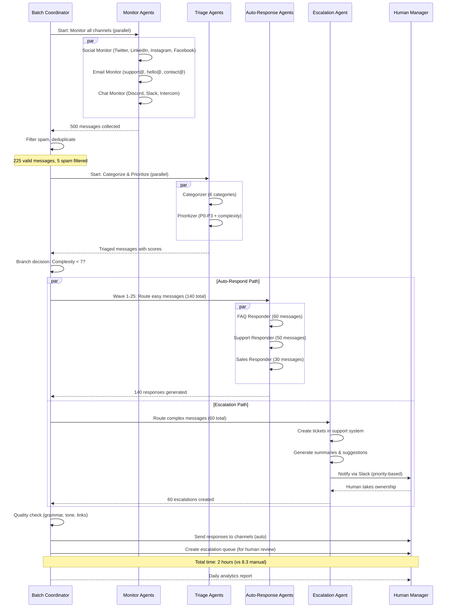
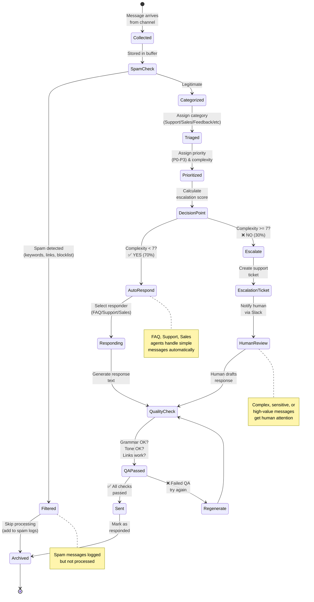
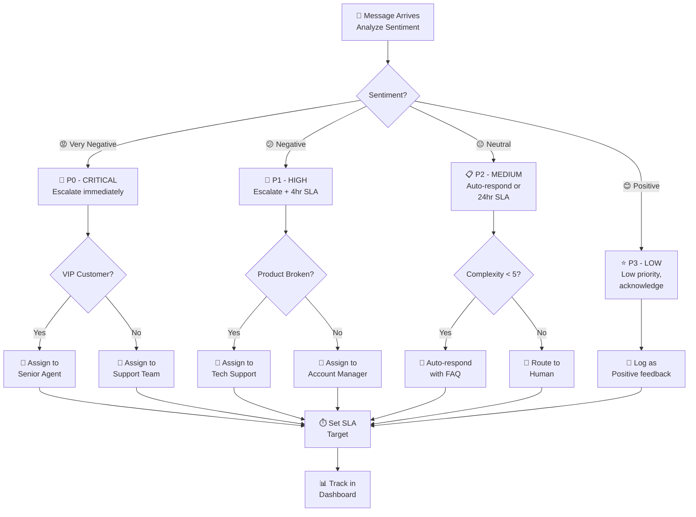
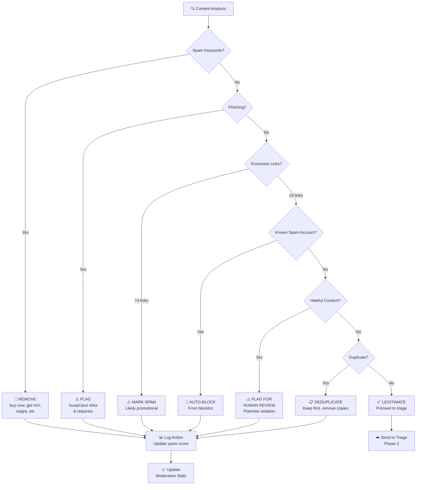
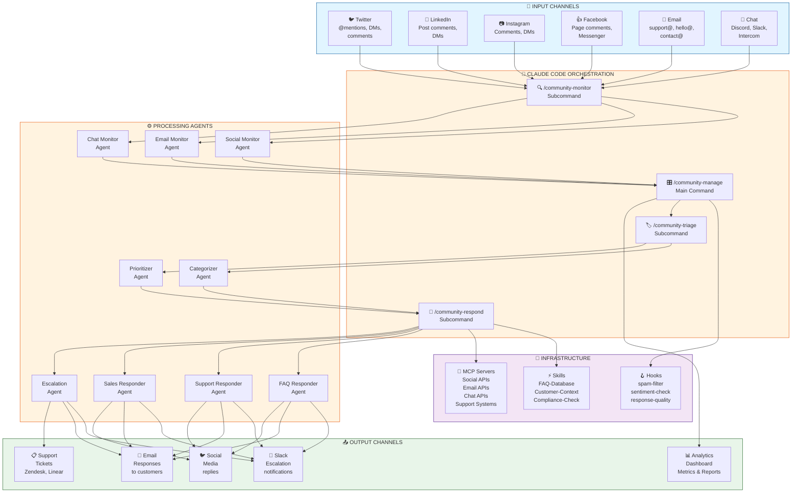
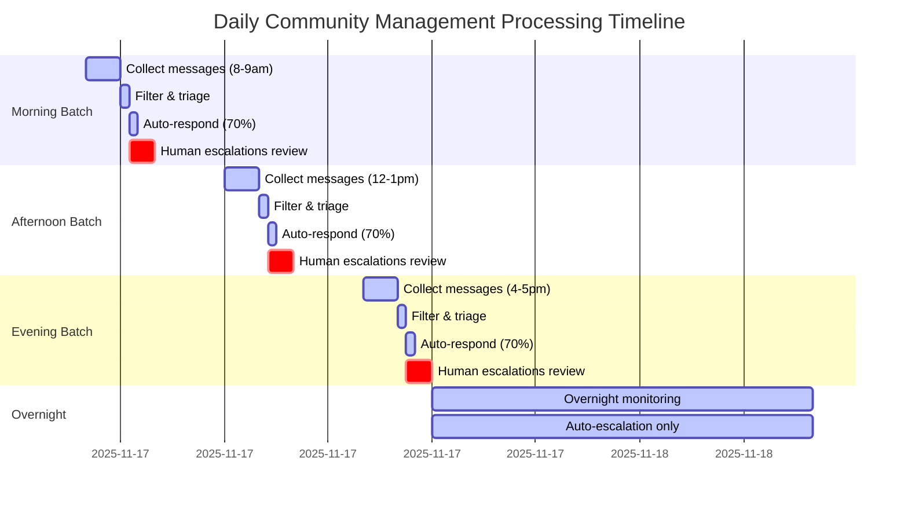
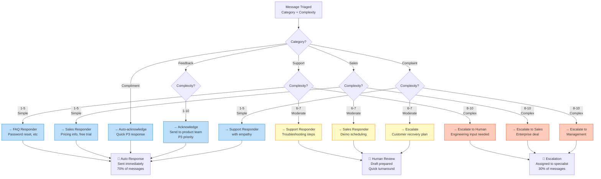
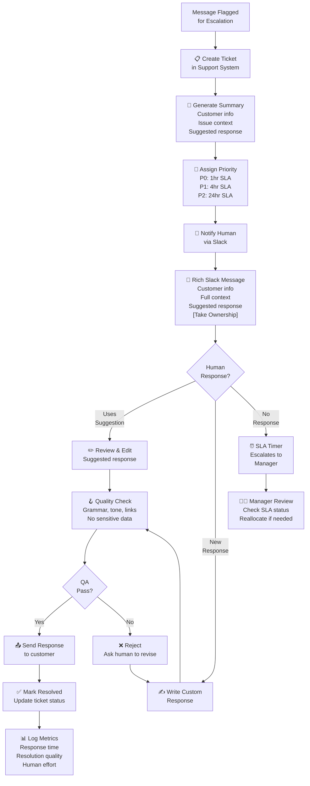

## 1. Batch Processing Flowchart

Shows how 500 accumulated messages flow through monitoring, filtering, triage, and response phases.



---

## 2. Batch Wave Execution Timeline (Gantt)

Shows how 500 messages are processed in 25 waves of 20 messages each, with parallel processing.

```mermaid
gantt
    title Batch Processing Timeline: 500 Messages in 25 Waves
    dateFormat YYYY-MM-DD HH:mm

    section Monitoring
    Social Monitor     :active, monitor1, 2025-11-17 08:00, 5m
    Email Monitor      :active, monitor2, 2025-11-17 08:00, 5m
    Chat Monitor       :active, monitor3, 2025-11-17 08:00, 5m
    Merge & Dedup      :crit, merge, 2025-11-17 08:05, 2m

    section Filtering
    Spam Filter (Hook) :crit, spamfilter, 2025-11-17 08:07, 2m
    Sentiment Check    :crit, sentiment, 2025-11-17 08:09, 3m

    section Triage (Parallel)
    Categorizer Agent  :active, cat, 2025-11-17 08:12, 5m
    Prioritizer Agent  :active, pri, 2025-11-17 08:12, 5m

    section Wave Processing
    Waves 1-5 (Auto)   :active, wave1, 2025-11-17 08:17, 10m
    Waves 1-5 (Escalate) :active, wave1e, 2025-11-17 08:17, 10m
    Waves 6-15 (Auto)  :active, wave2, 2025-11-17 08:27, 20m
    Waves 6-15 (Escalate) :active, wave2e, 2025-11-17 08:27, 20m
    Waves 16-25 (Auto) :active, wave3, 2025-11-17 08:47, 20m
    Waves 16-25 (Escalate) :active, wave3e, 2025-11-17 08:47, 20m

    section QA & Output
    Response Quality   :crit, qa, 2025-11-17 09:07, 5m
    Analytics Report   :crit, report, 2025-11-17 09:12, 3m
    Human Review Start :milestone, humstart, 2025-11-17 09:15, 0m

    section Human Processing
    Human Escalation Review :human, human1, 2025-11-17 09:15, 60m
```

**Timeline Summary**:
- 08:00-08:07: Parallel monitoring (5 min) + dedup (2 min)
- 08:07-08:12: Filtering hooks (5 min)
- 08:12-08:17: Triage parallel (5 min)
- 08:17-09:07: Wave processing (50 min for 25 waves)
- 09:07-09:12: Quality check & reporting (5 min)
- **Total automated**: ~62 minutes
- **Human escalations**: ~60 minutes (parallel with automation)
- **Total time**: ~2 hours

---

## 3. Sequence Diagram: Batch Coordinator & Agent Waves

Shows the orchestration pattern: coordinator sends waves to parallel agent pools.



**Key orchestration points**:
1. **Batch Coordinator** manages all phases sequentially
2. **Monitoring Agents** run in parallel (5 channels)
3. **Triage Agents** run in parallel (categorize + prioritize)
4. **Response branches** split: auto (parallel pool) vs escalate (sequential)
5. **Human Manager** reviews escalations asynchronously

---

## 4. Message State Machine

Shows the lifecycle of a single message through the workflow.



---

## 5. Message Sentiment & Priority Routing

Shows how sentiment analysis drives prioritization and routing decisions.



**Routing logic**:
- **Very Negative + VIP** = Immediate human + senior agent
- **Negative + Product Issue** = Tech support escalation
- **Negative + Other** = Account manager
- **Neutral + Simple** = FAQ auto-response
- **Neutral + Complex** = Human support
- **Positive** = Logged for morale/metrics

---

## 6. Auto-Moderation Decision Tree

Shows how messages are filtered and moderated automatically.



**Filtering rules** (applied sequentially):
1. **Spam keywords** - Common promotional phrases
2. **Phishing patterns** - Suspicious requests for credentials
3. **Link ratio** - More than 3 links = likely spam
4. **Blocklist** - Known spam accounts
5. **Hateful content** - Policy violations
6. **Duplicates** - Same message from same/different users

---

## 7. Architecture Diagram: Multi-Channel Integration

Shows how all channels feed into the unified community management system.



---

## 8. Daily Processing Timeline

Hourly breakdown of community management workflow throughout the day.



**Daily rhythm**:
- **08:00-09:45** - Morning batch (3 parallel batches possible)
- **09:45-12:00** - Human escalation review + monitoring continues
- **12:00-13:45** - Afternoon batch
- **13:45-16:00** - Human escalation review + monitoring continues
- **16:00-17:45** - Evening batch
- **17:45-18:00** - Final human review
- **18:00-08:00** - Overnight automated monitoring (escalations only)

**Total human time**: ~2 hours/day (3 × 45 min reviews = 2.25 hours)
**Total automated**: ~1 hour/day (3 × 15 min = 45 min, but parallel processing reduces actual time)

---

## 9. Response Types & Complexity Matrix

Shows how different message types are routed to different responders.



---

## 10. Escalation & Human-in-Loop Flow

Shows the complete escalation process and human involvement.



**Escalation workflow**:
1. **Automatic ticket creation** in support system (Zendesk, Linear, etc.)
2. **Human notification** via Slack with rich context
3. **Response options**:
   - Use AI-suggested response (edit)
   - Write custom response
   - Delegate to specialist
4. **Quality check** before sending
5. **Metrics tracking** for improvement

---

## Summary: Key Architectural Patterns

| Pattern | Purpose | Benefit |
|---------|---------|---------|
| **Batch Processing** | Group messages into waves (500 → 25 waves of 20) | Efficient parallel processing, predictable timing |
| **Conditional Branching** | Auto-respond if simple, escalate if complex | Optimal resource allocation |
| **Human-in-Loop** | Humans review 30% of messages | Quality + context-awareness for edge cases |
| **Multi-stage Filtering** | Spam → Sentiment → Complexity → Routing | Catch problems early, reduce noise |
| **Parallel Agents** | 3 monitors, 2 triagers, 3 responders | Maximum throughput with minimal latency |
| **Hook-based Integration** | Spam filter, sentiment check, quality check | Extensible, testable, maintainable |

All diagrams reference the [Overview](overview.qmd) and [Examples](examples.qmd) documents.
