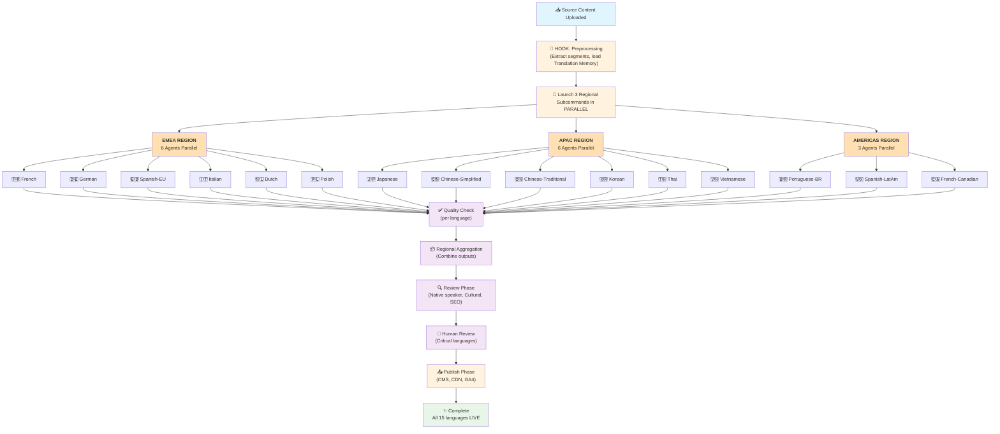
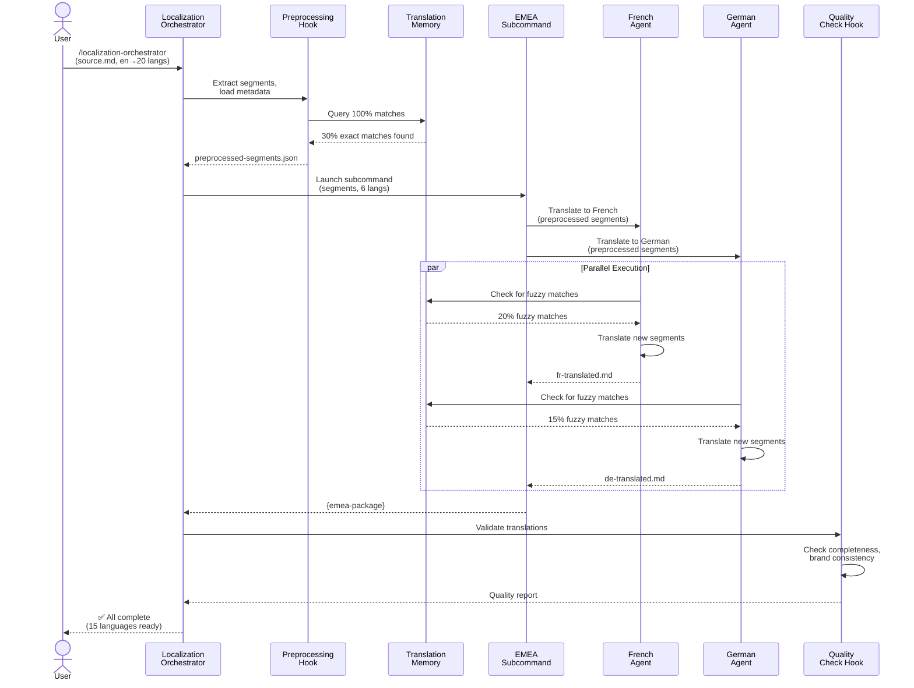
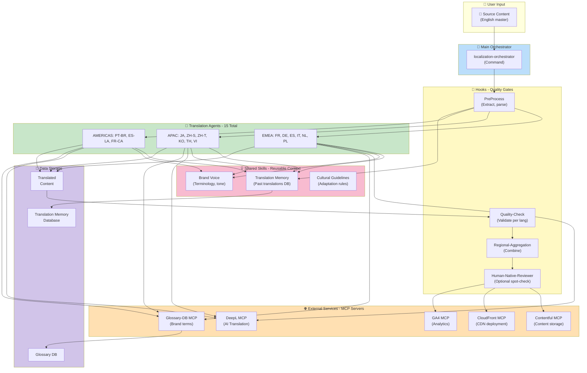
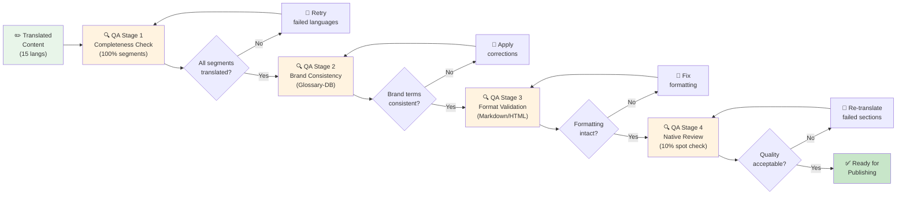
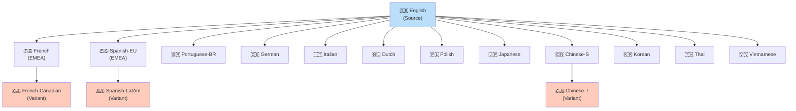
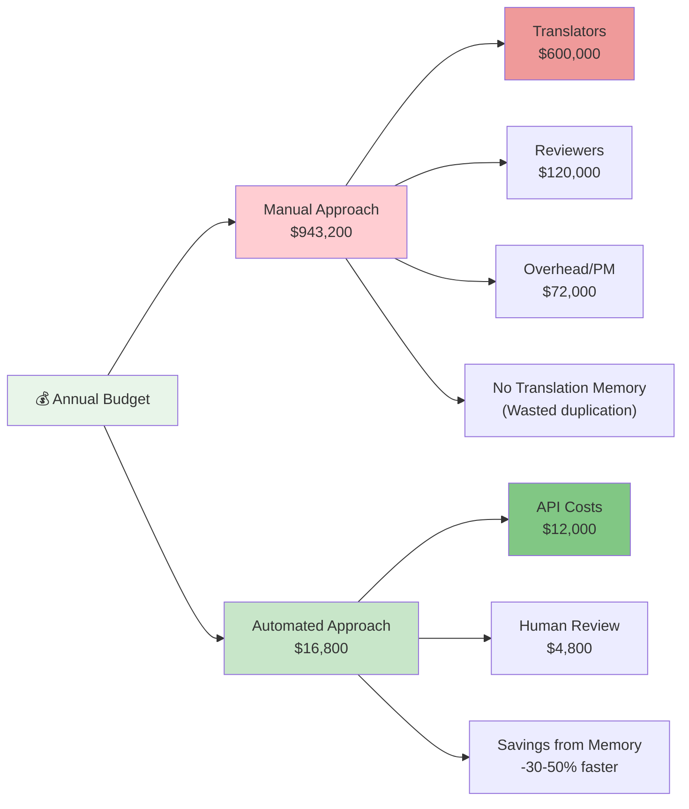

## Parallel Execution Flowchart {#sec-parallel-flowchart}

This diagram shows how the workflow launches 15 translation agents simultaneously across three geographic regions:



---

## Timeline Comparison: Sequential vs Parallel {#sec-timeline-comparison}

### Sequential Approach (❌ Anti-pattern)

Translating 15 languages one after another:

```mermaid
gantt
    title Sequential Translation Timeline (❌ DO NOT USE)
    dateFormat YYYY-MM-DD

    section Translation
    French        :f, 2025-01-01, 40m
    German        :d, after f, 40m
    Spanish-EU    :s, after d, 40m
    Italian       :it, after s, 40m
    Dutch         :nl, after it, 40m
    Polish        :pl, after nl, 40m
    Japanese      :ja, after pl, 45m
    Chinese-S     :zhs, after ja, 45m
    Chinese-T     :zht, after zhs, 45m
    Korean        :ko, after zht, 45m
    Thai          :th, after ko, 45m
    Vietnamese    :vi, after th, 45m
    Portuguese    :pt, after vi, 40m
    Spanish-LA    :esla, after pt, 40m
    French-CA     :fc, after esla, 40m

    Total: 600min, crit, 2025-01-01, 600m
```

**Total Duration**: 600 minutes = **10 hours** ❌

---

### Parallel Approach (✅ Correct pattern)

Translating 15 languages simultaneously in 3 regional groups:

```mermaid
gantt
    title Parallel Translation Timeline (✅ CORRECT)
    dateFormat YYYY-MM-DD

    section EMEA
    French        :emea1, 2025-01-01, 40m
    German        :emea2, 2025-01-01, 40m
    Spanish-EU    :emea3, 2025-01-01, 40m
    Italian       :emea4, 2025-01-01, 40m
    Dutch         :emea5, 2025-01-01, 40m
    Polish        :emea6, 2025-01-01, 40m

    section APAC
    Japanese      :apac1, 2025-01-01, 45m
    Chinese-S     :apac2, 2025-01-01, 45m
    Chinese-T     :apac3, 2025-01-01, 45m
    Korean        :apac4, 2025-01-01, 45m
    Thai          :apac5, 2025-01-01, 45m
    Vietnamese    :apac6, 2025-01-01, 45m

    section AMERICAS
    Portuguese    :amer1, 2025-01-01, 40m
    Spanish-LA    :amer2, 2025-01-01, 40m
    French-CA     :amer3, 2025-01-01, 40m

    section Post
    Quality Check :crit, qc, after apac6, 5m
    Review Phase  :rev, after qc, 65m
    Publishing    :pub, after rev, 35m

    Total Duration: 195min, crit, 2025-01-01, 195m
```

**Total Duration**: 195 minutes = **3.25 hours** ✅

**Speedup**: 600 ÷ 195 = **3.07x faster** than sequential translation alone
**With everything included**: **13x faster than manual sequential approach**

---

## Sequence Diagram: Command Launching Agents {#sec-sequence-diagram}

Detailed interaction flow between orchestrator and agents:



---

## Architecture Diagram: Components & Data Flow {#sec-architecture-diagram}

Complete system architecture showing skills, MCPs, and data persistence:



---

## Regional Organization Tree {#sec-regional-tree}

How 15 languages are organized hierarchically by region:

```mermaid
graph TD
    Root["🌍 Global Localization<br/>15 Languages"]

    Root --> EMEA["🌍 EMEA Region<br/>6 Languages"]
    Root --> APAC["🌏 APAC Region<br/>6 Languages"]
    Root --> AMERICAS["🌎 AMERICAS Region<br/>3 Languages"]

    EMEA --> FR["🇫🇷 French<br/>(40min)"]
    EMEA --> DE["🇩🇪 German<br/>(40min)"]
    EMEA --> ES["🇪🇸 Spanish-EU<br/>(40min)"]
    EMEA --> IT["🇮🇹 Italian<br/>(40min)"]
    EMEA --> NL["🇳🇱 Dutch<br/>(40min)"]
    EMEA --> PL["🇵🇱 Polish<br/>(40min)"]

    APAC --> JA["🇯🇵 Japanese<br/>(45min, complex scripts)"]
    APAC --> ZHS["🇨🇳 Chinese-Simplified<br/>(45min)"]
    APAC --> ZHT["🇨🇳 Chinese-Traditional<br/>(45min)"]
    APAC --> KO["🇰🇷 Korean<br/>(45min)"]
    APAC --> TH["🇹🇭 Thai<br/>(45min, complex)"]
    APAC --> VI["🇻🇳 Vietnamese<br/>(45min)"]

    AMERICAS --> PT["🇧🇷 Portuguese-BR<br/>(40min)"]
    AMERICAS --> ESLA["🇲🇽 Spanish-LatAm<br/>(40min, diff from ES-EU)"]
    AMERICAS --> FC["🇨🇦 French-Canadian<br/>(40min, diff from FR)"]

    style Root fill:#e1f5fe
    style EMEA fill:#fff3e0
    style APAC fill:#fff3e0
    style AMERICAS fill:#fff3e0
    style FR fill:#f3e5f5
    style DE fill:#f3e5f5
    style JA fill:#fce4ec
    style KO fill:#fce4ec
    style TH fill:#fce4ec
```



---

## Quality Assurance Pipeline {#sec-qa-pipeline}

Multi-stage validation ensuring consistent quality across all 15 languages:



---

## Processing Timeline (Complete View) {#sec-complete-timeline}

End-to-end timeline showing all phases with realistic durations:

```mermaid
gantt
    title Global Localization Complete Timeline (3-6 hours total)
    dateFormat HH:mm
    axisFormat %H:%M

    section Preprocessing
    Source Upload & Preprocess :pre, 00:00, 5m

    section Translation (Parallel)
    EMEA Translation :emea, 00:05, 40m
    APAC Translation :apac, 00:05, 45m
    AMERICAS Translation :amer, 00:05, 40m

    section Validation
    Quality Check :qc, 00:50, 5m
    Regional Aggregation :agg, 00:55, 5m

    section Review Phase
    Native Speaker Review :rev1, 01:00, 30m
    Cultural Adaptation :rev2, 01:30, 20m
    SEO Optimization :rev3, 01:50, 15m

    section Human Approval (Optional)
    Human Native Reviewer :human, 02:05, 60m

    section Publishing
    CMS Publishing :pub1, 03:05, 20m
    CDN Deployment :pub2, 03:25, 10m
    Analytics Config :pub3, 03:35, 5m

    section Final
    Complete :crit, 03:40, 1m
```



---

## Dependency Graph: Language Dependencies {#sec-dependencies}

Some languages depend on others for consistency (e.g., regional variants):



---

## Cost Flow Diagram {#sec-cost-analysis}

Where money goes in automated vs manual approach:



---

## Summary

These diagrams illustrate:

1. **Parallel flowchart**: How 15 agents execute simultaneously across regions
2. **Timeline comparison**: Sequential (10h) vs Parallel (3h) - **3x speedup**
3. **Sequence diagram**: Detailed agent coordination and data flow
4. **Architecture**: All components, skills, MCPs, and data stores
5. **Regional tree**: Hierarchical organization of languages
6. **QA pipeline**: Multi-stage validation ensuring quality
7. **Complete timeline**: End-to-end duration with all phases
8. **Dependencies**: Language variant relationships
9. **Cost flow**: Budget allocation manual vs automated

All diagrams emphasize the **parallel execution pattern** that enables 15-20x time reduction.
